# Barcode Module Assessment

## Scope

This document assesses the Barcode subsystem in `PA.js` as the candidate for the next architectural refactor step.

Constraints used for this assessment:

- No source code changes were made.
- No patch was generated.
- CSS was ignored except where DOM structure or rendering ownership affects module boundaries.
- Counts are estimates because Barcode behavior is interwoven with folder rendering, modal rendering, print infrastructure, shortcut handling, and import/export flows.

## Executive Summary

The Barcode subsystem should **not** be extracted in a single patch.

Recommended strategy: **C. Three or more patches**.

Reason: Barcode is not one isolated block. It currently spans persistent data, cache invalidation, CRUD operations, format validation, smart naming, search, folder/subfolder movement, batch selection, main grid rendering, QR/linear preview rendering, large modal rendering, print/ZPL integration, clipboard/page injection, shortcut save flows, import/export compatibility, and footer counts.

A single patch would mix data behavior, UI behavior, runtime APIs, rendering libraries, and print side effects. That would violate the current refactor rules: one logical module per patch, no schema changes, no storage key changes, and low-risk compatibility preservation.

## Estimated Size

Approximate Barcode-related code in `PA.js`: **~5,200 lines**.

This estimate includes direct Barcode logic and tightly coupled support code, but excludes unrelated CSS and unrelated Bookmark/Todo feature bodies.

| Area | Approx. lines | Notes |
|---|---:|---|
| QR/clipboard/cache foundation | ~220 | QR preview cache, clipboard cache, storage helpers around barcode UX |
| Barcode data CRUD | ~90 | `getBarcodes`, `idbAddBarcode`, update/delete/move/bulk format |
| Barcode validation/naming/import parsing | ~290 | format normalization, smart naming, TXT/CSV parsing, import merge participation |
| Print/clipboard/page integration | ~860 | ZPL bridge, print server calls, copies input, clipboard, send-to-page |
| Text barcode/edit modal support | ~200 | text label as Barcode-like item and edit flow |
| Search UI | ~200 | folder + barcode search UI and result rendering |
| Barcode state + shortcuts | ~80 | selection set and selected-text shortcut modal entry |
| Validation/move/form UI | ~730 | `validateBarcodeValue`, move barcode modal, barcode create/edit form and preview |
| Import preview mapping | ~45 | import preview/candidate mapping for barcodes |
| Main barcode renderer | ~1,030 | barcode grid, previews, batch actions, context menu, folder print-all coupling |
| Barcode detail modal | ~1,080 | large QR/linear/text modal, save/copy/print/send actions |
| Modal restore + menu/footer count | ~400 | restore open modal, dropdown entry, footer barcode counts |
| **Total estimated** | **~5,200** | Interwoven feature surface, not a clean contiguous module |

## Estimated Function Count

Approximate Barcode-related function-like units: **~160**.

This includes top-level functions and nested helpers/handlers inside large UI functions. The number is intentionally approximate because many event handlers and nested render helpers are closures rather than named top-level declarations.

| Category | Estimated function-like units | Representative functions / closures |
|---|---:|---|
| Data Layer | 10 | `makeBarcodeId`, `getBarcodes`, `idbAddBarcode`, `idbGetBarcodesByFolder`, `idbUpdateBarcode`, `idbDeleteBarcode` |
| Storage | 8 | `gmGet`, `gmSet` usage, `setBarcodesCache`, localStorage modal restore/cache calls |
| CRUD | 14 | add/update/delete/move/bulk delete/bulk format, save-from-modal, edit form submit |
| Search | 4 | `showSearchHost`, `renderBarcodeSearchResults`, `openBarcodeSearchUI`, input/keyboard handlers |
| Validation | 10 | `validateBarcodeValue`, check-digit helpers, URL detection, format normalization |
| Cache | 18 | QR preview cache load/save/touch/evict/schedule functions, clipboard cache helpers |
| UI | 30+ | form construction, dropdown entry, footer count, shortcut entry, folder format/move modals |
| Rendering | 20+ | active folder grid, barcode item renderer, preview renderers, chunk rendering |
| Modal | 30+ | `showBigBarcodeModal` and nested QR/linear/text/save/print helpers |
| Event Handling | 30+ | click, dblclick, keydown, input, change, checkbox, context-menu, shortcut handlers |
| Printing | 25+ | ZPL builders, bridge checks, print request, print type normalization, copies input |
| QR Preview | 12+ | QR canvas/dataURL generation, cache keying, modal QR render, form QR preview |
| Clipboard | 8 | `copyToClipboard`, clipboard cache, `sendClipboardToPage`, page typing helpers |
| Import/Export | 8 | `mergeImportData`, import preview parsing/mapping, barcode duplicate keying |

## Function Category Map

### Data Layer

Current responsibilities:

- Generate barcode IDs.
- Read barcode list from `STORAGE_KEYS.BARCODES`.
- Repair missing/duplicate IDs during read.
- Maintain `barcodesCache` and dirty state.
- Add, update, delete, bulk delete, move, and bulk format-update barcode records.

Representative functions:

- `makeBarcodeId`
- `getBarcodes`
- `idbAddBarcode`
- `idbGetBarcodesByFolder`
- `idbUpdateBarcode`
- `idbDeleteBarcode`
- `deleteBarcodesByIds`
- `moveBarcodesToFolder`
- `updateFolderBarcodesFormat`

Extraction suitability: **high**, if kept as a compatibility-preserving service with existing top-level facade names.

### Storage

Current responsibilities:

- Uses `STORAGE_KEYS.BARCODES`.
- Uses `gmGet` / `gmSet`, now routed through `StorageService` facades.
- Updates cache via `setBarcodesCache`.
- Uses direct `localStorage` for barcode modal restore and QR preview cache.

Extraction suitability: **medium-high**. The persistent barcode list can move early, but modal restore and QR cache should not be moved in the same patch unless a dedicated cache/restore boundary is introduced.

### CRUD

Current responsibilities:

- Create/edit barcode from form.
- Delete/pin barcode from context menu.
- Bulk delete selected barcodes.
- Move selected barcodes across folder/subfolder destinations.
- Save selected text / modal value as a new barcode.

Extraction suitability: **medium**. CRUD data functions can move first; UI-driven CRUD workflows should move later.

### Search

Current responsibilities:

- Search folders and barcode names/values.
- Render mixed search result UI.
- Navigate to matched folder/barcode and highlight result.

Extraction suitability: **medium**. Search is visually simple but depends on both `getFolders()` and `getBarcodes()`, active folder state, `folderDisplay`, and `renderFolders()`.

### Validation

Current responsibilities:

- Validate barcode values by format.
- Normalize format aliases like `2D`, `B00`, `LPN`, `X00`.
- Detect likely URLs for QR defaults and links.
- Generate preview-safe EAN/UPC/ISBN check digits in form/modal contexts.

Extraction suitability: **high** for pure helpers, but check-digit preview helpers are currently nested inside UI functions and should be separated carefully.

### Cache

Current responsibilities:

- Barcode list cache.
- QR preview cache using localStorage.
- Clipboard cache using localStorage/fallback.
- Print preview cache inside modal closure.

Extraction suitability: **medium**. Barcode list cache belongs with data service. QR preview cache is a separate concern and should be its own small extraction later.

### UI

Current responsibilities:

- New Barcode menu entry.
- Barcode create/edit form.
- Folder format modal.
- Move selected barcodes modal.
- Footer counts.
- Shortcut-created modal flow.

Extraction suitability: **low-medium** until data/validation/render helpers are isolated.

### Rendering

Current responsibilities:

- Render active folder barcode grid.
- Render folder/subfolder print-all affordances.
- Render QR, text, and linear barcode previews.
- Render batch selection toolbar.
- Render barcode context menus.
- Chunk-render large barcode sets.

Extraction suitability: **low for single extraction**. This area is highly coupled to `renderFolders()`, folder navigation state, selected barcode state, QR cache, print functions, context menu helpers, and modal opening.

### Modal

Current responsibilities:

- Large barcode preview modal.
- QR/linear/text rendering.
- Print-preview toggle.
- Copy, print, send-to-page, save-to-folder actions.
- Restore modal state via `STORAGE_KEYS.BARCODE_MODAL` in localStorage.

Extraction suitability: **medium**, but only after data, validation, and print adapters are stable. The modal is large enough to be its own extraction phase.

### Event Handling

Current responsibilities:

- Search input events.
- Form input/change/keydown events.
- Batch checkbox events.
- Context menu events.
- Modal Escape/Enter/click events.
- Shortcut event entry for selected text.

Extraction suitability: **low as a standalone module**. Event handling should move with each owning UI boundary, not as a separate global event module.

### Printing

Current responsibilities:

- Build QR ZPL.
- Build Code128 ZPL.
- Build text label ZPL.
- Detect/send through local ZPL bridge.
- Fallback to Printmon HTTP API.
- Normalize print formats and print types.
- Print single, batch, folder, subfolder, modal, and text-label values.

Extraction suitability: **high as a service**, but it is not Barcode-only because text labels and possibly future modules use it. It should be extracted as `PrintService` or similar, not as a nested `BarcodeService` concern.

### QR Preview

Current responsibilities:

- QR preview generation in list/grid.
- QR preview generation in form.
- QR rendering in big modal.
- QR preview localStorage cache.
- QR print handling.

Extraction suitability: **medium**. QR preview and QR print should not be conflated. Preview rendering can move with render helpers; print stays with print service.

### Clipboard

Current responsibilities:

- Copy barcode values.
- Cache copied value.
- Read clipboard or prompt manually.
- Type value into page like scanner input.

Extraction suitability: **medium-high** as `ClipboardService` / `PageInputService`, but it is cross-cutting and used outside Barcode as well.

### Import/Export

Current responsibilities:

- Merge incoming barcode records.
- Preserve existing schema.
- Deduplicate by name/value/format/folder.
- Auto-create folders referenced by imported barcodes.
- Preserve `subfolder` and `pinned` fields.
- Reset active state and rerender after import.

Extraction suitability: **medium**. Import/export compatibility is high-risk and should not be touched in the first Barcode extraction.

## Dependency Graph

```mermaid
flowchart TD
    BarcodeData[Barcode Data Layer]
    BarcodeValidation[Barcode Validation / Format Helpers]
    BarcodeNaming[Smart Name Helpers]
    BarcodeSearch[Barcode Search UI]
    BarcodeForm[Barcode Create/Edit Form]
    BarcodeRenderer[Barcode Grid Renderer]
    BarcodeModal[Barcode Detail Modal]
    BarcodeImport[Barcode Import/Merge]
    BatchActions[Batch Actions]
    QRPreview[QR Preview Cache/Renderer]
    PrintService[Print / ZPL / Printmon Pipeline]
    ClipboardService[Clipboard + Send-to-Page]

    StorageService[StorageService]
    FolderDataService[FolderDataService]
    DOM[DOM / Panel State]
    Runtime[Userscript Runtime APIs]
    Bookmark[Bookmark Module]
    Todo[Todo Module]
    QRCodeLib[QRCode Library]
    JsBarcodeLib[JsBarcode Library]
    LocalStorage[localStorage]

    BarcodeData --> StorageService
    BarcodeData --> FolderDataService

    BarcodeNaming --> BarcodeValidation
    BarcodeNaming --> BarcodeData

    BarcodeSearch --> BarcodeData
    BarcodeSearch --> FolderDataService
    BarcodeSearch --> DOM
    BarcodeSearch --> BarcodeRenderer

    BarcodeForm --> BarcodeData
    BarcodeForm --> BarcodeValidation
    BarcodeForm --> FolderDataService
    BarcodeForm --> QRCodeLib
    BarcodeForm --> JsBarcodeLib
    BarcodeForm --> DOM

    BarcodeRenderer --> BarcodeData
    BarcodeRenderer --> FolderDataService
    BarcodeRenderer --> QRPreview
    BarcodeRenderer --> BarcodeModal
    BarcodeRenderer --> PrintService
    BarcodeRenderer --> ClipboardService
    BarcodeRenderer --> DOM

    BarcodeModal --> BarcodeData
    BarcodeModal --> BarcodeNaming
    BarcodeModal --> FolderDataService
    BarcodeModal --> QRCodeLib
    BarcodeModal --> JsBarcodeLib
    BarcodeModal --> PrintService
    BarcodeModal --> ClipboardService
    BarcodeModal --> LocalStorage
    BarcodeModal --> DOM

    BatchActions --> BarcodeData
    BatchActions --> PrintService
    BatchActions --> ClipboardService
    BatchActions --> FolderDataService
    BatchActions --> DOM

    QRPreview --> QRCodeLib
    QRPreview --> LocalStorage
    QRPreview --> DOM

    PrintService --> Runtime
    PrintService --> DOM

    ClipboardService --> Runtime
    ClipboardService --> DOM
    ClipboardService --> LocalStorage

    BarcodeImport --> BarcodeData
    BarcodeImport --> FolderDataService
    BarcodeImport --> StorageService
    BarcodeImport --> DOM

    Bookmark -. shared footer/dropdown/render shell .-> DOM
    Todo -. shared footer/render shell .-> DOM
    BarcodeRenderer -. shares render shell with .-> Bookmark
    BarcodeRenderer -. shares footer shell with .-> Todo
```

## Coupling Assessment

Overall coupling level: **Very High**.

| Dependency | Coupling level | Why it matters |
|---|---|---|
| `StorageService` | High | Barcode persistence depends on `gmGet`/`gmSet`, `STORAGE_KEYS.BARCODES`, and cache invalidation. |
| `FolderDataService` | Very High | Almost every barcode is folder/subfolder scoped; move, count, render, import, save, and search all require folder data. |
| DOM / panel state | Very High | Barcode UI is built directly with `document.createElement`, global panel nodes, active folder state, footer state, and modal nodes. |
| Runtime APIs | Medium-High | Print, clipboard, unsafeWindow/page interactions, GM requests, and localStorage all rely on runtime-specific behavior. |
| QR Cache | High | Grid rendering performance and modal/form preview behavior depend on QR cache and QRCode availability. |
| Print | Very High | Barcode actions call print from folder menus, subfolder menus, batch toolbar, modal actions, and text-label flows. |
| Bookmark | Medium | Not a direct barcode data dependency, but shares dropdown, footer, tab shell, render wrapping, and clipboard/copy helpers. |
| Todo | Low-Medium | Mostly shared footer/render shell and panel layout, not barcode data. |

## Risk Assessment

Overall extraction risk: **High**.

| Risk area | Level | Reason |
|---|---|---|
| Data/service extraction | Medium | Data functions are compact, but storage key/schema/cache behavior must remain exact. |
| Validation/helper extraction | Low-Medium | Mostly pure, but some helpers are duplicated/nested in UI contexts. |
| Search extraction | Medium | Search depends on folder and barcode data plus active navigation state. |
| Form extraction | High | Form combines validation, preview rendering, folder destination UI, panel height management, create/edit side effects, and rerendering. |
| Main renderer extraction | Very High | `renderFolders()` is the central UI refresh and contains both folder and barcode rendering. |
| Modal extraction | High | Large nested closure with rendering, save, print, copy, runtime, and localStorage restore concerns. |
| Print extraction | High | External bridge/API behavior, fallback behavior, and user-facing success/error messages are sensitive. |
| Import/export extraction | High | Compatibility rules explicitly require preserving schemas and import/export behavior. |

## Recommended Extraction Strategy

Recommended option: **C. Three or more patches**.

### Why not a single patch?

A single patch would need to move or rewrite:

- Barcode data CRUD.
- Barcode validation and naming.
- QR preview cache.
- Barcode form and preview.
- Search UI.
- Active-folder barcode grid.
- Batch selection toolbar.
- Large barcode modal.
- Print and clipboard flows.
- Import/export merge handling.
- Footer count and restore hooks.

That would create a large behavioral blast radius and make regressions difficult to isolate. It would also make syntax recovery harder in a single-file userscript where function order and closure state matter.

### Why not only two patches?

Two patches would still force one of the patches to mix unrelated responsibilities, likely either:

1. data + validation + search + form, or
2. renderer + modal + print + clipboard.

Both combinations remain too large and too coupled. The Barcode subsystem has at least four natural seams.

## Recommended Extraction Phases

### Phase 1 — Barcode Data Service

Goal: extract only persistent barcode records and compatibility facades.

Candidate boundary:

- `BarcodeDataService.makeId`
- `BarcodeDataService.getAll`
- `BarcodeDataService.add`
- `BarcodeDataService.getByFolder`
- `BarcodeDataService.update`
- `BarcodeDataService.delete`
- `BarcodeDataService.deleteMany`
- `BarcodeDataService.moveMany`
- `BarcodeDataService.updateFolderFormat`

Keep existing top-level facade names temporarily:

- `makeBarcodeId`
- `getBarcodes`
- `idbAddBarcode`
- `idbGetBarcodesByFolder`
- `idbUpdateBarcode`
- `idbDeleteBarcode`
- `deleteBarcodesByIds`
- `moveBarcodesToFolder`
- `updateFolderBarcodesFormat`

Risk: **Medium**.

Do not touch:

- `renderFolders()`
- `showBarcodeForm()`
- `showBigBarcodeModal()`
- `mergeImportData()` behavior except calls if absolutely required
- print/clipboard helpers
- schema/storage key strings

Validation after phase:

- Syntax check.
- Add/edit/delete barcode manually or with existing mock flow.
- Move barcode across folder/subfolder.
- Confirm import/export-compatible record shape is unchanged.

### Phase 2 — Barcode Format and Naming Helpers

Goal: extract pure helpers with minimal side effects.

Candidate boundary:

- `normalizeBarcodeFormatInput`
- `validateBarcodeValue`
- `isLikelyUrlValue` / URL detection normalization
- `ellipsizeText`
- `buildSmartBaseName`
- `makeUniqueName`
- `generateSmartBarcodeName`
- check-digit helpers if lifted from nested form/modal code

Risk: **Low-Medium**.

Important caution:

- There are multiple URL detection helpers with slightly different regexes. Do not unify behavior unless explicitly planned and tested.
- Check-digit preview logic may be UI-specific; lift only if exact behavior is preserved.

### Phase 3 — Barcode Search and Small UI Adapters

Goal: extract search behavior and low-risk UI adapters after data/format helpers are stable.

Candidate boundary:

- `showSearchHost`
- `renderBarcodeSearchResults`
- `openBarcodeSearchUI`
- Search close/reset helpers if directly adjacent

Risk: **Medium**.

Dependencies to inject or reference carefully:

- `getFolders`
- `getBarcodes`
- `activeFolder`
- `folderDisplay`
- `renderFolders`
- `panel`

This phase should not touch main grid rendering.

### Phase 4 — Barcode Form Module

Goal: extract create/edit form behavior after validation/data helpers exist.

Candidate boundary:

- `showBarcodeForm`
- preview helpers currently nested in the form
- destination select interaction if reusable hooks already exist

Risk: **High**.

Reasons:

- It mutates panel layout, footer visibility, and form wrapper state.
- It uses `QRCode` and `JsBarcode` directly.
- It includes validation, smart format behavior, preview rendering, create/update persistence, and rerender calls.

Recommended approach:

- Keep top-level `showBarcodeForm` facade.
- Extract as an object/function that receives a small UI context instead of pulling globals blindly.
- Avoid changing preview output in the same patch.

### Phase 5 — Print / Clipboard Service Extraction

Goal: extract cross-cutting runtime integrations that Barcode uses heavily.

Candidate boundaries:

- `PrintService`
  - ZPL builders
  - bridge availability/send
  - print request
  - format/type normalization
  - `printBarcodeValue`
- `ClipboardService` or `PageInputService`
  - `copyToClipboard`
  - clipboard cache usage
  - `sendValueToPage`
  - `sendClipboardToPage`

Risk: **High**.

Important caution:

- Print is cross-feature, not purely Barcode. Extract it as a shared service, not inside a Barcode module.
- Preserve all user-facing messages and fallback paths.

### Phase 6 — Barcode Detail Modal

Goal: extract `showBigBarcodeModal` after data, naming, print, and clipboard boundaries are stable.

Risk: **High**.

Reasons:

- Large nested closure.
- Uses QR/linear/text rendering.
- Saves values to folders.
- Restores state through localStorage.
- Calls print/copy/send/page helpers.
- Uses active folder/subfolder state.

Recommended approach:

- Keep top-level `showBigBarcodeModal` facade.
- Move modal-local helpers together.
- Inject or pass dependencies explicitly where feasible.

### Phase 7 — Barcode Grid Renderer

Goal: split barcode rendering out of `renderFolders()` only after earlier dependencies are stable.

Risk: **Very High**.

Reasons:

- `renderFolders()` is central to folder grid and barcode grid.
- Barcode rendering is interwoven with folder/subfolder rendering, batch actions, context menus, QR preview cache, print actions, selected state, footer messages, and active folder navigation.

Recommended approach:

- First create small internal renderer helpers near `renderFolders()` without moving behavior far.
- Then extract active-folder barcode grid renderer.
- Keep root folder grid renderer separate.

### Phase 8 — Import/Export Boundary

Goal: only after data service is stable, route barcode import/export operations through the service if beneficial.

Risk: **High**.

Reasons:

- Import/export compatibility is protected by refactor rules.
- `mergeImportData` merges folders, subfolders, and barcodes together.
- It currently writes multiple storage keys in one transaction-like operation.

Recommended approach:

- Do not make import/export part of initial Barcode extraction.
- If touched later, preserve exact schema and duplicate detection semantics.

## Suggested Patch Sequence

| Patch | Name | Primary goal | Risk |
|---|---|---|---|
| 004 | Barcode Data Service | Extract barcode persistence + compatibility facades | Medium |
| 005 | Barcode Format Helpers | Extract pure format/validation/naming helpers | Low-Medium |
| 006 | Barcode Search Module | Extract search UI and search result rendering | Medium |
| 007 | Barcode Form Module | Extract create/edit form and form preview | High |
| 008 | Print/Clipboard Services | Extract shared runtime integration services | High |
| 009 | Barcode Modal Module | Extract large preview/save/copy/print modal | High |
| 010 | Barcode Grid Renderer | Extract active-folder barcode grid rendering from `renderFolders()` | Very High |
| 011 | Import/Export Integration Cleanup | Optional service routing for barcode import/export | High |

## Recommended Next Patch

The safest next implementation patch is:

**Patch 004 — Barcode Data Service**

Rationale:

- It has the smallest cohesive boundary.
- It builds directly on the existing `StorageService` and `FolderDataService` work.
- It can preserve all top-level function names as facades.
- It avoids DOM, QR, print, modal, and import/export complexity.
- It prepares later patches without changing user-visible behavior.

## Architectural Decision

Barcode extraction should proceed as **multiple staged extractions**, starting with the data layer and pure helpers, then moving gradually toward UI, modal, print, and renderer boundaries.

Final decision:

> Choose **C. Three or more patches**. Do not extract Barcode in a single patch.

