# Project Overview

This document records the current implementation of the `PA` codebase as it exists in this workspace on 2026-07-02.

It is an architectural discovery document, not a redesign document. It describes the current source layout, execution flow, runtime modules, data models, storage behavior, UI architecture, services, event flow, dependency graph, performance observations, technical-debt observations, and open questions.

The implementation is currently concentrated in one main userscript file:

- `PA.js`

Supporting files currently provide documentation and a manual browser test harness:

- `mock_test.html`
- `README.md`
- `MANIFESTO.md`
- `docs/Architecture.md`
- `docs/Development.md`
- `docs/Roadmap.md`

The application is implemented as a Tampermonkey/Greasemonkey userscript that injects a floating productivity panel into matched pages. It includes barcode management, folder/subfolder organization, bookmark management, todo management, reminders, wellness reminders, import/export, print/ZPL workflows, search, settings/dropdowns, and runtime synchronization.

The main source file contains approximately `13,975` lines. The CSS injection block starts near line `12619`; styling rules are present in the implementation but this document focuses on architecture and does not enumerate CSS rules.

## Runtime Type

- Browser userscript
- Local-first data model
- Tampermonkey/Greasemonkey API integration
- Runtime-created DOM UI
- External barcode/QR libraries loaded through userscript metadata

## External Runtime APIs

The userscript metadata requests these APIs:

- `GM_addStyle`
- `GM_registerMenuCommand`
- `GM_setValue`
- `GM_getValue`
- `GM_addValueChangeListener`
- `GM_xmlhttpRequest`
- `GM_notification`
- `unsafeWindow`

## External Libraries

The userscript metadata loads:

- `JsBarcode` from jsDelivr
- `QRCode` from jsDelivr

The manual test page also loads these libraries directly before loading `PA.js`.

# Repository Structure

```text
PA/
├── .github/
├── analysis/
│   └── PA_Code_Discovery.md
├── backup/
├── docs/
│   ├── Architecture.md
│   ├── Development.md
│   └── Roadmap.md
├── src/
├── test/
├── MANIFESTO.md
├── mock_test.html
├── PA.js
└── README.md
```

## File Inventory

| Path | Current role | Current content status |
|---|---|---|
| `PA.js` | Main application source and userscript entrypoint | Active implementation |
| `mock_test.html` | Manual browser test harness | Active support file |
| `README.md` | Project overview | Documentation |
| `MANIFESTO.md` | Product principles | Documentation |
| `docs/Architecture.md` | Intended architecture notes | Documentation |
| `docs/Development.md` | Development standards | Documentation |
| `docs/Roadmap.md` | Project roadmap | Documentation |
| `src/` | Future module location | Empty in current workspace scan |
| `test/` | Future/placeholder test resources | Empty in current workspace scan |
| `backup/` | Future/placeholder backup samples | Empty in current workspace scan |
| `.github/` | GitHub configuration placeholder | Empty in current workspace scan |
| `analysis/` | Architecture/discovery documentation | Contains this generated discovery document |

# Execution Flow

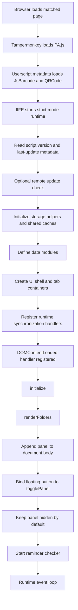

## Runtime Event Loop

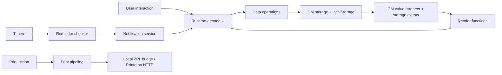

# Module Index

The module order below follows the logical order of `PA.js`.

## 1. Userscript Metadata and Runtime Contract

**Approximate line range:** `1–20`

### Purpose

Declares the userscript identity, runtime grants, external connectivity, and required barcode/QR libraries.

### Responsibilities

- Identify the script as `PA`.
- Set the current version and last-update metadata.
- Match all pages with `*://*/*`.
- Request Tampermonkey/Greasemonkey permissions.
- Declare `JsBarcode` and `QRCode` as external runtime dependencies.
- Allow connection to `api.quotable.io`.

### Dependencies

- Tampermonkey/Greasemonkey runtime
- Browser page context
- jsDelivr-hosted `JsBarcode`
- jsDelivr-hosted `QRCode`

### Public Functions

None. This section declares metadata only.

### Internal Functions

None.

### Stored Data

None directly.

### Related UI

None directly.

### Related Services

- Userscript runtime
- External library loader

---

## 2. Application Wrapper, Version Metadata, and Update Check

**Approximate line range:** `21–83`

### Purpose

Starts the script runtime, enables strict mode, resolves script metadata, and performs a periodic update check through `GM_xmlhttpRequest`.

### Responsibilities

- Wrap all implementation inside an IIFE.
- Enable strict mode.
- Resolve `SCRIPT_VERSION` from `GM_info` or metadata text.
- Resolve `SCRIPT_LAST_UPDATE` from metadata text.
- Check for script updates no more frequently than the configured interval.
- Redirect to the update URL when a newer version is detected.

### Dependencies

- `GM_info`
- `GM_getValue`
- `GM_setValue`
- `GM_xmlhttpRequest`
- `window.location.href`

### Public Functions

None exported. Top-level constants are referenced by later UI:

- `SCRIPT_VERSION`
- `SCRIPT_LAST_UPDATE`

### Internal Functions

- Anonymous update-check IIFE

### Stored Data

| Key | Shape | Purpose |
|---|---|---|
| `PA` | Number timestamp | Stores last update-check time. |

### Related UI

- About modal displays script version/update metadata later in the file.

### Related Services

- Update-check service

---

## 3. Storage, Shared Cache, and Cross-Tab Sync Foundations

**Approximate line range:** `84–359`

### Purpose

Provides storage abstraction, shared runtime caches, QR preview cache/prefetch behavior, clipboard cache, and cache invalidation hooks.

### Responsibilities

- Read/write through GM storage with localStorage fallback/mirroring.
- Maintain barcode and folder in-memory caches.
- Maintain QR preview data URL cache.
- Persist QR preview cache in localStorage.
- Throttle QR preview prefetches.
- Cache the last copied value.
- Register value-change listeners for barcode/folder cache invalidation.

### Dependencies

- `GM_getValue`
- `GM_setValue`
- `GM_addValueChangeListener`
- `localStorage`
- `QRCode`
- `document.visibilityState`
- Browser timers
- Barcode data functions defined later but referenced at runtime

### Public Functions

These functions are used across later modules:

- `gmGet(key, fallback = null)`
- `gmSet(key, value)`
- `setBarcodesCache(list)`
- `setFoldersCache(list)`
- `invalidateBarcodesCache()`
- `invalidateFoldersCache()`
- `cacheClipboardValue(value)`
- `getCachedClipboardValue()`
- `scheduleQrPreviewPrefetch()`
- `getQrPreviewCacheKey(value, size)`
- `setQrPreviewCacheEntry(key, url)`
- `touchQrPreviewCacheKey(key)`

### Internal Functions

- `loadQrPreviewCache()`
- `queueSaveQrPreviewCache()`
- `scheduleIdle(fn)`
- `getQrPrefetchLastRun()`
- `setQrPrefetchLastRun(ts = Date.now())`
- `startQrPreviewPrefetchWorker()`
- `enqueueQrPreviewPrefetch(barcodes, size = QR_PREVIEW_DEFAULT_SIZE)`
- Internal arrow: `processNext`

### Stored Data

| Key | Shape | Purpose |
|---|---|---|
| `bm_last_copied` | String | Last copied barcode/text value. |
| `bm_qr_preview_cache` | `{ entries: Array<[key, url]> }` | Cached QR preview data URLs. |
| `bm_qr_preview_prefetch_last_run` | String timestamp | Last QR prefetch execution time. |
| `bm_barcodes` | Array | Observed for cache invalidation. |
| `bm_folders` | Array | Observed for cache invalidation. |

### Related UI

- Barcode list previews
- QR preview images
- Clipboard send/copy actions

### Related Services

- Storage service
- QR preview cache service
- Clipboard cache service
- Cross-tab cache invalidation service

---

## 4. Folder Data Operations

**Approximate line range:** `360–789`

### Purpose

Owns the folder and subfolder data model used by barcode records.

### Responsibilities

- Read and cache folders.
- Populate folder and folder-tree select elements.
- Parse folder/subfolder destination values.
- Create folders and subfolders.
- Rename folders and subfolders.
- Update folder/subfolder metadata.
- Delete folders/subfolders and cascade barcode deletion where implemented.
- Move top-level folders into other folders as subfolders.
- Move subfolders to root or another folder.

### Dependencies

- `gmGet`
- `gmSet`
- `getBarcodes`
- `setBarcodesCache`
- `setFoldersCache`
- `renderFolders`
- `showFlash`
- `panel`
- `formWrapper`
- Active folder state:
  - `activeFolder`
  - `activeSubFolder`

### Public Functions

- `getFolders()`
- `populateFolderSelect(select, preferred)`
- `getSelectedFolderValue(select, fallback = 'Default')`
- `populateFolderTreeSelect(treeSelect, preferredFolder, preferredSubFolder)`
- `parseTreeSelectValue(val, fallbackFolder = 'Default')`
- `normalizeFolderDestination(preferredFolder = 'Default', preferredSubFolder = '')`
- `createFolderDestinationSelect(preferredFolder = 'Default', preferredSubFolder = '', styleOverrides = {})`
- `getSelectedFolderDestination(select, fallbackFolder = 'Default')`
- `showNewFolderModal(callback)`
- `saveFolder(name)`
- `updateFolder(name, updates)`
- `deleteFolder(folderName)`
- `renameFolder(oldName, newName)`
- `getAllSubFolders()`
- `getSubFolders(parentName)`
- `saveSubFolder(parentName, subName)`
- `deleteSubFolder(parentName, subName)`
- `renameSubFolder(parentName, oldName, newName)`
- `updateSubFolder(parentName, subName, updates)`
- `moveFolderTo(folderName, destFolder)`
- `moveSubFolderTo(parentName, subName, destFolder)`

### Internal Functions

No nested long-lived helper functions are defined in this module beyond callbacks attached inside UI creation.

### Stored Data

| Key | Shape | Purpose |
|---|---|---|
| `bm_folders` | `Folder[]` | Top-level barcode folders. |
| `bm_subfolders` | `SubFolder[]` | One-level barcode subfolders. |
| `bm_barcodes` | `Barcode[]` | Updated when folder/subfolder operations move or cascade barcode records. |

### Related UI

- Folder select controls
- Folder tree select controls
- New folder modal
- Folder grid
- Subfolder cards
- Barcode form destination controls
- Move modals

### Related Services

- Storage service
- Flash message service
- Main renderer

---

## 5. Bookmark Data Operations

**Approximate line range:** `790–1191`

### Purpose

Owns bookmark persistence, bookmark folders, bookmark subfolders, bookmark normalization, deduplication, and bookmark move/delete/update behavior.

### Responsibilities

- Normalize bookmark URLs.
- Extract bookmark domain/origin.
- Generate favicon URLs and fallback favicon URLs.
- Read and write bookmark records.
- Sanitize and deduplicate bookmark lists.
- Read and write bookmark folders/subfolders.
- Remove legacy auto-created defaults when empty.
- Create, update, rename, delete bookmark folders/subfolders.
- Add or update bookmark records.
- Batch update/delete bookmarks.
- Move bookmark folders/subfolders.

### Dependencies

- `gmGet`
- `gmSet`
- `URL`
- `showFlash`
- `renderBookmarks`
- Bookmark active state:
  - `bookmarkActiveFolder`
  - `bookmarkActiveSubFolder`
- Bookmark selection state:
  - `selectedBookmarkIds`

### Public Functions

- `normalizeBookmarkUrl(raw)`
- `getBookmarkDomain(rawUrl)`
- `getBookmarkOrigin(rawUrl)`
- `getBookmarkFaviconUrl(rawUrl)`
- `getBookmarkFallbackFaviconUrl(rawUrl)`
- `getBookmarks()`
- `sanitizeBookmarkList(list)`
- `saveBookmarks(list)`
- `getBookmarkFolders()`
- `saveBookmarkFolders(folders)`
- `getAllBookmarkSubFolders()`
- `saveBookmarkSubFolders(subs)`
- `getBookmarkSubFolders(parentName)`
- `ensureBookmarkDefaults()`
- `saveBookmarkFolder(name)`
- `saveBookmarkSubFolder(parentName, subName)`
- `updateBookmarkFolder(name, updates)`
- `updateBookmarkSubFolder(parentName, subName, updates)`
- `renameBookmarkFolder(oldName, newName)`
- `renameBookmarkSubFolder(parentName, oldName, newName)`
- `deleteBookmarkFolder(folderName)`
- `deleteBookmarkSubFolder(parentName, subName)`
- `addOrUpdateBookmark(bookmark)`
- `updateBookmark(id, updates)`
- `updateBookmarksByIds(ids, updates)`
- `deleteBookmark(id)`
- `deleteBookmarksByIds(ids)`
- `moveBookmarkFolderTo(folderName, destFolder)`
- `moveBookmarkSubFolderTo(parentName, subName, destFolder)`

### Internal Functions

- `normalize` arrow inside `sanitizeBookmarkList`

### Stored Data

| Key | Shape | Purpose |
|---|---|---|
| `bm_bookmarks` | `Bookmark[]` | Bookmark records. |
| `bm_bookmark_folders` | `BookmarkFolder[]` | Top-level bookmark folders. |
| `bm_bookmark_subfolders` | `BookmarkSubFolder[]` | One-level bookmark subfolders. |
| `bm_bookmark_no_defaults_migrated` | Boolean | Marks legacy default-folder cleanup as completed. |

### Related UI

- Bookmark tab
- Bookmark folder form
- Bookmark form
- Bookmark folder/subfolder cards
- Bookmark list items
- Bookmark move modals
- Bookmark batch move modal
- Bookmark search UI
- Footer bookmark counts

### Related Services

- Storage service
- Flash message service
- Bookmark renderer
- Import/export service

---

## 6. Todo Data, NLP, Wellness, Notifications, and Reminder Scheduling

**Approximate line range:** `1192–2267`

### Purpose

Owns persistent todo state, todo project lists, task lifecycle operations, natural-language date parsing, task recurrence, reminder scheduling, notification delivery, sound playback, snooze state, and wellness reminder settings.

### Responsibilities

- Read/write task cache.
- Create/update/delete/toggle/clear todo tasks.
- Maintain todo projects.
- Extract tags.
- Parse natural-language due dates and times.
- Compute recurrence next dates.
- Track pending reminders.
- Snooze and stop snoozed reminders.
- Normalize wellness settings.
- Schedule reminder checks.
- Send task/wellness notifications.
- Play reminder sound.
- Request notification permission when needed.
- Provide wellness settings modal.

### Dependencies

- `gmGet`
- `gmSet`
- `Notification`
- `GM_notification`
- `window.AudioContext` / `window.webkitAudioContext`
- Browser timers
- `showFlash`
- `switchTab`
- `togglePanel`
- `panel`
- Todo rendering callbacks:
  - `renderTasksList`
  - `updateTaskTabBadge`
  - `updateReminderCountdownDisplays`
- Wellness UI callback:
  - `refreshWellnessTodoToggles`

### Public Functions

- `getTasks()`
- `saveTasks(tasks)`
- `composeTaskDueDate(dateValue, timeValue, options = {})`
- `getActiveSnoozedTasks(tasks = getTasks(), now = Date.now())`
- `getNearestActiveSnooze(tasks = getTasks(), now = Date.now())`
- `formatCountdownClock(ms)`
- `getTodoProjects()`
- `saveTodoProjects(projects)`
- `addTodoProject(name)`
- `deleteTodoProject(name)`
- `renameTodoProject(oldName, newName)`
- `getNextRecurrenceDate(currentDateStr, recurrence)`
- `extractTags(text)`
- `parseTaskTextWithNLP(text)`
- `addTask(title, priority = 'P4', dueDate = null, linkedItem = null, project = 'Personal', recurrence = 'none', description = '', tags = [], reminderTime = null)`
- `updateTask(id, updates)`
- `deleteTask(id)`
- `getPendingTaskReminderCount(tasks = getTasks())`
- `snoozeTaskReminder(id, minutes = 10)`
- `stopSnoozedTaskReminder(id)`
- `toggleTask(id)`
- `clearCompletedTasks()`
- `getWellnessWaterIntervalMs(settings = getWellnessSettings())`
- `getWellnessStretchIntervalMs(settings = getWellnessSettings())`
- `getWellnessBreakMinutes(settings = getWellnessSettings())`
- `getWellnessSettings()`
- `saveWellnessSettings(settings)`
- `setWellnessToggle(settings, key, enabled, intervalMs)`
- `hasPendingReminderDemand()`
- `ensureNotificationPermissionIfNeeded()`
- `sendAppNotification({ title, body, tag, onClick, fallbackType = 'info' })`
- `sendWellnessNotification(kind)`
- `getNextReminderDelay(now = Date.now())`
- `scheduleReminderCheck(delayMs = null)`
- `runReminderCheck()`
- `initReminderChecker()`
- `sendTaskNotification(task)`
- `sendTestTaskNotification()`
- `showWellnessSettingsModal()`

### Internal Functions

- `parseTimeFromText(str)` inside NLP parsing
- `clampWellnessMinutes(value, fallback, min, max)`
- `normalizeWellnessSettings(raw)`
- `isChromeLikeBrowser()`
- `getReminderAudioContext()`
- `unlockReminderAudio()`
- `playReminderSound()`
- `sendNativeNotification({ title, body, tag, onClick })`
- `sendGmNotification({ title, body, tag, onClick })`
- `sendChromeHistoryNotification({ title, body, tag, onClick })`
- `createNumberRow(label, hint, value, min, max)` inside wellness modal
- `makeTestButton` arrow inside wellness modal

### Stored Data

| Key | Shape | Purpose |
|---|---|---|
| `bm_tasks` | `Task[]` | Todo tasks. |
| `bm_todo_projects` | `string[]` | Todo project names. |
| `bm_wellness_settings` | `WellnessSettings` | Wellness reminder settings and next trigger times. |

### Related UI

- Todo tab
- Todo filter bar
- Todo search/filter/sort controls
- Task form
- Task details modal
- Manage projects modal
- Insights modal
- Wellness settings modal
- Snooze UI
- Reminder badge/countdown UI

### Related Services

- Notification service
- Reminder scheduler
- Wellness service
- Audio alert service
- Storage service

---

## 7. Barcode Data, Utilities, Footer Quotes, Import, Export, and Backup

**Approximate line range:** `2268–3078`

### Purpose

Owns barcode persistence, barcode batch operations, flash messages, footer quote rotation, smart naming, CSV/TXT parsing, import merging, full backup creation, backup payload normalization, and backup import.

### Responsibilities

- Create stable barcode IDs.
- Read/write barcode records.
- Query barcodes by folder/subfolder.
- Update/delete/move barcode records.
- Batch delete barcode records.
- Batch update folder barcode format.
- Safely append DOM nodes.
- Show flash/system messages.
- Fetch and rotate footer quotes.
- Normalize barcode format inputs.
- Detect URL-like barcode values.
- Build smart barcode names.
- Parse CSV-like delimited files.
- Parse TXT files into values.
- Merge imported barcode/folder/subfolder data.
- Merge imported bookmark data.
- Merge imported todo data.
- Build full backup payload.
- Normalize backup payload variants.
- Import backup payloads.

### Dependencies

- `gmGet`
- `gmSet`
- Barcode cache helpers
- Folder data operations
- Bookmark data operations
- Todo data operations
- Wellness settings
- Print storage keys
- `GM_xmlhttpRequest`
- DOM APIs
- `renderFolders`
- `renderBookmarks`
- `renderTasksList`
- `refreshPanelAfterDataMutation`
- `showFlash`

### Public Functions

- `makeBarcodeId()`
- `getBarcodes()`
- `idbAddBarcode(barcode)`
- `idbGetBarcodesByFolder(folderName, subFolderName = null)`
- `idbUpdateBarcode(id, updates)`
- `idbDeleteBarcode(id)`
- `deleteBarcodesByIds(ids)`
- `moveBarcodesToFolder(ids, folder, subfolder = '')`
- `updateFolderBarcodesFormat(folderName, subFolderName, format)`
- `safeAppend(parent, child)`
- `showFlash(message, isError = false, type = 'info')`
- `isFooterSystemMessageActive()`
- `renderFooterQuoteIfAllowed()`
- `formatFooterQuoteDisplay(quote)`
- `chooseDifferentFooterQuote(pool, recent = footerRecentQuotes)`
- `applyFooterQuoteNow(quote)`
- `clearFooterQuoteTimer()`
- `scheduleFooterQuoteRefresh(delayMs = FOOTER_QUOTE_INTERVAL_MS)`
- `fetchFooterQuote()`
- `normalizeBarcodeFormatInput(format)`
- `isLikelyUrlValue(value)`
- `ellipsizeText(text, maxLen)`
- `buildSmartBaseName(value, format)`
- `makeUniqueName(base, existingSet, maxLen = SMART_NAME_MAX_LEN)`
- `generateSmartBarcodeName(value, format, folder)`
- `detectDelimiter(line)`
- `parseDelimitedLine(line, delimiter)`
- `parseCsvText(text)`
- `parseTxtText(text)`
- `mergeImportData(incomingFolders, incomingBarcodes, incomingSubFolders = [], options = {})`
- `mergeBookmarkImportData(incomingFolders = [], incomingBookmarks = [], incomingSubFolders = [])`
- `mergeTodoImportData(incomingTasks = [], incomingProjects = [])`
- `buildFullBackupData()`
- `normalizeBackupPayload(data)`
- `importBackupData(data)`

### Internal Functions

- `normalizeQuotePayload` arrow inside quote fetch
- `failGracefully` arrow inside quote fetch
- `handleQuoteSource` arrow inside quote fetch
- Local `normalize` arrows inside merge functions
- `barcodeKey` arrow inside barcode import merge
- `bookmarkKey` arrow inside bookmark import merge
- `taskKey` arrow inside todo import merge
- Local ID factory arrows inside import logic

### Stored Data

| Key | Shape | Purpose |
|---|---|---|
| `bm_barcodes` | `Barcode[]` | Barcode records. |
| `bm_folders` | `Folder[]` | Updated during import merge. |
| `bm_subfolders` | `SubFolder[]` | Updated during import merge. |
| `bm_bookmark_folders` | `BookmarkFolder[]` | Updated during bookmark import merge. |
| `bm_bookmark_subfolders` | `BookmarkSubFolder[]` | Updated during bookmark import merge. |
| `bm_bookmarks` | `Bookmark[]` | Updated during bookmark import merge. |
| `bm_todo_projects` | `string[]` | Updated during todo import merge. |
| `bm_tasks` | `Task[]` | Updated during todo import merge. |
| `bm_wellness_settings` | `WellnessSettings` | Included in backup/import. |
| `bm_print_server_override` | String | Included in backup/import. |
| `bm_print_log` | `PrintLogEntry[]` | Included in backup/import. |

### Related UI

- Barcode grid
- Folder grid
- Import modal
- Export action
- Footer quote display
- Flash message area
- Settings reset action

### Related Services

- Barcode storage service
- Import/export service
- Backup service
- Footer quote service
- Flash message service

---

## 8. Print Pipeline: Configuration, Logs, ZPL, Printmon, Bridge, Text Labels

**Approximate line range:** `3079–4911`

### Purpose

Owns all print-related behavior, including printer configuration, logs, ZPL construction, local bridge fallback, Printmon HTTP calls, barcode print entrypoints, text-label printing, copy/send-to-page helpers, and context menus.

### Responsibilities

- Store and resolve print server override.
- Build default print server URL.
- Store and display print logs.
- Encode text for ZPL.
- Generate ZPL for QR, Code128, and text labels.
- Resolve print type from barcode format.
- Try local ZPL bridge before fallback paths.
- Send print requests to Printmon-compatible endpoint.
- Print barcode values from UI actions.
- Print text labels from raw input or modal.
- Manage print copies input.
- Create and position context menus.
- Copy text to clipboard.
- Send values/keys to target page elements.
- Normalize/wrap/justify/truncate text for print layout.

### Dependencies

- `gmGet`
- `gmSet`
- `GM_xmlhttpRequest`
- `window.__BM_PRINT_DESC_NEWLINE`
- `document.cookie`
- DOM APIs
- Clipboard APIs where available
- Flash message service
- Modal lifecycle helpers
- Barcode values/formats
- Print server settings
- Local bridge endpoint behavior
- Printmon HTTP behavior

### Public Functions

- `buildDefaultPrintServer(host = DEFAULT_PRINT_HOST, port = DEFAULT_PRINT_PORT)`
- `initPrintLog()`
- `getPrintServerOverride()`
- `setPrintServerOverride(value)`
- `getDefaultPrintServer()`
- `resolvePrintServer()`
- `asciihex(s)`
- `genId()`
- `getDefaultBadgeId(value)`
- `buildQrZpl(value, options = {})`
- `buildCode128Zpl(value, options = {})`
- `buildTextZpl(text, options = {})`
- `buildZplForPrint(value, type, options = {})`
- `isQrBridgeAvailable()`
- `sendZplViaBridge(zpl, options = {})`
- `sendPrintRequest(url, options = {})`
- `getCookie(name)`
- `buildQs(params)`
- `sendViaPrintmon(value, type, options = {})`
- `tryBridgeThenFallback(value, type, options = {})`
- `printmonBarcode(value, type, options = {})`
- `printmonTextLabel(text, options = {})`
- `printTextRawLabel(text, options = {})`
- `runActionWithFeedback(action, successMessage, errorMessage)`
- `createPrintCopiesInput(defaultValue = 1)`
- `getPrintCopies(input)`
- `closeAllContextMenus()`
- `buildContextMenu(items)`
- `openContextMenuAtEvent(event, menu)`
- `copyToClipboard(text)`
- `sendKeyToTarget(target, key)`
- `getTargetElement()`
- `getSelectedTextFromDocument()`
- `sendValueToPage(value)`
- `isInsideTightHitbox(event, element, padding = 4)`
- `sendClipboardToPage()`
- `normalizePrintFormat(format)`
- `resolvePrintType(format)`
- `joinDescLinesForPrint(text)`
- `wrapDescWords(text, maxChars)`
- `formatDescForPrint(text)`
- `printBarcodeValue(value, format, options = {})`
- `printBarcodeModal(value, format, options = {})`
- `addTextPageDivider(text)`
- `addTextPageDividers(text)`
- `applyTextareaPageDivider(textarea)`
- `wrapPrintValue(value, maxChars)`
- `normalizeTextForPrint(text)`
- `truncateByColumns(text, maxColumns)`
- `justifyLinePreserve(line, width)`
- `wrapJustifyText(text, width, maxLines)`
- `getMaxCharsForElement(element)`
- `clampTextLines(text, maxLines)`
- `preserveSpacesForPrint(text)`
- `printTextLabel(text, options = {})`
- `showTextPrintModal(initialText = '')`
- `showTextEditModal(initialText, onSave)`

### Internal Functions

`initPrintLog()` returns an object with these service methods:

- `read`
- `write`
- `add`
- `update`
- `showModal`

Other local arrows/callbacks include:

- `doCheck` inside QR bridge availability
- `onDone` inside Printmon flow
- Context-menu close and document-click callbacks
- Text modal character counter callbacks

### Stored Data

| Key | Shape | Purpose |
|---|---|---|
| `bm_print_server_override` | String | User-specified print endpoint override. |
| `bm_print_log` | `PrintLogEntry[]` | Recent print request records. |
| Settings-derived print config | Object | Read from app settings through storage where available. |

### Related UI

- Print server modal
- Print log modal
- Barcode print buttons
- Batch print toolbar
- Folder/subfolder print context menu items
- Big barcode print modal controls
- Text print modal
- Text edit modal
- Print copies input
- Context menus

### Related Services

- Print service
- ZPL generation service
- Print log service
- Context menu service
- Clipboard/page-send service

---

## 9. UI State, Modal Lifetime, and Panel Auto-Close

**Approximate line range:** `4912–5052`

### Purpose

Owns panel/modal visibility, auto-close timing, hover state, idle tracking, and panel toggle behavior.

### Responsibilities

- Detect open modals.
- Close all app modals.
- Close panel and modals together.
- Determine whether panel list view is active.
- Schedule/clear panel auto-close timer.
- Schedule/clear modal auto-close timer.
- Reset modal timers on activity.
- Wire modal idle tracking events.
- Toggle panel visibility.

### Dependencies

- DOM APIs
- Browser timers
- `panel`
- Modal elements with `.bm-modal`
- Search UI close function
- Settings dropdown close function

### Public Functions

- `isAnyBmModalOpen()`
- `closeAllBmModals()`
- `closePanelAndModals()`
- `isPanelListViewActive()`
- `schedulePanelAutoClose()`
- `clearPanelAutoClose()`
- `scheduleModalAutoClose()`
- `clearModalAutoClose()`
- `resetModalAutoCloseOnActivity()`
- `wireModalIdleTracking(modal)`
- `togglePanel()`

### Internal Functions

- `handler` arrow inside `wireModalIdleTracking`

### Stored Data

Runtime-only state:

- `panelAutoCloseTimer`
- `modalAutoCloseTimer`
- `panelHovering`
- `modalHovering`

### Related UI

- Floating panel
- All modal dialogs
- Settings dropdown
- Search host

### Related Services

- Modal lifecycle service
- Panel lifecycle service

---

## 10. UI Shell, Floating Button, Header, Settings, Search

**Approximate line range:** `5053–5933`

### Purpose

Creates the root UI shell: floating launcher, panel, panel positioning/resizing, top controls, settings dropdown, import/export/reset buttons, print configuration entrypoints, wellness entrypoint, and shared search host.

### Responsibilities

- Create floating button/container.
- Create panel DOM element.
- Position panel relative to floating button.
- Persist panel size.
- Add resize handle.
- Watch modals via `MutationObserver`.
- Build top controls and header.
- Build settings dropdown.
- Provide import/export/reset/settings buttons.
- Build print server modal entrypoint.
- Build shared search UI host.
- Render barcode search results.
- Open todo/bookmark/barcode search modes.
- Refresh panel after data mutation.

### Dependencies

- DOM APIs
- `MutationObserver`
- `gmGet`
- `gmSet`
- Import/export functions
- Print functions
- Wellness settings modal
- Search data from barcode/folder/bookmark/todo modules
- Panel lifecycle service
- Render functions

### Public Functions

- `updatePanelPosition()`
- `closeSettingsDropdown()`
- `showPrintServerModal()`
- `closeDropdownOnClick(event)`
- `showSearchHost()`
- `renderBarcodeSearchResults()`
- `openBarcodeSearchUI()`
- `openTodoSearchUI()`
- `openBookmarkSearchUI()`
- `closeSearchUI()`
- `refreshPanelAfterDataMutation()`

### Internal Functions

- `resetPanelAutoCloseOnActivity` arrow
- Dropdown click handlers
- Import/export button callbacks
- Reset button callback

### Stored Data

| Key | Shape | Purpose |
|---|---|---|
| `bm_panel_size` | `{ width, height }` | Persisted panel size. |
| Multiple reset keys | Various | Reset action clears barcode, bookmark, todo, wellness, and print data. |

### Related UI

- Floating launcher
- Floating snooze label
- Main panel
- Header/title
- Settings dropdown
- Search host
- Import/export/reset controls
- Print server/log controls

### Related Services

- UI shell service
- Settings dropdown service
- Search service
- Panel sizing service

---

## 11. UI Containers, Tabs, Bookmark Tab, and Bookmark Rendering

**Approximate line range:** `5934–6796`

### Purpose

Creates the tab infrastructure and tab content containers. Owns bookmark-specific UI controls, bookmark forms, bookmark move modals, bookmark icons, and bookmark rendering.

### Responsibilities

- Create tab bar and tab content container.
- Register tabs.
- Maintain current tab state.
- Create barcode tab content containers.
- Create bookmark tab content containers.
- Populate bookmark destination select controls.
- Parse bookmark destination selections.
- Create bookmark folder form.
- Create bookmark add/edit form.
- Auto-fill bookmark name from URL.
- Create bookmark move and batch move modals.
- Create bookmark folder icon SVGs.
- Render bookmark folder/subfolder/list UI.
- Create bookmark item cards.

### Dependencies

- DOM APIs
- Bookmark data operations
- Folder/destination logic for bookmark hierarchy
- Modal lifecycle service
- Flash message service
- Footer count updater
- Search state
- Selection state

### Public Functions

- `populateBookmarkDestinationSelect(select, preferredFolder, preferredSubFolder)`
- `parseBookmarkDestination(raw, fallbackFolder = '')`
- `createBookmarkDestinationSelect(preferredFolder = '', preferredSubFolder = '', styleOverrides = {})`
- `showBookmarkFolderForm()`
- `showBookmarkForm(existing = null)`
- `showBookmarkMoveModal(parentName, subName = '')`
- `showBookmarkBatchMoveModal(ids)`
- `createBookmarkFolderIcon(open = false)`
- `renderBookmarks()`
- `createBookmarkItem(bookmark)`

### Internal Functions

- `autoFillNameFromUrl()` inside bookmark form
- Bookmark render-local menu callbacks
- Bookmark card-local event handlers

### Stored Data

Runtime-only state:

- `tabsMap`
- `currentTabName`
- Bookmark form DOM state
- Bookmark selection state through `selectedBookmarkIds`

Persistent data used:

- `bm_bookmark_folders`
- `bm_bookmark_subfolders`
- `bm_bookmarks`

### Related UI

- Tab bar
- Barcode tab container
- Bookmark tab container
- Bookmark form wrapper
- Bookmark display area
- Bookmark folder cards
- Bookmark item cards
- Bookmark move modals

### Related Services

- Tab service
- Bookmark renderer
- Bookmark form service

---

## 12. Todo UI

**Approximate line range:** `6797–8634`

### Purpose

Builds and renders the Todo tab, including filters, project/tag controls, task creation, archive/active views, wellness toggles, project management, reminder countdown UI, inline subtasks, task details, time picker, insights, and dropdown handling.

### Responsibilities

- Create Todo tab content.
- Maintain todo filter/sort/search state.
- Render wellness toggle buttons.
- Create filter buttons.
- Create project/tag dropdown filters.
- Manage todo projects through modal.
- Populate project/tag dropdowns.
- Render task list.
- Submit new tasks.
- Render inline subtasks.
- Create generic custom modal.
- Show insights modal.
- Show task details modal.
- Provide custom time picker behavior.
- Track reminder countdown UI references.
- Handle task snooze UI.
- Manage task-related dropdowns.

### Dependencies

- Todo data functions
- Wellness settings/reminder functions
- DOM APIs
- Browser timers
- Modal lifecycle service
- Flash message service
- Footer updater
- Task notification/reminder scheduler

### Public Functions

- `updateWellnessTodoToggleButtons()`
- `showManageProjectsModal()`
- `updateProjectAndTagDropdowns()`
- `formatLocalDateToHTML(value)`
- `populateMainProjectSelect()`
- `populateProjectSelects()`
- `startReminderCountdownUiTimer()`
- `renderTasksList()`
- `renderInlineSubtasks(task, container)`
- `submitNewTask()`
- `createCustomModal(titleText)`
- `showInsightsModal()`
- `showTaskDetailsModal(taskId)`
- `closeOpenFolderMenu()`
- `toggleDropdown(menu, anchor)`
- `closeDropdown(menu)`
- `closeDropdownOnOutsideClick(event)`

### Internal Functions

- `renderProjectsListInModal` arrow
- `saveHandler` arrow
- `cancelHandler` arrow
- `yesHandler` arrow
- `noHandler` arrow
- `updateReminderCountdownDisplays` arrow
- Time picker arrows:
  - `createTimePickerColumn`
  - `setTimeValue`
  - `getTimePickerStateFromInput`
  - `syncInputFromPickerState`
  - `scrollActiveTimePickerItemIntoView`
  - `renderTimePickerOptions`
  - `onHourClick`
  - `onMinuteClick`
  - `positionTimePickerPopup`
  - `closeTimePickerPopup`
  - `openTimePickerPopup`
- Task detail modal arrows:
  - `renderModalSubtasks`
  - `saveEdit`
  - `styleIconModalButton`

### Stored Data

Runtime-only state:

- `currentFilter`
- `currentProjectFilter`
- `currentTagFilter`
- `currentSort`
- `taskSearchQuery`
- `showingArchive`
- `taskSnoozeUiRefs`

Persistent data used:

- `bm_tasks`
- `bm_todo_projects`
- `bm_wellness_settings`

### Related UI

- Todo tab
- Filter bar
- Wellness toggle group
- Search/filter bar
- Project/tag/sort controls
- Todo list container
- Todo form
- Manage projects modal
- Insights modal
- Task details modal
- Time picker popup
- Inline subtasks
- Pomodoro UI

### Related Services

- Todo renderer
- Todo form service
- Project management service
- Reminder countdown UI service

---

## 13. Folder and Barcode Forms

**Approximate line range:** `8635–9448`

### Purpose

Creates and controls forms/modals for folder creation, folder format changes, folder/subfolder/barcode moves, barcode creation/editing, barcode validation, and live barcode preview.

### Responsibilities

- Show folder form.
- Restore display/layout after forms close.
- Validate barcode values by format.
- Show folder format-change modal.
- Show folder/subfolder move modal.
- Show barcode batch move modal.
- Show barcode create/edit form.
- Create barcode form rows.
- Compute check digits for preview values.
- Generate preview values for EAN/UPC formats.
- Render barcode/QR previews.
- Adjust barcode form panel height.
- Detect URL-like barcode values.
- Update format options based on URL-like values.

### Dependencies

- Folder data operations
- Barcode data operations
- `JsBarcode`
- `QRCode`
- DOM APIs
- Panel lifecycle/layout state
- Flash message service
- Main renderer

### Public Functions

- `showFolderForm()`
- `restoreDisplayAndLayout()`
- `validateBarcodeValue(value, format)`
- `showFolderChangeFormatModal(folderName, subFolderName = null)`
- `showMoveModal(folderName, subName = '')`
- `showMoveBarcodesModal(ids)`
- `showBarcodeForm(existing = null)`
- `createBarcodeFormRow(label, input)`
- `calcEan13CheckDigit(core12)`
- `calcEan8CheckDigit(core7)`
- `calcUpcCheckDigit(core11)`
- `makePreviewDigits(value, format)`
- `getPreviewData(value, format)`
- `getPixelHeight(element)`
- `adjustBarcodeFormPanelHeight()`
- `isLikelyURL(value)`
- `updateFormatOptionsForURL()`

### Internal Functions

- `estimatePreviewModules` arrow
- `computePreviewBarWidth` arrow
- `renderPreview` arrow
- Form-local submit/cancel handlers

### Stored Data

Persistent data affected:

- `bm_folders`
- `bm_subfolders`
- `bm_barcodes`

Runtime UI state:

- Current form element references
- Previous panel height during barcode form display

### Related UI

- Folder form
- Barcode form
- Barcode preview area
- Folder format modal
- Move modal
- Batch barcode move modal

### Related Services

- Barcode validation service
- Barcode preview service
- Folder form service

---

## 14. Import, Export, Confirmation, and Rename Modals

**Approximate line range:** `9449–9925`

### Purpose

Provides modal workflows for importing data, previewing import payloads, confirming actions, and renaming entities.

### Responsibilities

- Show import modal.
- Accept JSON import payloads.
- Accept CSV/TXT barcode imports.
- Preview pending import data.
- Provide default destination folder/format controls for CSV/TXT imports.
- Invoke backup import pipeline.
- Provide generic confirmation modal.
- Provide generic rename modal.

### Dependencies

- DOM APIs
- `FileReader`
- Import parsing/merge functions
- Folder destination select helpers
- Modal lifecycle service
- Flash message service
- Refresh/render functions

### Public Functions

- `showImportModal()`
- `bmConfirm(message)`
- `showRenameModal(title, currentName, callback)`

### Internal Functions

- `showPreview` arrow
- `createFolderSelect` arrow
- `pickFile` arrow
- `section` arrow
- Import modal-local event handlers

### Stored Data

No unique persistent data owned by this module. It routes imported data into the storage keys owned by barcode, folder, bookmark, todo, wellness, and print modules.

### Related UI

- Import modal
- Import preview box
- Confirmation modal
- Rename modal

### Related Services

- Import service
- Backup service
- Modal service

---

## 15. Main Renderer: Folder Grid and Barcode Grid

**Approximate line range:** `9926–10965`

### Purpose

Renders the primary barcode-management view: folders, subfolders, barcodes, batch controls, context menus, barcode previews, selection behavior, and navigation within the barcode tab.

### Responsibilities

- Render folder and barcode display based on active folder/subfolder state.
- Render folder header/back button.
- Render subfolder cards.
- Render barcode list container.
- Render batch action bar.
- Render barcode item cards.
- Render QR previews from cache or live generation.
- Render linear barcode previews through `JsBarcode`.
- Open barcode detail modal.
- Handle copy/send/move/print/delete actions.
- Handle folder/subfolder context menus.
- Track selected barcode IDs.
- Chunk rendering for barcode items.

### Dependencies

- Folder data operations
- Barcode data operations
- Print pipeline
- Clipboard helpers
- QR preview cache
- `QRCode`
- `JsBarcode`
- DOM APIs
- Flash message service
- Modal functions
- Active barcode folder/subfolder state

### Public Functions

- `renderFolders()`

### Internal Functions

- `isStale` arrow
- `createBarcodeItem` arrow
- `estimateModules` arrow
- `isLikelyURL` arrow
- `renderChunk` arrow
- Render-local context-menu handlers
- Render-local batch action handlers

### Stored Data

Runtime-only state includes:

- `activeFolder`
- `activeSubFolder`
- `selectedBarcodeIds`
- Render generation IDs/stale checks

Persistent data used:

- `bm_folders`
- `bm_subfolders`
- `bm_barcodes`

Additional localStorage:

| Key | Shape | Purpose |
|---|---|---|
| `bm_barcode_modal` | `{ open, value, format, name }` | Persists open barcode modal state for restore. |

### Related UI

- Folder grid
- Subfolder cards
- Barcode list
- Barcode cards
- Batch action bar
- Context menus
- Barcode detail modal trigger

### Related Services

- Barcode renderer
- Folder renderer
- QR preview service
- Print service
- Clipboard service

---

## 16. Barcode Detail Modal and Print Preview

**Approximate line range:** `10966–12143`

### Purpose

Shows a large barcode/QR detail modal with barcode rendering, value display, URL behavior, auto-close tracking, print-preview mode, label preview rendering, and modal-local controls.

### Responsibilities

- Remove existing barcode modal before opening a new one.
- Store modal state in localStorage.
- Render QR or linear barcode preview.
- Support modal auto-close behavior.
- Handle Escape close behavior.
- Render print preview label areas.
- Normalize barcode formats for display/rendering.
- Estimate modules and compute rendering sizes.
- Render format-specific linear barcodes.
- Manage folder swap/select UI inside modal.
- Reset modal auto-close on user activity.

### Dependencies

- DOM APIs
- `localStorage`
- `QRCode`
- `JsBarcode`
- Print pipeline
- Folder data operations
- Modal lifecycle service
- Clipboard/page send helpers

### Public Functions

- `showBigBarcodeModal(value, format, name = '')`

### Internal Functions

- `clearAutoClose` arrow
- `closeModal` arrow
- `escHandler` arrow
- `scheduleAutoClose` arrow
- `resetAutoClose` arrow
- `isLikelyURL` arrow
- `getPrintPreviewCacheKey` arrow
- `normalizeJsBarcodeFormat` arrow
- `estimateModules` arrow
- `mmToPx` arrow
- `badgeId` arrows
- Format renderers:
  - `renderCode128`
  - `renderEan13`
  - `renderEan8`
  - `renderUpc`
  - `renderIsbn`
  - `renderItf`
  - `renderCodabar`
  - `renderLinearByFormat`
- `renderBigBarcode` arrow
- Folder UI arrows:
  - `swapToNewFolder`
  - `swapToSelect`
  - `showNewFolderRow`
  - `hideNewFolderRow`
- `resetAutoCloseOnActivity` arrow

### Stored Data

| Key | Shape | Purpose |
|---|---|---|
| `bm_barcode_modal` | `{ open, value, format, name }` | Restores open modal after page reload/DOMContentLoaded path. |

### Related UI

- Big barcode modal
- Barcode/QR display holder
- Print preview toggle
- Print preview label
- Folder selection controls inside modal
- Close controls

### Related Services

- Barcode rendering service
- Print preview service
- Modal lifecycle service

---

## 17. Runtime Synchronization and Bootstrap

**Approximate line range:** `12144–12200`

### Purpose

Registers runtime synchronization listeners, attaches the panel at startup, binds launcher behavior, starts reminder checking, and restores persisted barcode modal state.

### Responsibilities

- Mirror GM value changes into localStorage.
- Re-render folders on folder/barcode changes.
- Update footer counts after synchronized changes.
- Trigger QR prefetch after barcode changes.
- Listen for browser `storage` events.
- Initialize panel and default hidden state.
- Start reminder checker.
- Restore barcode modal from `bm_barcode_modal` on DOMContentLoaded.

### Dependencies

- `GM_addValueChangeListener`
- `window.addEventListener('storage')`
- `document.addEventListener('DOMContentLoaded')`
- `localStorage`
- `renderFolders`
- `updateFooterCount`
- `scheduleQrPreviewPrefetch`
- `panel`
- `floatingButton`
- `togglePanel`
- `initReminderChecker`
- `showBigBarcodeModal`

### Public Functions

- `updateLocalCache(key, value)`
- `initialize()`

### Internal Functions

- GM value-change callbacks
- `storage` event callback
- DOMContentLoaded callback

### Stored Data

Uses existing keys:

- `bm_folders`
- `bm_barcodes`
- `bm_barcode_modal`

### Related UI

- Floating button
- Main panel
- Folder/barcode display
- Barcode detail modal

### Related Services

- Synchronization service
- Bootstrap service

---

## 18. Footer, Action Dropdown, and About Modal

**Approximate line range:** `12201–12618`

### Purpose

Builds the footer area, action dropdown, quick-add buttons, text-label print action, about modal, footer counts/status, and wrapper hooks that refresh footer state after renders/tab switches.

### Responsibilities

- Create action dropdown.
- Create icon menu buttons.
- Create add-folder/add-barcode/add-bookmark-folder/add-bookmark actions.
- Create print-text action.
- Create footer layout with left/center/right regions.
- Create about modal with script metadata.
- Add footer spacer.
- Update footer count/status based on active tab.
- Wrap `renderFolders`, `renderBookmarks`, `renderTasksList`, and `switchTab` to keep footer count updated.
- Expose `window.bmSwitchTab`.
- Call `updateFooterCount()` before initialize.
- Call `initialize()`.

### Dependencies

- DOM APIs
- Form functions
- Print text modal
- Render functions
- Bookmark/todo/barcode/folder data functions
- `SCRIPT_VERSION`
- `SCRIPT_LAST_UPDATE`
- `switchTab`
- `renderFolders`
- `renderBookmarks`
- `renderTasksList`

### Public Functions

- `updateFooterCount()`
- `escHandler(event)` for about modal close handling
- Runtime global assignment:
  - `window.bmSwitchTab = switchTab`

### Internal Functions

- `createMenuIconButton` arrow
- `setFooterLeftText` arrow
- Wrapped render/switch callbacks

### Stored Data

No unique persistent data. Reads from:

- `bm_bookmarks`
- `bm_bookmark_folders`
- `bm_bookmark_subfolders`
- `bm_tasks`
- `bm_todo_projects`
- `bm_barcodes`
- `bm_folders`
- `bm_subfolders`

### Related UI

- Footer
- Footer left count/status area
- Footer quote/status center area
- Footer right/about area
- Action dropdown
- About modal

### Related Services

- Footer status service
- Action menu service

---

## 19. CSS Injection Block

**Approximate line range:** `12619–13975`

### Purpose

Injects stylesheet rules through `GM_addStyle`.

### Responsibilities

- Provide visual styling for all runtime-created UI elements.

### Dependencies

- `GM_addStyle`

### Public Functions

None.

### Internal Functions

None.

### Stored Data

None.

### Related UI

All runtime-created UI elements use CSS classes styled in this block.

### Related Services

- Userscript style injection

# Data Models

This section describes persistent objects observed in the current implementation.

## Folder

Stored in `bm_folders`.

| Property | Type | Observed meaning |
|---|---|---|
| `name` | String | Folder display name and identity key. |
| `pinned` | Boolean | Whether the folder is pinned. |

## SubFolder

Stored in `bm_subfolders`.

| Property | Type | Observed meaning |
|---|---|---|
| `name` | String | Subfolder display name. |
| `parent` | String | Parent folder name. |
| `pinned` | Boolean | Whether the subfolder is pinned. |

## Barcode

Stored in `bm_barcodes`.

| Property | Type | Observed meaning |
|---|---|---|
| `id` | Number/String | Barcode identifier. Existing records are repaired if missing or duplicated. |
| `name` | String | Display name. |
| `value` | String | Encoded barcode/QR value. |
| `format` | String | Barcode format, commonly `CODE128`, QR-like formats, EAN/UPC variants, etc. |
| `folder` | String | Parent folder name. |
| `subfolder` | String | Optional subfolder name. |
| `pinned` | Boolean | Whether the barcode is pinned. |

## BookmarkFolder

Stored in `bm_bookmark_folders`.

| Property | Type | Observed meaning |
|---|---|---|
| `name` | String | Bookmark folder display name and identity key. |
| `pinned` | Boolean | Whether the bookmark folder is pinned. |

## BookmarkSubFolder

Stored in `bm_bookmark_subfolders`.

| Property | Type | Observed meaning |
|---|---|---|
| `parent` | String | Parent bookmark folder name. |
| `name` | String | Bookmark subfolder display name. |
| `pinned` | Boolean | Whether the bookmark subfolder is pinned. |

## Bookmark

Stored in `bm_bookmarks`.

| Property | Type | Observed meaning |
|---|---|---|
| `id` | String | Bookmark identifier. Generated as timestamp plus random suffix when missing. |
| `name` | String | Display name. Defaults from domain or URL when missing. |
| `url` | String | Normalized URL. |
| `domain` | String | Hostname without leading `www.` when derived. |
| `folder` | String | Parent bookmark folder. |
| `subfolder` | String | Optional bookmark subfolder. |
| `favicon` | String | Origin favicon URL or supplied favicon. |
| `pinned` | Boolean | Whether the bookmark is pinned. |
| `createdAt` | Number | Creation timestamp. |
| `updatedAt` | Number | Last update timestamp. |

## Task

Stored in `bm_tasks`.

| Property | Type | Observed meaning |
|---|---|---|
| `id` | Number/String | Task identifier. |
| `title` | String | Task title. |
| `description` | String | Task description. |
| `project` | String | Project name. |
| `priority` | String | Priority label, e.g. `P1`–`P4`. |
| `dueDate` | String/null | ISO due date or null. |
| `reminderTime` | String/null | ISO reminder time or null. |
| `reminderSent` | Boolean | Whether the current reminder has been sent. |
| `recurrence` | String | Recurrence type; observed values include `none`, `daily`, `weekly`, `monthly`. |
| `subtasks` | Array | Subtask list. Shape is handled in UI but not centralized as a named model. |
| `tags` | String[] | Tags extracted from task text. |
| `completed` | Boolean | Completion state. |
| `archived` | Boolean | Archive state. |
| `snoozedUntil` | String/null | ISO snooze target time or null. |
| `createdAt` | Number | Creation timestamp. |
| `completedAt` | Number/null | Completion timestamp. |
| `linkedItem` | Any/null | Optional related item reference. |
| `pomodoro` | Object | Pomodoro state. |
| `pomodoro.totalSessions` | Number | Number of completed sessions. |
| `pomodoro.elapsedTime` | Number | Elapsed Pomodoro time. |

## Todo Project

Stored in `bm_todo_projects`.

| Type | Observed meaning |
|---|---|
| `string[]` | Project names. Defaults are created when missing or empty: `Personal`, `Work`, `Shopping`, `Programming`. |

## WellnessSettings

Stored in `bm_wellness_settings`.

| Property | Type | Observed meaning |
|---|---|---|
| `waterEnabled` | Boolean | Whether water reminders are enabled. |
| `stretchEnabled` | Boolean | Whether stretch reminders are enabled. |
| `waterIntervalMinutes` | Number | Minutes between water reminders, clamped between 5 and 480. |
| `workMinutes` | Number | Work duration before stretch reminder, clamped between 5 and 480. |
| `breakMinutes` | Number | Suggested stretch/rest break length, clamped between 1 and 120. |
| `waterNextAt` | Number | Next water reminder timestamp. |
| `stretchNextAt` | Number | Next stretch reminder timestamp. |

## QR Preview Cache Payload

Stored in localStorage key `bm_qr_preview_cache`.

| Property | Type | Observed meaning |
|---|---|---|
| `entries` | Array | Ordered cache entries used to reconstruct a `Map`. Entries are key/value pairs. |

## Full Backup Payload

Produced by `buildFullBackupData()`.

| Property | Type | Observed meaning |
|---|---|---|
| `schema` | String | Literal observed value: `PA-backup`. |
| `schemaVersion` | Number | Observed current value: `2`. |
| `exportedAt` | String | ISO export timestamp. |
| `folders` | `Folder[]` | Barcode folders. |
| `barcodes` | `Barcode[]` | Barcode records. |
| `subfolders` | `SubFolder[]` | Barcode subfolders. |
| `bookmarkFolders` | `BookmarkFolder[]` | Bookmark folders. |
| `bookmarkSubfolders` | `BookmarkSubFolder[]` | Bookmark subfolders. |
| `bookmarks` | `Bookmark[]` | Bookmark records. |
| `todoProjects` | `string[]` | Todo projects. |
| `tasks` | `Task[]` | Todo tasks. |
| `wellnessSettings` | `WellnessSettings` | Wellness reminder settings. |
| `printServerOverride` | String | Print server override. |
| `printLog` | `PrintLogEntry[]` | Print logs. |

## PrintLogEntry

Stored in `bm_print_log`.

The exact full shape is assembled by the print log service. Observed fields in UI/log display include request metadata such as:

| Property | Type | Observed meaning |
|---|---|---|
| `status` / status-like data | String/Number | Print request result/status. |
| `http` / HTTP-like data | String/Number | HTTP response information. |
| `body` / `bodyText` | String | Request or response body details. |
| `url` | String | Print endpoint URL. |
| `sizes` | Object/String | Size metadata shown in log modal. |
| `meta` | Object/String | Additional print metadata. |

The code stores the log array under `bm_print_log` and trims it to `PRINT_LOG_MAX`.

## Panel Size

Stored in `bm_panel_size`.

| Property | Type | Observed meaning |
|---|---|---|
| `width` | Number/String | Saved panel width. |
| `height` | Number/String | Saved panel height. |

## Barcode Modal Restore State

Stored in localStorage key `bm_barcode_modal`.

| Property | Type | Observed meaning |
|---|---|---|
| `open` | Boolean | Whether modal should be restored. |
| `value` | String | Barcode value to show. |
| `format` | String | Barcode format to show. |
| `name` | String | Display name. |

# Storage Architecture

## GM Storage

The core storage abstraction is `gmGet` / `gmSet`.

`gmGet` attempts to read from `localStorage` first as a cached value, then attempts `GM_getValue` when available. If GM storage returns a value, it mirrors that value into localStorage. If GM storage is missing a value but localStorage has one, it attempts to write the cached local value back to GM storage.

`gmSet` writes to GM storage when available, then mirrors the value into localStorage.

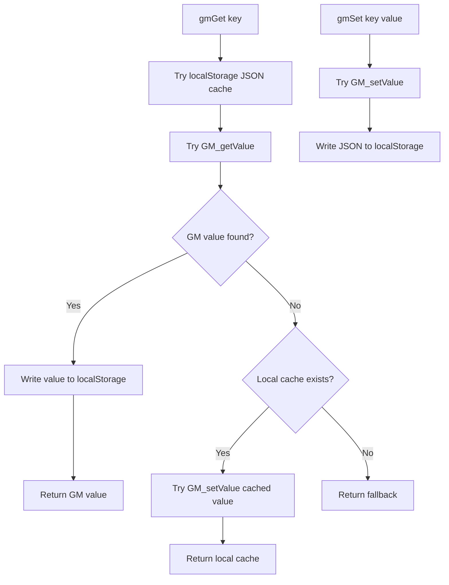

## localStorage

localStorage is used for:

- Mirroring GM storage values.
- QR preview cache.
- QR prefetch timestamp.
- Barcode modal restore state.
- Synchronization fallback through `storage` events.

## Cache

Runtime caches include:

| Cache | Shape | Purpose |
|---|---|---|
| `barcodesCache` | `Barcode[] \| null` | Avoid repeated barcode storage reads. |
| `foldersCache` | `Folder[] \| null` | Avoid repeated folder storage reads. |
| `qrPreviewCache` | `Map` | Cached QR data URLs. |
| `qrPreviewCacheOrder` | `string[]` | LRU-like QR cache order. |
| `clipboardCache` | String | Last copied value. |
| `tasksCache` | `Task[] \| null` | Avoid repeated task storage reads. |

Cache invalidation exists for barcode and folder storage changes through `GM_addValueChangeListener`.

## Synchronization

Synchronization currently exists for:

- `bm_folders`
- `bm_barcodes`

Mechanisms:

- `GM_addValueChangeListener` mirrors new values into localStorage and triggers render/footer updates.
- Browser `storage` event triggers render/footer updates when `bm_folders` or `bm_barcodes` changes.
- Barcode sync also schedules QR preview prefetch.

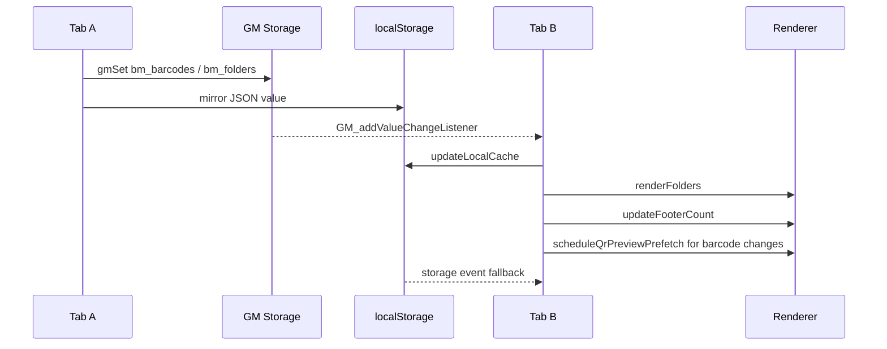

## Backup

Backup is built by `buildFullBackupData()` and imported through `importBackupData()`.

Backup includes:

- Barcode folders
- Barcodes
- Barcode subfolders
- Bookmark folders
- Bookmark subfolders
- Bookmarks
- Todo projects
- Tasks
- Wellness settings
- Print server override
- Print log

`normalizeBackupPayload()` accepts both current flat payloads and some nested bookmark/todo/wellness shapes.

# UI Architecture

## UI Creation Model

The UI is created entirely at runtime from JavaScript. DOM elements are created through `document.createElement`, assigned classes, wired with event listeners, and appended to the panel or document body.

## Tabs

Observed tabs/content areas:

- Barcode tab
- Bookmark tab
- Todo tab

The tab infrastructure uses:

- `tabBar`
- `tabContentContainer`
- `tabsMap`
- `currentTabName`
- `registerTab`
- `switchTab`

## Panels

Primary panel components:

- Floating container
- Floating button
- Floating snooze label
- Main panel
- Header/title area
- Top controls
- Settings dropdown
- Search host
- Tab bar
- Tab content container
- Footer

Panel behavior:

- Panel is hidden by default after initialization.
- Floating button toggles panel visibility.
- Panel size can be resized and persisted in `bm_panel_size`.
- Auto-close behavior exists for panel and modals.

## Dialogs and Modals

Current modal/dialog families:

- New folder modal
- Bookmark folder form/modal-like form
- Bookmark form
- Bookmark move modal
- Bookmark batch move modal
- Manage projects modal
- Insights modal
- Task details modal
- Wellness settings modal
- Folder format-change modal
- Folder/subfolder move modal
- Barcode batch move modal
- Barcode form
- Import modal
- Confirmation modal
- Rename modal
- Big barcode modal
- Print server modal
- Print log modal
- Text print modal
- Text edit modal
- About modal

Modal lifecycle support:

- Auto-close timers
- Hover/activity tracking
- Escape handlers in some modals
- `wireModalIdleTracking`
- `closeAllBmModals`

## Navigation

Navigation exists through:

- Floating button panel toggle
- Tab switching
- Barcode folder/subfolder drilldown
- Back button inside barcode folder view
- Bookmark folder/subfolder navigation
- Search result clicks
- Footer/action dropdown quick actions
- Notification click opens Todo tab

## Rendering Flow

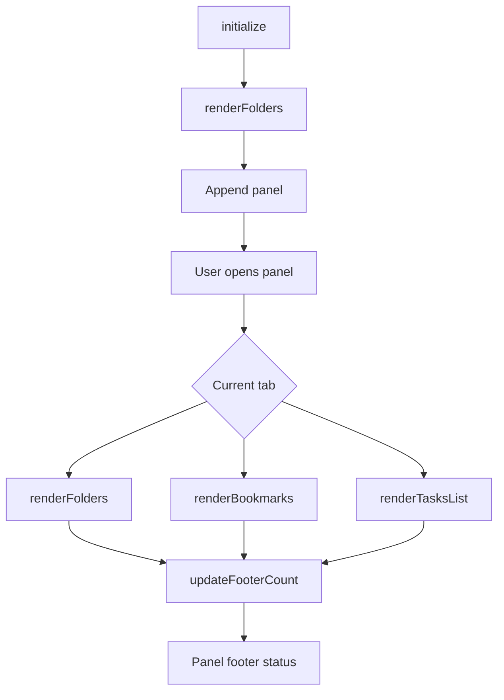

Render wrappers near the footer section wrap `renderFolders`, `renderBookmarks`, `renderTasksList`, and `switchTab` so footer counts update after those operations.

# Services

## Storage Service

Functions:

- `gmGet`
- `gmSet`

Purpose:

- Abstract GM storage/localStorage reads and writes.
- Mirror persistent values across both storage layers.

## QR Preview Cache Service

Functions:

- `getQrPreviewCacheKey`
- `loadQrPreviewCache`
- `queueSaveQrPreviewCache`
- `touchQrPreviewCacheKey`
- `setQrPreviewCacheEntry`
- `scheduleIdle`
- `getQrPrefetchLastRun`
- `setQrPrefetchLastRun`
- `startQrPreviewPrefetchWorker`
- `enqueueQrPreviewPrefetch`
- `scheduleQrPreviewPrefetch`

Purpose:

- Cache QR image previews as data URLs.
- Prefetch QR previews for barcode list rendering.

## Flash Message Service

Function:

- `showFlash`

Purpose:

- Display status, success, info, and error feedback in the UI/footer-message area.

## Footer Quote Service

Functions:

- `isFooterSystemMessageActive`
- `renderFooterQuoteIfAllowed`
- `formatFooterQuoteDisplay`
- `chooseDifferentFooterQuote`
- `applyFooterQuoteNow`
- `clearFooterQuoteTimer`
- `scheduleFooterQuoteRefresh`
- `fetchFooterQuote`

Purpose:

- Fetch and rotate footer quote content.

Related external service:

- `api.quotable.io`

## Notification Service

Functions:

- `sendNativeNotification`
- `sendGmNotification`
- `sendChromeHistoryNotification`
- `sendAppNotification`
- `sendTaskNotification`
- `sendWellnessNotification`
- `sendTestTaskNotification`

Purpose:

- Route notifications through GM notification, native browser notifications, Chrome/Windows notification history behavior, or UI fallback.

## Reminder Scheduler Service

Functions:

- `getNextReminderDelay`
- `scheduleReminderCheck`
- `runReminderCheck`
- `initReminderChecker`

Purpose:

- Poll and trigger task/wellness reminders.

## Audio Alert Service

Functions:

- `getReminderAudioContext`
- `unlockReminderAudio`
- `playReminderSound`

Purpose:

- Play reminder sounds through Web Audio.

## Import/Export/Backup Service

Functions:

- `parseCsvText`
- `parseTxtText`
- `mergeImportData`
- `mergeBookmarkImportData`
- `mergeTodoImportData`
- `buildFullBackupData`
- `normalizeBackupPayload`
- `importBackupData`
- `showImportModal`

Purpose:

- Parse import files.
- Merge imported records.
- Build and restore full backups.

## Print Service

Functions include:

- Print configuration functions
- ZPL generation functions
- Bridge/Printmon request functions
- Barcode/text print entrypoints
- Print log service

Purpose:

- Convert barcode/text data into printable payloads.
- Send print requests.
- Maintain print diagnostics.

## Modal Lifecycle Service

Functions:

- `isAnyBmModalOpen`
- `closeAllBmModals`
- `closePanelAndModals`
- `scheduleModalAutoClose`
- `clearModalAutoClose`
- `resetModalAutoCloseOnActivity`
- `wireModalIdleTracking`

Purpose:

- Centralize modal idle/close behavior.

## Panel Lifecycle Service

Functions:

- `togglePanel`
- `schedulePanelAutoClose`
- `clearPanelAutoClose`
- `closePanelAndModals`
- `updatePanelPosition`

Purpose:

- Manage panel visibility, position, and auto-close behavior.

## Search Service

Functions:

- `showSearchHost`
- `renderBarcodeSearchResults`
- `openBarcodeSearchUI`
- `openTodoSearchUI`
- `openBookmarkSearchUI`
- `closeSearchUI`

Purpose:

- Provide context-aware search UI for barcode, todo, and bookmark modules.

## Context Menu Service

Functions:

- `closeAllContextMenus`
- `buildContextMenu`
- `openContextMenuAtEvent`

Purpose:

- Build and manage custom action menus.

## Clipboard/Page Send Service

Functions:

- `copyToClipboard`
- `sendKeyToTarget`
- `getTargetElement`
- `getSelectedTextFromDocument`
- `sendValueToPage`
- `sendClipboardToPage`
- `cacheClipboardValue`
- `getCachedClipboardValue`

Purpose:

- Copy values and send stored/copied values to page targets.

# Event Flow

## Application Startup

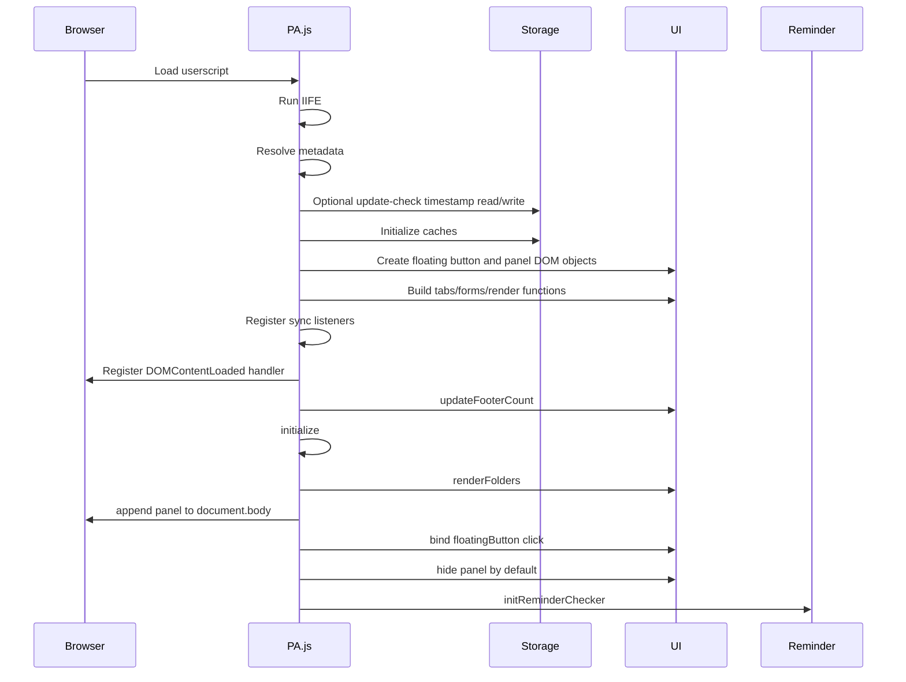

## User Opens Panel

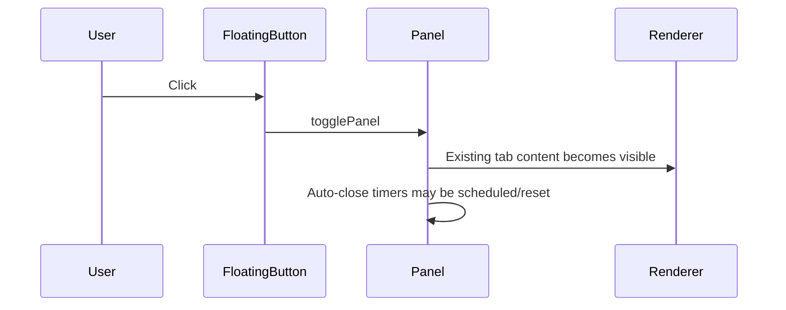

## Barcode Create Flow

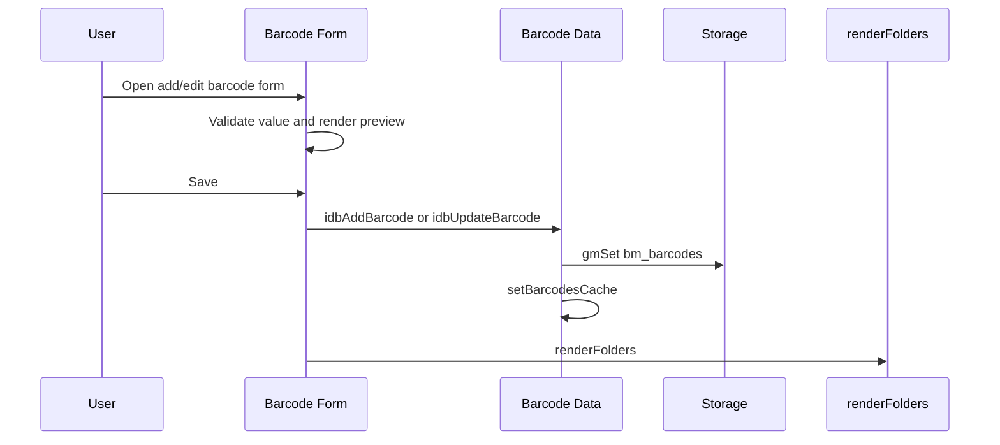

## Import Flow

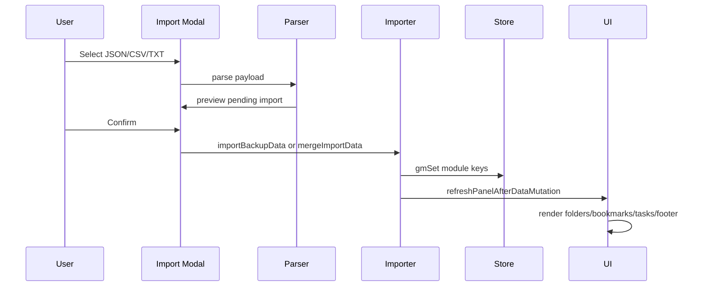

## Reminder Flow

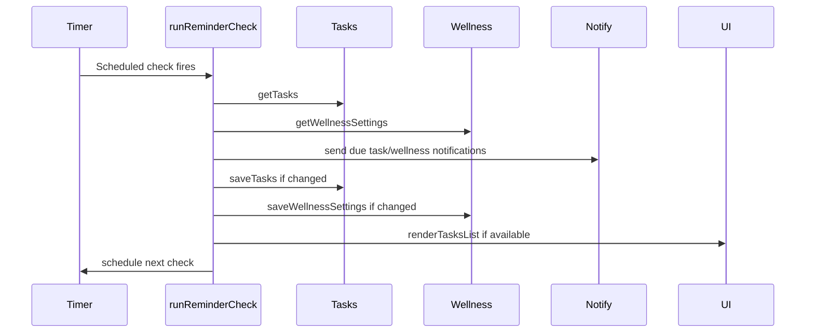

## Cross-Tab Sync Flow

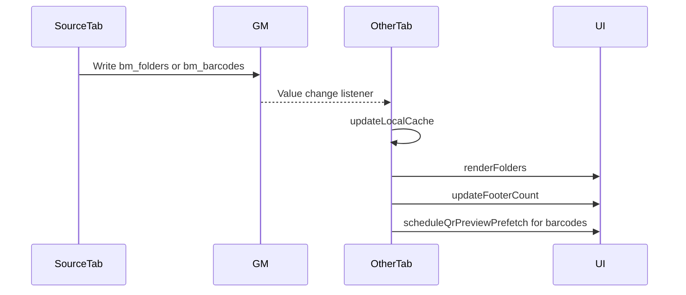

# Dependency Graph

## High-Level Module Dependency Graph

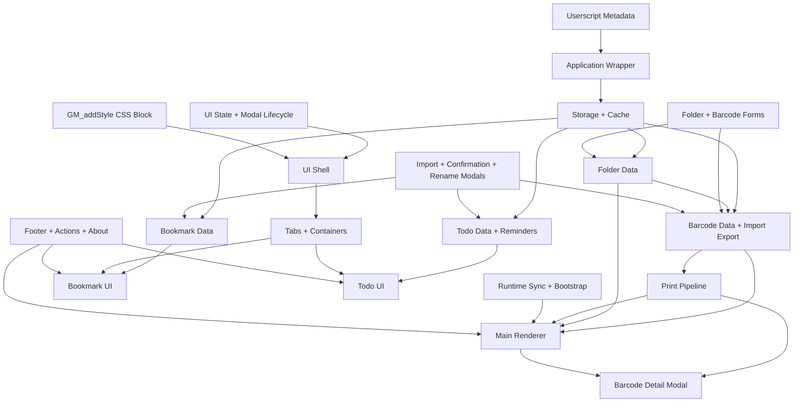

## Storage Dependency Graph

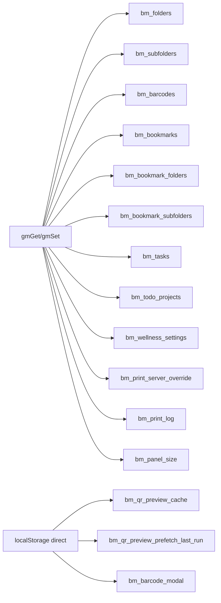

# Performance Notes

Only observations from current code:

- Barcode and folder data use in-memory caches with dirty flags.
- Task data uses an in-memory cache with a dirty flag.
- QR previews are cached in a `Map` and persisted to localStorage.
- QR preview cache has a maximum entry count.
- QR prefetch is throttled by a minimum interval and visibility checks.
- QR prefetch uses a queue and worker-style processing.
- `scheduleIdle` uses `requestIdleCallback` when available and falls back to `setTimeout`.
- Barcode list rendering includes chunked rendering behavior through a `renderChunk` local function.
- Footer quote refresh is timer-based and keeps recent quote history.
- Reminder checks compute the next delay and cap/floor delays with constants.
- Panel size is persisted to avoid recomputing user layout preferences.
- Some render functions are wrapped to update footer counts after render completion.
- Cross-tab sync currently targets folder and barcode keys.

# Technical Debt

Only observations from current code:

- Most implementation currently resides in a single large `PA.js` file.
- Several modules communicate through shared top-level state.
- Many functions are top-level within the IIFE rather than separated into files or explicit module objects.
- Some section boundaries are documented with comments, while many UI subsections are embedded as long contiguous blocks.
- Data model shapes are implicit in CRUD/import/render code rather than centralized schemas.
- Some persistent data keys are string literals spread across modules.
- Some behavior depends on functions declared later in the file, relying on function hoisting and runtime ordering.
- The print pipeline is intentionally documented in-code as kept in-place and not split/reordered without printer access and regression tests.
- Several UI workflows create modal-specific functions and closures inline.
- Cross-tab synchronization is implemented for barcode folders/barcodes, while other persistent domains rely primarily on local operations.
- There is a historical/legacy bookmark default migration path still present.
- `mock_test.html` references `mock_test.css`, but that stylesheet was not present in the scanned file list.
- Empty placeholder directories exist for `src/`, `test/`, `backup/`, and `.github/`.

# Open Questions

- The exact full shape of each `PrintLogEntry` could not be fully determined as a named schema because print log entries are assembled procedurally in the print log service.
- The exact subtask object shape is not centralized as a named model; it is handled inside todo UI/task detail behavior.
- The full set of supported barcode `format` strings is distributed across validation, rendering, print, and form-option logic rather than declared as one central enum.
- The current workspace scan did not include `mock_test.css`, although `mock_test.html` links to it.
- The `src/`, `test/`, `backup/`, and `.github/` directories exist but contain no files in the current scan.
- The runtime behavior of the local ZPL bridge/Printmon endpoint cannot be fully determined from repository code alone.
- The behavior of external services and APIs such as `api.quotable.io`, browser notification permission UX, and userscript manager behavior cannot be fully determined from repository code alone.
- Some UI state variables are introduced near their use sites; a single centralized runtime state map does not exist in the current implementation.
- The document records source structure as observed; if `PA.js` changes, line ranges and function lists should be refreshed from the current file.
