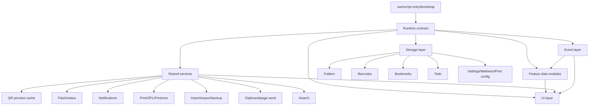
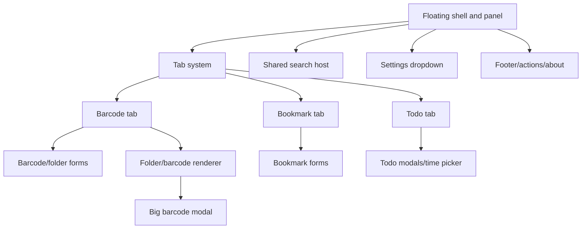
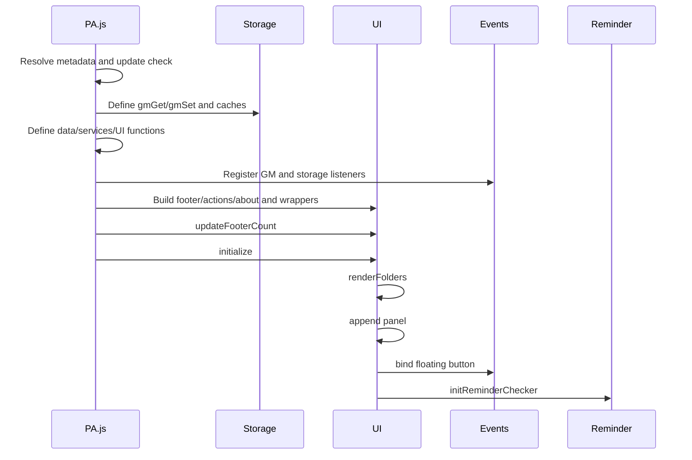
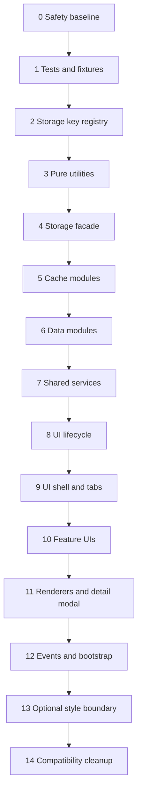

# PA Refactor Plan

Document date: 2026-07-02

Project: PA — Process Assistant

Scope: current implementation only.

This document is a refactoring plan. It is not a refactor implementation. It does not rename functions, split files, delete code, generate replacement code, or change behavior. The project is treated as active production software. Every migration step in this plan must preserve current behavior exactly.

## Non-Negotiable Constraints

- No behavior changes.
- No feature additions.
- No optimizations unless explicitly requested later.
- No function renames during planning or extraction unless a later approved migration explicitly introduces compatibility aliases.
- No deletion during extraction; old paths remain until verified.
- Every step must be small, testable, and reversible.
- No step should touch more than one logical module.
- Public behavior must remain compatible with the current single-userscript runtime.

## Current State Summary

The current codebase is dominated by one production userscript file:

- `PA.js`

The userscript currently includes:

- Metadata and userscript runtime contract
- Storage abstraction and local cache logic
- Folder and subfolder data operations
- Bookmark data operations
- Barcode data operations
- Todo, reminder, notification, wellness, and Pomodoro-related logic
- Import/export/backup handling
- Printmon/ZPL/local bridge print pipeline
- Clipboard and page-send integration
- Floating UI shell
- Tabs and renderers
- Dialogs and modals
- Runtime synchronization and bootstrap
- Footer/action dropdown/about modal
- Injected CSS through `GM_addStyle`

The existing support files are:

- `mock_test.html` — manual browser test harness with mocked userscript APIs
- `analysis/PA_Code_Discovery.md` — current implementation discovery document
- `docs/*` — project documentation

## Refactor Goal

Transform the current single large userscript into a modular architecture while preserving 100% current functionality.

The intended final state is modular, but the migration path must be incremental. The safe migration pattern is:

1. Establish characterization tests and baselines.
2. Create module boundaries without changing behavior.
3. Move pure/shared utilities first.
4. Move storage and services behind compatibility facades.
5. Move feature modules one at a time.
6. Move UI modules last.
7. Keep a compatibility bootstrap until the entire userscript is modular.

## Approved Future Feature Refactors

The following refactors are larger than normal module extraction because they require storage/data-model migration. They must be planned and executed as explicit feature refactors, not hidden inside ordinary cleanup patches.

| Refactor | Status | Architecture document | Notes |
|---|---|---|---|
| Folder Tree Refactor | Proposed | `architecture/Folder_Tree_Refactor.md` | Replace barcode `folders + subfolders` with one recursive folder tree using stable `id` and `parentId`, while preserving UI behavior and legacy compatibility during migration. |

## Proposed Target Module Families

## Extraction Principles

- Extract by dependency direction, not by visual source order alone.
- Pure functions before stateful services.
- Storage keys before storage consumers.
- Data modules before render modules.
- Render modules before shell/bootstrap wiring only when all dependencies are explicit.
- CSS extraction, if ever performed, must be a separate approved step because current UI class names and layout are production behavior.
- Keep a compatibility namespace/facade during migration so current functions can still be called exactly as before.

# Core Modules

The current single-file implementation contains these core logical modules. The detailed extraction plan for each module appears in the next section.

| Core module | Current location in `PA.js` | Refactor target family |
|---|---|---|
| Userscript runtime contract | Metadata, wrapper, version, update-check section | `runtime/` |
| Storage layer | `gmGet`, `gmSet`, storage keys, localStorage mirroring | `core/storage` |
| Runtime cache layer | Barcode/folder/task cache, QR preview cache, clipboard cache | `core/cache` |
| Folder data | Barcode folder/subfolder operations | `features/folders` |
| Barcode data | Barcode CRUD and batch data operations | `features/barcodes` |
| Bookmark data | Bookmark/folder/subfolder operations | `features/bookmarks` |
| Todo data | Task/project/NLP/recurrence data operations | `features/todo` |
| Wellness data | Wellness settings and timing calculations | `features/wellness` |
| Notification/reminder service | Notifications, audio, scheduler, reminder dispatch | `services/reminders-notifications` |
| Import/export/backup service | CSV/TXT parsing, backup payloads, merge imports | `services/import-export-backup` |
| Print service | Print config, logs, ZPL, bridge, Printmon | `services/print` |
| Page integration service | Clipboard, selected text, active target, send-to-page | `services/page-integration` |
| UI lifecycle | Panel/modal timers and close/toggle behavior | `ui/lifecycle` |
| UI shell | Floating button, panel, header, settings, search | `ui/shell` |
| Tab system | Tab registration, tab switching, tab content containers | `ui/tabs` |
| Bookmark UI | Bookmark forms and renderer | `features/bookmarks/ui` |
| Todo UI | Todo tab, modals, filters, time picker, task renderer | `features/todo/ui` |
| Barcode forms | Folder/barcode forms, validation, live preview | `features/barcodes/forms` |
| Barcode renderer | Folder grid, subfolder cards, barcode list/cards | `features/barcodes/render` |
| Barcode detail modal | Big barcode modal and print preview | `features/barcodes/detail-modal` |
| Event layer | Cross-tab sync, DOMContentLoaded restore, runtime listeners | `events/` |
| Initialization flow | `initialize`, final startup calls, bootstrap ordering | `bootstrap/` |
| CSS injection | `GM_addStyle` block | `ui/styles` |

# Module Plan

Each module below describes the intended module boundary based on current code. Function names are current names and must not be renamed as part of this plan.

## 1. Userscript Runtime Contract Module

### Module Name

`runtime/userscript-contract`

### Responsibilities

- Preserve userscript metadata assumptions.
- Represent required grants and external runtime APIs.
- Represent required global libraries: `JsBarcode`, `QRCode`.
- Preserve script metadata values: `SCRIPT_VERSION`, `SCRIPT_LAST_UPDATE`.
- Preserve update-check behavior.

### Dependencies

- `GM_info`
- `GM_getValue`
- `GM_setValue`
- `GM_xmlhttpRequest`
- `window.location`
- Userscript metadata block

### Global Variables Used

- `GM_info`
- `GM_getValue`
- `GM_setValue`
- `GM_xmlhttpRequest`
- `window`
- `SCRIPT_VERSION`
- `SCRIPT_LAST_UPDATE`

### Storage Keys Used

- `PA` — update-check timestamp

### DOM Dependencies

- None directly, except `window.location.href` for update redirect.

### Functions Included

- `SCRIPT_VERSION` resolver
- `SCRIPT_LAST_UPDATE` resolver
- Anonymous update-check IIFE logic

### Risk Level

Medium.

Reason: This code executes before everything else and depends on userscript runtime behavior.

### Recommended Extraction Order

Late foundation phase, after tests verify startup behavior and metadata-derived about modal values.

---

## 2. Storage Layer Module

### Module Name

`core/storage`

### Responsibilities

- Preserve `gmGet` and `gmSet` behavior.
- Mirror GM storage and localStorage exactly as today.
- Keep fallback behavior for mocked/non-userscript environments.
- Centralize persistent key definitions without changing key strings.

### Dependencies

- `GM_getValue`
- `GM_setValue`
- `localStorage`
- JSON serialization/deserialization

### Global Variables Used

- `GM_getValue`
- `GM_setValue`
- `localStorage`

### Storage Keys Used

All persistent keys are accessed through this layer once extracted, including:

- `PA`
- `bm_last_copied`
- `bm_qr_preview_cache`
- `bm_qr_preview_prefetch_last_run`
- `bm_folders`
- `bm_subfolders`
- `bm_barcodes`
- `bm_bookmarks`
- `bm_bookmark_folders`
- `bm_bookmark_subfolders`
- `bm_bookmark_no_defaults_migrated`
- `bm_tasks`
- `bm_todo_projects`
- `bm_wellness_settings`
- `bm_print_server_override`
- `bm_print_log`
- `bm_panel_size`
- `bm_barcode_modal`

### DOM Dependencies

None.

### Functions Included

- `gmGet`
- `gmSet`

### Risk Level

High.

Reason: Every production feature depends on storage semantics and localStorage/GM mirroring.

### Recommended Extraction Order

After pure utility extraction and characterization tests. Extract as a compatibility wrapper first, keeping original names available.

---

## 3. Storage Key Registry Module

### Module Name

`core/storage-keys`

### Responsibilities

- Document and eventually centralize storage key constants.
- Preserve exact string values.
- Provide a non-behavior-changing reference point for future modules.

### Dependencies

None.

### Global Variables Used

None.

### Storage Keys Used

Defines string constants only. No direct reads/writes.

### DOM Dependencies

None.

### Functions Included

No functions required.

### Risk Level

Low.

Reason: Constants can be extracted safely if values remain identical and old references are preserved during migration.

### Recommended Extraction Order

First extraction step after tests. This is a small, reversible boundary.

---

## 4. Runtime Cache Module

### Module Name

`core/cache`

### Responsibilities

- Manage in-memory barcode, folder, task, QR preview, clipboard, and prefetch caches.
- Preserve dirty-flag behavior.
- Preserve QR preview cache persistence and prefetch throttling.
- Preserve cache invalidation listeners.

### Dependencies

- Storage layer
- `localStorage`
- `QRCode`
- `document.visibilityState`
- Timers
- Barcode data access at runtime
- `GM_addValueChangeListener`

### Global Variables Used

- `barcodesCache`
- `foldersCache`
- `barcodesCacheDirty`
- `foldersCacheDirty`
- `tasksCache`
- `tasksCacheDirty`
- `clipboardCache`
- `qrPreviewCache`
- `qrPreviewCacheOrder`
- `qrPreviewCacheSaveTimer`
- `qrPreviewPrefetchQueue`
- `qrPreviewPrefetchQueuedKeys`
- `qrPreviewPrefetchRunning`
- `qrPreviewPrefetchDebounce`
- `QRCode`
- `document`
- `localStorage`
- `GM_addValueChangeListener`

### Storage Keys Used

- `bm_last_copied`
- `bm_qr_preview_cache`
- `bm_qr_preview_prefetch_last_run`
- `bm_barcodes`
- `bm_folders`

### DOM Dependencies

- `document.visibilityState`
- `document.createElement('canvas')` in QR prefetch path

### Functions Included

- `getQrPreviewCacheKey`
- `loadQrPreviewCache`
- `queueSaveQrPreviewCache`
- `touchQrPreviewCacheKey`
- `setQrPreviewCacheEntry`
- `scheduleIdle`
- `getQrPrefetchLastRun`
- `setQrPrefetchLastRun`
- `startQrPreviewPrefetchWorker`
- `enqueueQrPreviewPrefetch`
- `scheduleQrPreviewPrefetch`
- `setBarcodesCache`
- `setFoldersCache`
- `invalidateBarcodesCache`
- `invalidateFoldersCache`
- `cacheClipboardValue`
- `getCachedClipboardValue`

### Risk Level

Medium.

Reason: Cache behavior affects render performance and cross-tab behavior. QR rendering depends on async behavior.

### Recommended Extraction Order

After storage layer compatibility is locked. Extract QR cache and clipboard cache separately before barcode/folder cache dirty flags.

---

## 5. Folder Data Module

### Module Name

`features/folders/data`

### Responsibilities

- Manage barcode folder and subfolder persistence.
- Preserve folder/subfolder CRUD.
- Preserve folder destination parsing.
- Preserve cascading barcode updates/deletes during folder/subfolder operations.
- Preserve active folder/subfolder updates.

### Dependencies

- Storage layer
- Cache module
- Barcode data module
- Flash service
- Folder renderer
- Modal UI service for new folder modal

### Global Variables Used

- `foldersCache`
- `foldersCacheDirty`
- `activeFolder`
- `activeSubFolder`
- `panel`
- `formWrapper`

### Storage Keys Used

- `bm_folders`
- `bm_subfolders`
- `bm_barcodes`

### DOM Dependencies

- Select elements passed into population functions
- `document.createElement`
- `panel.appendChild`
- Modal DOM classes

### Functions Included

- `getFolders`
- `populateFolderSelect`
- `getSelectedFolderValue`
- `populateFolderTreeSelect`
- `parseTreeSelectValue`
- `normalizeFolderDestination`
- `createFolderDestinationSelect`
- `getSelectedFolderDestination`
- `showNewFolderModal`
- `saveFolder`
- `updateFolder`
- `deleteFolder`
- `renameFolder`
- `getAllSubFolders`
- `getSubFolders`
- `saveSubFolder`
- `deleteSubFolder`
- `renameSubFolder`
- `updateSubFolder`
- `moveFolderTo`
- `moveSubFolderTo`

### Risk Level

High.

Reason: Folder operations are tightly coupled to barcode records and renderer state.

### Recommended Extraction Order

After barcode data access has a compatibility facade, but before moving the main renderer.

---

## 6. Bookmark Data Module

### Module Name

`features/bookmarks/data`

### Responsibilities

- Manage bookmark records.
- Manage bookmark folders and subfolders.
- Preserve URL normalization and favicon derivation.
- Preserve deduplication semantics.
- Preserve legacy default migration behavior.
- Preserve bookmark selection side effects.

### Dependencies

- Storage layer
- Flash service
- Bookmark renderer
- URL API

### Global Variables Used

- `bookmarkActiveFolder`
- `bookmarkActiveSubFolder`
- `bookmarkSearchQuery`
- `selectedBookmarkIds`

### Storage Keys Used

- `bm_bookmarks`
- `bm_bookmark_folders`
- `bm_bookmark_subfolders`
- `bm_bookmark_no_defaults_migrated`

### DOM Dependencies

None in pure data functions except renderer callbacks invoked after mutation.

### Functions Included

- `normalizeBookmarkUrl`
- `getBookmarkDomain`
- `getBookmarkOrigin`
- `getBookmarkFaviconUrl`
- `getBookmarkFallbackFaviconUrl`
- `getBookmarks`
- `sanitizeBookmarkList`
- `saveBookmarks`
- `getBookmarkFolders`
- `saveBookmarkFolders`
- `getAllBookmarkSubFolders`
- `saveBookmarkSubFolders`
- `getBookmarkSubFolders`
- `ensureBookmarkDefaults`
- `saveBookmarkFolder`
- `saveBookmarkSubFolder`
- `updateBookmarkFolder`
- `updateBookmarkSubFolder`
- `renameBookmarkFolder`
- `renameBookmarkSubFolder`
- `deleteBookmarkFolder`
- `deleteBookmarkSubFolder`
- `addOrUpdateBookmark`
- `updateBookmark`
- `updateBookmarksByIds`
- `deleteBookmark`
- `deleteBookmarksByIds`
- `moveBookmarkFolderTo`
- `moveBookmarkSubFolderTo`

### Risk Level

Medium.

Reason: Bookmark module is comparatively self-contained but still calls renderer and flash behavior.

### Recommended Extraction Order

After storage and flash services, before bookmark UI extraction.

---

## 7. Todo Data Module

### Module Name

`features/todo/data`

### Responsibilities

- Manage task persistence.
- Manage project persistence.
- Preserve task CRUD, recurrence, archive, completion, snooze, and Pomodoro state fields.
- Preserve NLP parsing behavior for task due dates and tags.

### Dependencies

- Storage layer
- Reminder scheduler
- Todo renderer callbacks

### Global Variables Used

- `tasksCache`
- `tasksCacheDirty`
- `updateTaskTabBadge`
- `updateReminderCountdownDisplays`
- `scheduleReminderCheck`

### Storage Keys Used

- `bm_tasks`
- `bm_todo_projects`

### DOM Dependencies

None for core data operations.

### Functions Included

- `getTasks`
- `saveTasks`
- `composeTaskDueDate`
- `getActiveSnoozedTasks`
- `getNearestActiveSnooze`
- `formatCountdownClock`
- `getTodoProjects`
- `saveTodoProjects`
- `addTodoProject`
- `deleteTodoProject`
- `renameTodoProject`
- `getNextRecurrenceDate`
- `extractTags`
- `parseTaskTextWithNLP`
- `addTask`
- `updateTask`
- `deleteTask`
- `getPendingTaskReminderCount`
- `snoozeTaskReminder`
- `stopSnoozedTaskReminder`
- `toggleTask`
- `clearCompletedTasks`

### Risk Level

High.

Reason: Todo data is coupled to reminder scheduling, UI badges, recurrence behavior, and task detail forms.

### Recommended Extraction Order

After storage and before reminder service extraction, with characterization tests for task mutations.

---

## 8. Wellness Settings Module

### Module Name

`features/wellness/data`

### Responsibilities

- Preserve wellness settings normalization.
- Preserve water/stretch timing calculations.
- Preserve wellness toggle state effects.

### Dependencies

- Storage layer
- Reminder scheduler
- Todo wellness UI callback

### Global Variables Used

- `refreshWellnessTodoToggles`
- `scheduleReminderCheck`

### Storage Keys Used

- `bm_wellness_settings`

### DOM Dependencies

None for data functions.

### Functions Included

- `clampWellnessMinutes`
- `normalizeWellnessSettings`
- `getWellnessWaterIntervalMs`
- `getWellnessStretchIntervalMs`
- `getWellnessBreakMinutes`
- `getWellnessSettings`
- `saveWellnessSettings`
- `setWellnessToggle`
- `hasPendingReminderDemand`

### Risk Level

Medium.

Reason: The logic is simple but coupled to reminder scheduling and Todo UI toggles.

### Recommended Extraction Order

After Todo data extraction and before reminder scheduler extraction.

---

## 9. Notification and Reminder Service Module

### Module Name

`services/reminders-notifications`

### Responsibilities

- Preserve notification permission behavior.
- Preserve GM/native/Chrome notification routing.
- Preserve reminder audio behavior.
- Preserve task and wellness reminder scheduling.
- Preserve reminder click behavior that opens Todo tab.

### Dependencies

- Todo data module
- Wellness data module
- UI shell functions: `togglePanel`, `switchTab`
- `panel`
- Browser Notification API
- `GM_notification`
- Web Audio API
- Browser timers

### Global Variables Used

- `reminderAudioCtx`
- `reminderCheckTimer`
- `panel`
- `switchTab`
- `togglePanel`
- `renderTasksList`

### Storage Keys Used

Indirectly:

- `bm_tasks`
- `bm_wellness_settings`

### DOM Dependencies

- `document.addEventListener` for audio unlock
- `window.focus`
- Panel visibility checks

### Functions Included

- `isChromeLikeBrowser`
- `ensureNotificationPermissionIfNeeded`
- `getReminderAudioContext`
- `unlockReminderAudio`
- `playReminderSound`
- `sendNativeNotification`
- `sendGmNotification`
- `sendChromeHistoryNotification`
- `sendAppNotification`
- `sendWellnessNotification`
- `getNextReminderDelay`
- `scheduleReminderCheck`
- `runReminderCheck`
- `initReminderChecker`
- `sendTaskNotification`
- `sendTestTaskNotification`

### Risk Level

High.

Reason: Browser permission behavior, timers, audio unlock, notification click routing, and reminder state changes are all user-visible.

### Recommended Extraction Order

After Todo and Wellness data modules are stable. Extract notification sending before scheduler loop.

---

## 10. Barcode Data Module

### Module Name

`features/barcodes/data`

### Responsibilities

- Preserve barcode ID generation and repair behavior.
- Preserve barcode CRUD.
- Preserve batch delete/move/update behavior.
- Preserve folder/subfolder filtering behavior.

### Dependencies

- Storage layer
- Cache module
- Folder data module

### Global Variables Used

- `barcodesCache`
- `barcodesCacheDirty`

### Storage Keys Used

- `bm_barcodes`

### DOM Dependencies

None for data functions.

### Functions Included

- `makeBarcodeId`
- `getBarcodes`
- `idbAddBarcode`
- `idbGetBarcodesByFolder`
- `idbUpdateBarcode`
- `idbDeleteBarcode`
- `deleteBarcodesByIds`
- `moveBarcodesToFolder`
- `updateFolderBarcodesFormat`

### Risk Level

High.

Reason: Barcode records are central to folder rendering, printing, previewing, import/export, and search.

### Recommended Extraction Order

After storage/cache foundations. Extract before forms/renderers/import/export.

---

## 11. Barcode Utility Module

### Module Name

`features/barcodes/utils`

### Responsibilities

- Preserve barcode format normalization.
- Preserve URL detection.
- Preserve smart name generation helpers.
- Preserve barcode value validation/check-digit helpers.
- Preserve preview value helpers.

### Dependencies

- Barcode data access for uniqueness checks
- URL API

### Global Variables Used

- `SMART_NAME_MAX_LEN`

### Storage Keys Used

Indirectly via barcode data lookup:

- `bm_barcodes`

### DOM Dependencies

None for pure helpers.

### Functions Included

- `normalizeBarcodeFormatInput`
- `isLikelyUrlValue`
- `ellipsizeText`
- `buildSmartBaseName`
- `makeUniqueName`
- `generateSmartBarcodeName`
- `validateBarcodeValue`
- `calcEan13CheckDigit`
- `calcEan8CheckDigit`
- `calcUpcCheckDigit`
- `makePreviewDigits`
- `getPreviewData`
- Form-local `isLikelyURL` behavior should be reconciled by compatibility, not renamed.

### Risk Level

Medium.

Reason: Utility behavior affects names, validation, form options, rendering, and print format mapping.

### Recommended Extraction Order

Before barcode forms and renderers. Keep compatibility wrappers for duplicate `isLikelyURL`/`isLikelyUrlValue` behavior.

---

## 12. Flash Message and Footer Quote Service Module

### Module Name

`services/status-feedback`

### Responsibilities

- Preserve flash message display behavior.
- Preserve footer quote fetching and refresh behavior.
- Preserve footer quote click behavior.

### Dependencies

- DOM footer/message target
- `GM_xmlhttpRequest`
- `fetch` fallback behavior where present
- Timers
- `unsafeWindow` fallback to `window` for footer click capture

### Global Variables Used

- `footerRecentQuotes`
- `footerQuoteTimer`
- `footerQuoteText`
- `footerQuoteTitle`
- `footerQuoteLastFetchedAt`
- `footerQuotePool`
- `footerCenter`
- `window._barcodeFlash`
- `window._barcodeFlashActive`
- `unsafeWindow`

### Storage Keys Used

None observed for quote state. Runtime state only.

### DOM Dependencies

- Footer center element
- Click listener on `unsafeWindow` or `window`
- Flash DOM target

### Functions Included

- `safeAppend`
- `showFlash`
- `isFooterSystemMessageActive`
- `renderFooterQuoteIfAllowed`
- `formatFooterQuoteDisplay`
- `chooseDifferentFooterQuote`
- `applyFooterQuoteNow`
- `clearFooterQuoteTimer`
- `scheduleFooterQuoteRefresh`
- `fetchFooterQuote`

### Risk Level

Medium.

Reason: User-visible status behavior and event-capture behavior can break subtly.

### Recommended Extraction Order

After UI footer target is represented by a stable adapter. `safeAppend` can move earlier as a pure DOM utility.

---

## 13. Import Export and Backup Module

### Module Name

`services/import-export-backup`

### Responsibilities

- Preserve CSV/TXT parsing behavior.
- Preserve full backup schema and compatibility normalization.
- Preserve merge semantics for barcodes, folders, bookmarks, tasks, wellness, print settings, and print logs.
- Preserve import result messages.

### Dependencies

- Storage layer
- Folder data module
- Barcode data module
- Bookmark data module
- Todo data module
- Wellness data module
- Print config/log module
- Render refresh function
- Flash service

### Global Variables Used

- `activeFolder`
- `activeSubFolder`
- `bookmarkActiveFolder`
- `bookmarkActiveSubFolder`
- `selectedBookmarkIds`

### Storage Keys Used

- `bm_folders`
- `bm_subfolders`
- `bm_barcodes`
- `bm_bookmark_folders`
- `bm_bookmark_subfolders`
- `bm_bookmarks`
- `bm_todo_projects`
- `bm_tasks`
- `bm_wellness_settings`
- `bm_print_server_override`
- `bm_print_log`

### DOM Dependencies

Parsing and merge functions do not require DOM; `showImportModal` does.

### Functions Included

- `detectDelimiter`
- `parseDelimitedLine`
- `parseCsvText`
- `parseTxtText`
- `mergeImportData`
- `mergeBookmarkImportData`
- `mergeTodoImportData`
- `buildFullBackupData`
- `normalizeBackupPayload`
- `importBackupData`

### Risk Level

High.

Reason: Import/export touches every persistent domain and can affect production data.

### Recommended Extraction Order

After all data modules have stable facades. Extract parsing helpers first, then backup builder, then import merge functions.

---

## 14. Print Configuration and Log Module

### Module Name

`services/print/config-log`

### Responsibilities

- Preserve print server override behavior.
- Preserve default print server resolution.
- Preserve print log read/write/add/update/showModal behavior.

### Dependencies

- Storage layer
- DOM modal support for log modal
- Flash/status service

### Global Variables Used

- `PRINT_LOG`
- `ENABLE_PRINT_LOG`

### Storage Keys Used

- `bm_print_server_override`
- `bm_print_log`

### DOM Dependencies

- Print log modal DOM
- Print server modal DOM if grouped with config UI

### Functions Included

- `buildDefaultPrintServer`
- `initPrintLog`
- `getPrintServerOverride`
- `setPrintServerOverride`
- `getDefaultPrintServer`
- `resolvePrintServer`

### Risk Level

Medium.

Reason: Print behavior is production-sensitive, but config/log boundaries are clearer than sending logic.

### Recommended Extraction Order

Before moving the print sender/ZPL logic. Keep `PRINT_LOG` behavior identical.

---

## 15. Print ZPL and Printmon Module

### Module Name

`services/print/zpl-printmon`

### Responsibilities

- Preserve ZPL generation.
- Preserve local ZPL bridge behavior.
- Preserve Printmon fallback behavior.
- Preserve Amazon FC Printmon-specific assumptions.
- Preserve badge cookie behavior.
- Preserve barcode/text print entrypoints.

### Dependencies

- Print config/log module
- Storage layer
- `GM_xmlhttpRequest`
- `fetch`
- `AbortSignal.timeout`
- `document.cookie`
- Flash service

### Global Variables Used

- `QR_BRIDGE_PORT`
- `QR_BRIDGE_URL`
- `_qrBridgeAvailable`
- `_qrBridgeLastCheck`
- `QR_BRIDGE_CHECK_INTERVAL`
- `PRINT_LOG`
- `window.__BM_PRINT_DESC_NEWLINE`

### Storage Keys Used

Indirectly:

- `bm_print_server_override`
- `bm_print_log`

### DOM Dependencies

- `document.cookie` for badge/employee ID

### Functions Included

- `asciihex`
- `genId`
- `getDefaultBadgeId`
- `buildQrZpl`
- `buildCode128Zpl`
- `buildTextZpl`
- `buildZplForPrint`
- `isQrBridgeAvailable`
- `sendZplViaBridge`
- `sendPrintRequest`
- `printmonBarcode`
- `printmonTextLabel`
- `printTextRawLabel`
- `normalizePrintFormat`
- `resolvePrintType`
- `joinDescLinesForPrint`
- `wrapDescWords`
- `formatDescForPrint`
- `printBarcodeValue`
- `printBarcodeModal`
- `printTextLabel`

### Risk Level

Very High.

Reason: Current code comments explicitly warn not to split/reorder print behavior without printer access and regression tests. It includes production-specific Printmon/ZPL behavior.

### Recommended Extraction Order

Late. Do not extract until print characterization tests exist for QR, Code128, text label, bridge-available, bridge-unavailable, and Printmon fallback paths.

---

## 16. Clipboard and Page Integration Module

### Module Name

`services/page-integration`

### Responsibilities

- Preserve copy-to-clipboard behavior.
- Preserve selected text detection.
- Preserve active-target detection outside PA panel.
- Preserve keyboard event dispatch behavior.
- Preserve send-to-page behavior.
- Preserve clipboard permission fallback/prompt behavior.

### Dependencies

- Browser Clipboard API
- Browser Permissions API
- DOM active element and selection APIs
- Flash service
- Clipboard cache service
- `panel`

### Global Variables Used

- `panel`
- `navigator.clipboard`
- `navigator.permissions`
- `window`
- `document`

### Storage Keys Used

- `bm_last_copied`

### DOM Dependencies

- `document.activeElement`
- `window.getSelection`
- `KeyboardEvent`
- Input/textarea selection fields
- Target element dispatch events

### Functions Included

- `copyToClipboard`
- `sendKeyToTarget`
- `getTargetElement`
- `getSelectedTextFromDocument`
- `sendValueToPage`
- `isInsideTightHitbox`
- `sendClipboardToPage`

### Risk Level

High.

Reason: It interacts with arbitrary host pages and uses synthetic keyboard events.

### Recommended Extraction Order

After flash/cache modules and before moving UI buttons that call it.

---

## 17. Text Print UI Module

### Module Name

`features/text-print/ui`

### Responsibilities

- Preserve text print modal behavior.
- Preserve text edit modal behavior.
- Preserve text wrapping/page divider UI behavior.

### Dependencies

- Print service
- DOM APIs
- Flash service
- Modal lifecycle service

### Global Variables Used

- Text modal local state only

### Storage Keys Used

None directly.

### DOM Dependencies

- Modal DOM
- Textarea DOM
- Character counters

### Functions Included

- `addTextPageDivider`
- `addTextPageDividers`
- `applyTextareaPageDivider`
- `wrapPrintValue`
- `normalizeTextForPrint`
- `truncateByColumns`
- `justifyLinePreserve`
- `wrapJustifyText`
- `getMaxCharsForElement`
- `clampTextLines`
- `preserveSpacesForPrint`
- `showTextPrintModal`
- `showTextEditModal`

### Risk Level

Medium.

Reason: User-visible print UI depends on print service but is relatively isolated.

### Recommended Extraction Order

After print service is wrapped, before footer action dropdown extraction.

---

## 18. Modal and Panel Lifecycle Module

### Module Name

`ui/lifecycle`

### Responsibilities

- Preserve modal open/close detection.
- Preserve modal and panel auto-close timers.
- Preserve panel toggle behavior.
- Preserve idle tracking behavior.

### Dependencies

- DOM APIs
- Timers
- Panel shell state
- Settings dropdown/search UI adapters

### Global Variables Used

- `panelAutoCloseTimer`
- `modalAutoCloseTimer`
- `panelHovering`
- `modalHovering`
- `panel`

### Storage Keys Used

None.

### DOM Dependencies

- `.bm-modal`
- `panel`
- Event listeners on modals

### Functions Included

- `isAnyBmModalOpen`
- `closeAllBmModals`
- `closePanelAndModals`
- `isPanelListViewActive`
- `schedulePanelAutoClose`
- `clearPanelAutoClose`
- `scheduleModalAutoClose`
- `clearModalAutoClose`
- `resetModalAutoCloseOnActivity`
- `wireModalIdleTracking`
- `togglePanel`

### Risk Level

High.

Reason: Auto-close and modal behavior are cross-cutting and user-visible.

### Recommended Extraction Order

After UI shell has an adapter object for `panel`, but before moving individual modals.

---

## 19. UI Shell Module

### Module Name

`ui/shell`

### Responsibilities

- Preserve floating button and panel creation.
- Preserve panel sizing and positioning.
- Preserve settings dropdown behavior.
- Preserve top controls.
- Preserve shared search host.
- Preserve reset/import/export/print/wellness button wiring.

### Dependencies

- DOM APIs
- MutationObserver
- Storage layer
- Lifecycle module
- Import/export service
- Print config/log service
- Wellness modal
- Search service
- Renderers

### Global Variables Used

- `floatingContainer`
- `floatingButton`
- `buttonSpan`
- `floatingSnoozeLabel`
- `panel`
- `resizeHandle`
- `settingsDropdown`
- `searchActive`
- `searchInput`
- `barcodeSearchQuery`
- `searchHost`

### Storage Keys Used

- `bm_panel_size`
- Reset action writes/clears multiple production keys

### DOM Dependencies

- `document.createElement`
- `document.body`
- Window/document event listeners
- Panel resize mouse events
- Settings dropdown positioning

### Functions Included

- `updatePanelPosition`
- `closeSettingsDropdown`
- `showPrintServerModal`
- `closeDropdownOnClick`
- `showSearchHost`
- `renderBarcodeSearchResults`
- `openBarcodeSearchUI`
- `openTodoSearchUI`
- `openBookmarkSearchUI`
- `closeSearchUI`
- `refreshPanelAfterDataMutation`

### Risk Level

Very High.

Reason: Shell creation order defines many globals used by later modules.

### Recommended Extraction Order

Late. First introduce a shell state object/facade without moving DOM construction.

---

## 20. Tab System Module

### Module Name

`ui/tabs`

### Responsibilities

- Preserve tab bar and content container behavior.
- Preserve tab registration and switching.
- Preserve current tab state.

### Dependencies

- DOM APIs
- Footer count update wrapper
- Search close behavior

### Global Variables Used

- `tabBar`
- `tabContentContainer`
- `tabsMap`
- `currentTabName`
- `switchTab`
- `registerTab`

### Storage Keys Used

None.

### DOM Dependencies

- Tab button elements
- Tab content containers

### Functions Included

- `registerTab`
- `switchTab`
- Runtime assignment `window.bmSwitchTab = switchTab`

### Risk Level

High.

Reason: Tab switching controls visibility and footer status across all feature UIs.

### Recommended Extraction Order

After UI shell is stable and before individual tab UI modules are moved.

---

## 21. Bookmark UI Module

### Module Name

`features/bookmarks/ui`

### Responsibilities

- Preserve bookmark tab content.
- Preserve bookmark forms.
- Preserve bookmark folder/subfolder navigation.
- Preserve bookmark item rendering.
- Preserve bookmark batch actions.

### Dependencies

- Bookmark data module
- Tab system
- Modal lifecycle
- Flash service
- Footer update service

### Global Variables Used

- `bookmarksTabContent`
- `bookmarkFormWrapper`
- `bookmarkDisplay`
- `bookmarkActiveFolder`
- `bookmarkActiveSubFolder`
- `bookmarkSearchQuery`
- `selectedBookmarkIds`

### Storage Keys Used

Indirectly:

- `bm_bookmarks`
- `bm_bookmark_folders`
- `bm_bookmark_subfolders`

### DOM Dependencies

- Bookmark form elements
- Bookmark display container
- Bookmark cards/context controls

### Functions Included

- `populateBookmarkDestinationSelect`
- `parseBookmarkDestination`
- `createBookmarkDestinationSelect`
- `showBookmarkFolderForm`
- `showBookmarkForm`
- `showBookmarkMoveModal`
- `showBookmarkBatchMoveModal`
- `createBookmarkFolderIcon`
- `renderBookmarks`
- `createBookmarkItem`

### Risk Level

Medium.

Reason: Bookmark UI is sizeable but comparatively independent from barcode UI.

### Recommended Extraction Order

After bookmark data module and tab system extraction.

---

## 22. Todo UI Module

### Module Name

`features/todo/ui`

### Responsibilities

- Preserve Todo tab layout.
- Preserve filters, search, project/tag controls, sort, archive/active state.
- Preserve task form behavior.
- Preserve task details modal.
- Preserve project management modal.
- Preserve insights modal.
- Preserve subtasks, time picker, reminder countdown, wellness toggles, and Pomodoro UI.

### Dependencies

- Todo data module
- Wellness data module
- Reminder service
- Tab system
- Modal lifecycle
- Flash service
- Footer update service

### Global Variables Used

- `todoTabContent`
- `currentFilter`
- `currentProjectFilter`
- `currentTagFilter`
- `currentSort`
- `taskSearchQuery`
- `showingArchive`
- `taskSnoozeUiRefs`
- `refreshWellnessTodoToggles`
- `updateTaskTabBadge`
- `updateReminderCountdownDisplays`
- `renderTasksList`

### Storage Keys Used

Indirectly:

- `bm_tasks`
- `bm_todo_projects`
- `bm_wellness_settings`

### DOM Dependencies

- Todo tab container
- Filter controls
- Task form controls
- Modal DOM
- Time picker DOM
- Countdown displays

### Functions Included

- `updateWellnessTodoToggleButtons`
- `showManageProjectsModal`
- `updateProjectAndTagDropdowns`
- `formatLocalDateToHTML`
- `populateMainProjectSelect`
- `populateProjectSelects`
- `startReminderCountdownUiTimer`
- `renderTasksList`
- `renderInlineSubtasks`
- `submitNewTask`
- `createCustomModal`
- `showInsightsModal`
- `showTaskDetailsModal`
- `closeOpenFolderMenu`
- `toggleDropdown`
- `closeDropdown`
- `closeDropdownOnOutsideClick`

### Risk Level

Very High.

Reason: This is one of the largest UI blocks and contains many nested callbacks and runtime state variables.

### Recommended Extraction Order

Late UI phase, after Todo data and reminder service are stable. Extract smaller UI submodules first only after a stable adapter exists.

---

## 23. Folder and Barcode Form UI Module

### Module Name

`features/barcodes/forms`

### Responsibilities

- Preserve folder creation form.
- Preserve barcode creation/edit form.
- Preserve barcode validation and live preview.
- Preserve move and format-change modals.

### Dependencies

- Folder data module
- Barcode data module
- Barcode utility module
- `JsBarcode`
- `QRCode`
- Modal lifecycle
- Flash service
- Main renderer

### Global Variables Used

- `formWrapper`
- `folderDisplay`
- `panel`
- `activeFolder`
- `activeSubFolder`

### Storage Keys Used

Indirectly:

- `bm_folders`
- `bm_subfolders`
- `bm_barcodes`

### DOM Dependencies

- Form wrapper
- Panel dimensions
- Barcode preview canvas/SVG/image elements
- Select/input/button elements

### Functions Included

- `showFolderForm`
- `restoreDisplayAndLayout`
- `validateBarcodeValue`
- `showFolderChangeFormatModal`
- `showMoveModal`
- `showMoveBarcodesModal`
- `showBarcodeForm`
- `createBarcodeFormRow`
- `calcEan13CheckDigit`
- `calcEan8CheckDigit`
- `calcUpcCheckDigit`
- `makePreviewDigits`
- `getPreviewData`
- `getPixelHeight`
- `adjustBarcodeFormPanelHeight`
- `isLikelyURL`
- `updateFormatOptionsForURL`

### Risk Level

High.

Reason: Form behavior affects creation/editing and preview correctness.

### Recommended Extraction Order

After barcode data/utils and folder data extraction, before main renderer extraction.

---

## 24. Import and Generic Modal UI Module

### Module Name

`ui/modals-import-confirm-rename`

### Responsibilities

- Preserve import modal UI.
- Preserve generic confirmation modal.
- Preserve generic rename modal.

### Dependencies

- Import/export service
- Folder destination UI
- Modal lifecycle
- Flash service
- FileReader API

### Global Variables Used

- `panel`

### Storage Keys Used

No direct ownership; import routes data to multiple modules.

### DOM Dependencies

- File input
- Modal DOM elements
- Preview containers

### Functions Included

- `showImportModal`
- `bmConfirm`
- `showRenameModal`

### Risk Level

Medium.

Reason: Generic modal behavior is important, but module boundary is clear.

### Recommended Extraction Order

After import/export service extraction.

---

## 25. Main Barcode Renderer Module

### Module Name

`features/barcodes/render`

### Responsibilities

- Preserve folder/subfolder/barcode grid rendering.
- Preserve batch bar behavior.
- Preserve barcode item cards and previews.
- Preserve folder/subfolder context menus.
- Preserve barcode context actions.
- Preserve selected barcode state.

### Dependencies

- Folder data module
- Barcode data module
- Barcode utility module
- Print service
- Clipboard/page integration
- QR preview cache
- `QRCode`
- `JsBarcode`
- Modal lifecycle
- Flash service
- Footer update service

### Global Variables Used

- `activeFolder`
- `activeSubFolder`
- `selectedBarcodeIds`
- `folderDisplay`
- `formWrapper`
- `panel`
- `barcodeSearchQuery`

### Storage Keys Used

Indirectly:

- `bm_folders`
- `bm_subfolders`
- `bm_barcodes`
- `bm_barcode_modal`

### DOM Dependencies

- Folder display container
- Barcode cards
- Canvas/SVG/IMG preview elements
- Context menus
- Batch toolbar

### Functions Included

- `renderFolders`
- Local `createBarcodeItem`
- Local `renderChunk`
- Local QR/linear preview render helpers
- Render-local context menu handlers
- Render-local batch action handlers

### Risk Level

Very High.

Reason: Central renderer ties together storage, UI, print, clipboard, modal, QR, barcode preview, selection, and navigation behavior.

### Recommended Extraction Order

Late. Extract only after all data/services it depends on are stable behind facades.

---

## 26. Barcode Detail Modal Module

### Module Name

`features/barcodes/detail-modal`

### Responsibilities

- Preserve big barcode modal behavior.
- Preserve barcode/QR rendering inside modal.
- Preserve modal auto-close behavior.
- Preserve print preview toggle and label preview.
- Preserve folder selection UI inside modal.

### Dependencies

- Barcode utility module
- Folder data module
- Print service
- Clipboard/page integration
- `QRCode`
- `JsBarcode`
- Modal lifecycle

### Global Variables Used

- `panel`
- `activeFolder`
- `activeSubFolder`

### Storage Keys Used

- `bm_barcode_modal`

### DOM Dependencies

- Modal DOM
- Barcode holder DOM
- Print preview DOM
- Folder select/new-folder DOM
- Escape/click/activity event listeners

### Functions Included

- `showBigBarcodeModal`
- Modal-local format renderers and print-preview helpers

### Risk Level

High.

Reason: Large modal with many nested functions and cross-service dependencies.

### Recommended Extraction Order

After main renderer dependency services are extracted, but before bootstrap finalization.

---

## 27. Runtime Synchronization Module

### Module Name

`events/synchronization`

### Responsibilities

- Preserve GM value-change synchronization.
- Preserve localStorage `storage` event fallback.
- Preserve render/footer updates after sync.
- Preserve QR prefetch scheduling after barcode sync.

### Dependencies

- Storage/cache layer
- Main renderer
- Footer updater
- QR prefetch service
- `GM_addValueChangeListener`
- `window.addEventListener`

### Global Variables Used

- `GM_addValueChangeListener`
- `window`

### Storage Keys Used

- `bm_folders`
- `bm_barcodes`

### DOM Dependencies

None directly.

### Functions Included

- `updateLocalCache`
- GM value-change callbacks
- `storage` event callback

### Risk Level

Medium.

Reason: Current synchronization scope is limited but important for multi-tab behavior.

### Recommended Extraction Order

After storage/cache and renderer facades exist.

---

## 28. Initialization and Bootstrap Module

### Module Name

`bootstrap/initialize`

### Responsibilities

- Preserve startup ordering.
- Preserve initial `renderFolders()` call.
- Preserve panel attachment to `document.body`.
- Preserve floating button click binding.
- Preserve default hidden panel state.
- Preserve reminder checker startup.
- Preserve DOMContentLoaded modal restore behavior.
- Preserve final `GM_addStyle` invocation order unless CSS extraction is explicitly approved.

### Dependencies

- Runtime contract
- UI shell
- Renderer
- Reminder service
- Barcode detail modal
- Footer/action module
- CSS injection

### Global Variables Used

- `panel`
- `floatingButton`
- `togglePanel`
- `renderFolders`
- `initReminderChecker`
- `showBigBarcodeModal`

### Storage Keys Used

- `bm_barcode_modal`

### DOM Dependencies

- `document.body`
- `document.addEventListener('DOMContentLoaded')`

### Functions Included

- `initialize`
- DOMContentLoaded callback

### Risk Level

Very High.

Reason: Startup order depends on functions and DOM objects declared throughout the file.

### Recommended Extraction Order

Last. Bootstrap should remain as the compatibility orchestration layer until all modules are extracted.

---

## 29. Footer, Action Dropdown, and About UI Module

### Module Name

`ui/footer-actions-about`

### Responsibilities

- Preserve footer layout.
- Preserve action dropdown behavior.
- Preserve quick actions.
- Preserve about modal.
- Preserve footer count/status logic.
- Preserve render/switch wrappers for footer count updates.
- Preserve `window.bmSwitchTab` exposure.

### Dependencies

- DOM APIs
- Form UI modules
- Print text UI
- Renderers
- Bookmark/Todo/Barcode data modules
- Runtime metadata
- Tab system
- Footer quote service

### Global Variables Used

- `dropdown`
- `footer`
- `footerLeft`
- `footerCenter`
- `footerRight`
- `aboutModal`
- `renderFolders`
- `renderBookmarks`
- `renderTasksList`
- `switchTab`
- `window.bmSwitchTab`
- `window._barcodeFlash`

### Storage Keys Used

Indirectly reads:

- `bm_bookmarks`
- `bm_bookmark_folders`
- `bm_bookmark_subfolders`
- `bm_tasks`
- `bm_todo_projects`
- `bm_barcodes`
- `bm_folders`
- `bm_subfolders`

### DOM Dependencies

- Panel footer DOM
- Dropdown DOM
- About modal DOM
- Click/Escape event listeners
- `unsafeWindow`/`window` footer quote event target

### Functions Included

- `createMenuIconButton`
- `escHandler`
- `updateFooterCount`
- Render/switch wrapper functions

### Risk Level

High.

Reason: Footer code wraps core render functions and introduces global compatibility behavior.

### Recommended Extraction Order

Late UI phase, after renderers and tab system are stable.

---

## 30. CSS Injection Module

### Module Name

`ui/styles`

### Responsibilities

- Preserve current `GM_addStyle` injection.
- Preserve all class names and style behavior.

### Dependencies

- `GM_addStyle`

### Global Variables Used

- `GM_addStyle`

### Storage Keys Used

None.

### DOM Dependencies

- Style injection into page context through userscript API.

### Functions Included

No JavaScript functions beyond the `GM_addStyle(...)` invocation.

### Risk Level

High.

Reason: CSS is directly user-visible and may encode layout assumptions for dynamically created DOM.

### Recommended Extraction Order

Only after UI modules are stabilized and only as a dedicated no-behavior-change style extraction step.

# Shared Utilities

The following logic can become shared utilities, but only after tests confirm exact behavior:

| Utility area | Current functions | Risk |
|---|---|---|
| Storage | `gmGet`, `gmSet` | High |
| DOM append/safety | `safeAppend` | Low |
| Text shortening | `ellipsizeText` | Low |
| URL detection/normalization | `isLikelyUrlValue`, `normalizeBookmarkUrl`, local `isLikelyURL` functions | Medium |
| Date/time parsing | `composeTaskDueDate`, `parseTaskTextWithNLP`, `formatLocalDateToHTML` | High |
| Barcode validation/check digits | `validateBarcodeValue`, `calcEan13CheckDigit`, `calcEan8CheckDigit`, `calcUpcCheckDigit` | Medium |
| Text wrapping/print formatting | `wrapDescWords`, `formatDescForPrint`, `wrapPrintValue`, `wrapJustifyText`, etc. | High |
| Clipboard/page target | `copyToClipboard`, `sendValueToPage`, `getTargetElement` | High |
| Modal lifecycle | `wireModalIdleTracking`, `closeAllBmModals` | High |

# Shared Services

The following should be treated as services because they have state, side effects, or external API dependencies:

| Service | Current responsibilities | Risk |
|---|---|---|
| Storage service | GM/localStorage read/write and mirroring | High |
| Cache service | Barcode/folder/task dirty caches, QR cache, clipboard cache | Medium |
| Flash/status service | Flash messages and footer status target | Medium |
| Footer quote service | Quotable API fetch, quote rotation, footer click behavior | Medium |
| Notification service | GM/native/Chrome notification routing | High |
| Reminder scheduler | Timer loop for task/wellness reminders | High |
| Print service | Printmon, ZPL, bridge, logs, text labels | Very High |
| Import/export/backup service | Full-data serialization and merge import | High |
| Page integration service | Keyboard dispatch, clipboard read, selected text | High |
| Search service | Barcode/todo/bookmark search UI routing | Medium |
| Context menu service | Custom menu creation and placement | Medium |

# Storage Layer Plan

## Current Behavior to Preserve

- `gmGet` reads localStorage cache first, then GM storage when available.
- GM values are mirrored into localStorage.
- localStorage cached values can backfill GM storage.
- `gmSet` writes GM storage and mirrors to localStorage.
- Some localStorage-only keys are accessed directly.
- GM value listeners are currently used for folder and barcode invalidation/sync.

## Storage Refactor Target

A storage module should eventually expose the same behavior through stable compatibility functions:

- `gmGet`
- `gmSet`
- direct localStorage helpers for local-only keys
- key registry preserving exact key strings

## Storage Migration Risk

High because storage semantics affect production data and import/export compatibility.

# UI Layer Plan

## Current UI Layers

## UI Extraction Strategy

- Do not extract UI first.
- First stabilize data/services behind facades.
- Introduce explicit references for shared DOM roots:
  - `panel`
  - `folderDisplay`
  - `formWrapper`
  - `bookmarkDisplay`
  - `bookmarkFormWrapper`
  - `todoTabContent`
  - `footerCenter`
- Extract self-contained modal UI before extracting renderers.
- Extract renderers after their data/service dependencies have stable interfaces.

# Event Layer Plan

## Current Event Categories

| Event category | Examples | Current location |
|---|---|---|
| Startup | `initialize`, DOMContentLoaded restore | End of `PA.js` |
| Cross-tab sync | `GM_addValueChangeListener`, `storage` | Storage/bootstrap areas |
| UI click/input | Buttons, forms, menus, modals | Throughout UI sections |
| Timers | Reminder loop, QR cache save, QR prefetch, footer quotes, modal auto-close | Multiple services |
| Host-page integration | synthetic keyboard events, selection, active element | Print/page integration section |
| Notification click | open Todo tab and focus window | Reminder service |
| Footer quote click | `unsafeWindow`/`window` capture listener | Footer section |

## Event Extraction Strategy

- Centralize event registration only after modules expose stable functions.
- Keep event listener timing unchanged during migration.
- Preserve capture/bubble options exactly, especially footer `unsafeWindow` click capture.
- Preserve one-time audio unlock listeners.

# Initialization Flow Plan

## Current Initialization Flow

## Initialization Refactor Strategy

- Keep current initialization order until all dependencies are explicit.
- Do not move `initialize()` early.
- Do not change default panel visibility.
- Do not change when reminders start.
- Do not change DOMContentLoaded modal restore behavior.

# Amazon-Specific Code

Amazon-specific behavior observed in current code is mostly indirect and production-environment related.

## Observed Amazon-Specific or Amazon-Adjacent Elements

| Area | Evidence | Current behavior |
|---|---|---|
| Printmon | Comments identify Amazon FC Printmon behavior | HTTP API supports Code128 linear fallback; QR requires bridge/fallback strategy. |
| Badge ID | Cookie name `fcmenu-employeeId` | Used as default print badge ID. |
| QR printing | Comment: Amazon FC Printmon does not support QR via HTTP API | Current path tries ZPL bridge and falls back to linear barcode. |
| Page send | Generic target detection and keyboard event dispatch | Sends barcode/text into active page element, likely useful on Amazon tools but not hardcoded to Amazon domains. |
| Userscript match | `@match *://*/*` | Script currently runs on all pages, not only Amazon domains. |
| unsafeWindow footer click | Uses `unsafeWindow` to capture real page events before page handlers | Page-integration behavior, not Amazon-specific by name. |

## Amazon-Specific Refactor Rule

Do not generalize, rename, remove, or reinterpret Amazon/Printmon behavior during refactor. Preserve current assumptions exactly until separate production validation exists.

## Amazon-Specific Extraction Recommendation

Keep Amazon/Printmon behavior inside a dedicated print adapter boundary only after the print service is covered by characterization tests.

Proposed eventual boundaries:

- `services/print/zpl-builder`
- `services/print/local-zpl-bridge`
- `services/print/printmon-client`
- `services/print/amazon-print-context`

These are target planning names only. No current code should be moved until tests exist.

# Public Reusable Code

Current code does not expose a formal public package API. The following functions are effectively reusable across internal modules and should be treated as compatibility-sensitive during modularization:

## Storage/Public Internal API

- `gmGet`
- `gmSet`

## Data Access APIs

- Folder data functions
- Bookmark data functions
- Todo data functions
- Barcode data functions

## UI Entry APIs

- `renderFolders`
- `renderBookmarks`
- `renderTasksList`
- `showBigBarcodeModal`
- `showImportModal`
- `showBarcodeForm`
- `showBookmarkForm`
- `showFolderForm`
- `showTextPrintModal`

## Runtime APIs

- `initialize`
- `togglePanel`
- `updateFooterCount`
- `window.bmSwitchTab`

## Service APIs

- `showFlash`
- `copyToClipboard`
- `sendValueToPage`
- `sendClipboardToPage`
- `printBarcodeValue`
- `printTextLabel`
- `buildFullBackupData`
- `importBackupData`

# External Dependencies

## Userscript APIs

- `GM_addStyle`
- `GM_registerMenuCommand`
- `GM_setValue`
- `GM_getValue`
- `GM_addValueChangeListener`
- `GM_xmlhttpRequest`
- `GM_notification`
- `unsafeWindow`
- `GM_info`

## Browser APIs

- DOM creation and events
- `localStorage`
- `window.addEventListener`
- `document.addEventListener`
- `MutationObserver`
- `Notification`
- Web Audio API
- Clipboard API
- Permissions API
- Selection API
- FileReader API
- Fetch API
- `AbortSignal.timeout`
- Canvas APIs
- KeyboardEvent
- URL API

## Third-Party Libraries

- `JsBarcode`
- `QRCode`

## Network/Local Services

- Quotable API:
  - `https://api.quotable.io/random?minLength=25&maxLength=180`
  - `http://api.quotable.io/random?minLength=25&maxLength=180`
- Local ZPL bridge:
  - `http://localhost:9200/`
- Printmon-compatible printer endpoint:
  - resolved print server `/printer?...`

# Migration Roadmap

Every step below must be small, testable, and reversible. Each step should preserve all current globals until the final compatibility cleanup phase.

## Phase 0 — Safety Baseline

### Step 0.1 — Freeze Current Discovery Artifacts

- Scope: documentation only.
- Action: Treat `analysis/PA_Code_Discovery.md` and this plan as baseline references.
- Test: Confirm no production code changes.
- Reversible: Delete/replace docs only.

### Step 0.2 — Create Characterization Checklist

- Scope: tests/documentation only.
- Action: Define manual and automated behavior checks for every feature.
- Test: Checklist can be executed against current `PA.js`.
- Reversible: Remove checklist.

### Step 0.3 — Establish Golden Backup Fixture

- Scope: test data only.
- Action: Export current full backup data covering folders, subfolders, barcodes, bookmarks, tasks, wellness, print config/log.
- Test: Import backup into mock harness and compare counts/fields.
- Reversible: Delete fixture.

### Step 0.4 — Establish Mock Harness Baseline

- Scope: `mock_test.html` behavior only.
- Action: Record current load, panel open, tab switch, create/edit/delete, import/export, print-log behavior.
- Test: Manual pass/fail notes.
- Reversible: Documentation only.

## Phase 1 — Non-Behavioral Structure Preparation

### Step 1.1 — Add Architecture Directory Documentation

- Scope: documentation only.
- Action: Keep refactor plan under `architecture/`.
- Test: No code changes.
- Reversible: Remove document.

### Step 1.2 — Define Target Folder Map in Documentation

- Scope: documentation only.
- Action: Document eventual folders such as `src/core`, `src/services`, `src/features`, `src/ui`, `src/bootstrap`.
- Test: No runtime effect.
- Reversible: Documentation edit.

### Step 1.3 — Define Compatibility Policy

- Scope: documentation only.
- Action: Document that current function names remain available until final cleanup.
- Test: No runtime effect.
- Reversible: Documentation edit.

## Phase 2 — Test Harness Before Extraction

### Step 2.1 — Storage Characterization Tests

- Module: storage.
- Action: Capture current `gmGet`/`gmSet` behavior with GM present/missing and localStorage present/missing.
- Test: Compare return values and localStorage/GM side effects.
- Reversible: Remove tests.

### Step 2.2 — Data Model Characterization Tests

- Module: data modules.
- Action: Test folder, bookmark, barcode, and todo CRUD behavior against current implementation.
- Test: Storage snapshots before/after.
- Reversible: Remove tests.

### Step 2.3 — Import/Export Characterization Tests

- Module: import/export.
- Action: Test CSV, TXT, full backup import/export with representative data.
- Test: Compare output schemas and merged records.
- Reversible: Remove tests.

### Step 2.4 — Print Characterization Tests

- Module: print.
- Action: Record generated URLs/ZPL/log entries for QR, Code128, and text print paths.
- Test: Compare exact generated strings/fields where deterministic.
- Reversible: Remove tests.

### Step 2.5 — UI Smoke Checklist

- Module: UI.
- Action: Record smoke tests for panel, tabs, modals, forms, renderers, footer, search.
- Test: Manual or automated smoke pass.
- Reversible: Remove checklist.

## Phase 3 — Extract Pure Constants and Utilities

### Step 3.1 — Storage Key Registry

- Module: storage keys.
- Action: Extract exact string constants only.
- Test: All storage characterization tests pass.
- Reversible: Inline constants back or keep old literals.

### Step 3.2 — Pure Text Utilities

- Module: utility.
- Action: Extract pure helpers such as `ellipsizeText` where no DOM/storage dependencies exist.
- Test: Unit tests compare exact outputs.
- Reversible: Restore original helper location.

### Step 3.3 — Barcode Check-Digit Utilities

- Module: barcode utils.
- Action: Extract `calcEan13CheckDigit`, `calcEan8CheckDigit`, `calcUpcCheckDigit`.
- Test: Known input/output fixtures.
- Reversible: Restore original helper location.

### Step 3.4 — CSV/TXT Parsing Utilities

- Module: import parsing.
- Action: Extract `detectDelimiter`, `parseDelimitedLine`, `parseCsvText`, `parseTxtText`.
- Test: Parser fixtures pass exactly.
- Reversible: Restore original helper location.

## Phase 4 — Extract Storage and Cache Boundaries

### Step 4.1 — Storage Facade

- Module: storage.
- Action: Move `gmGet`/`gmSet` behind a facade while preserving function names.
- Test: Storage characterization tests pass.
- Reversible: Point function names back to original implementation.

### Step 4.2 — Clipboard Cache Boundary

- Module: cache.
- Action: Extract `cacheClipboardValue` and `getCachedClipboardValue`.
- Test: Clipboard cache storage behavior matches.
- Reversible: Restore original functions.

### Step 4.3 — QR Cache Boundary

- Module: QR cache.
- Action: Extract QR cache functions without changing timing/constants.
- Test: QR cache persistence and prefetch tests pass.
- Reversible: Restore original block.

### Step 4.4 — Barcode/Folder Cache Boundary

- Module: runtime cache.
- Action: Extract cache dirty flag helpers.
- Test: Cross-tab invalidation and render behavior pass.
- Reversible: Restore original helpers.

## Phase 5 — Extract Data Modules

### Step 5.1 — Barcode Data Module

- Module: barcode data.
- Action: Extract barcode CRUD behind same function names.
- Test: Barcode CRUD characterization tests pass.
- Reversible: Restore original block.

### Step 5.2 — Folder Data Module

- Module: folder data.
- Action: Extract folder/subfolder operations.
- Test: Folder/subfolder CRUD and barcode cascade tests pass.
- Reversible: Restore original block.

### Step 5.3 — Bookmark Data Module

- Module: bookmark data.
- Action: Extract bookmark CRUD/folder/subfolder functions.
- Test: Bookmark fixtures pass.
- Reversible: Restore original block.

### Step 5.4 — Todo Data Module

- Module: todo data.
- Action: Extract task/project/NLP/recurrence data functions.
- Test: Todo mutation and NLP fixture tests pass.
- Reversible: Restore original block.

### Step 5.5 — Wellness Data Module

- Module: wellness data.
- Action: Extract wellness normalization and timing functions.
- Test: Wellness settings fixtures pass.
- Reversible: Restore original block.

## Phase 6 — Extract Shared Services

### Step 6.1 — Flash Service

- Module: status feedback.
- Action: Extract `showFlash` after footer target adapter exists.
- Test: UI smoke verifies messages appear exactly as before.
- Reversible: Restore original function.

### Step 6.2 — Notification Sending Service

- Module: notifications.
- Action: Extract notification send functions without scheduler.
- Test: Mock notification paths pass.
- Reversible: Restore original functions.

### Step 6.3 — Reminder Scheduler

- Module: reminders.
- Action: Extract timer loop after notification and data modules are stable.
- Test: Reminder due/snooze/wellness tests pass.
- Reversible: Restore original scheduler block.

### Step 6.4 — Import/Export Service

- Module: import/export.
- Action: Extract backup build/normalize/import/merge functions.
- Test: Full backup round-trip tests pass.
- Reversible: Restore original block.

### Step 6.5 — Page Integration Service

- Module: page integration.
- Action: Extract clipboard/page-send functions.
- Test: Mock target element and selected text tests pass.
- Reversible: Restore original block.

### Step 6.6 — Print Config/Log Service

- Module: print config/log.
- Action: Extract config and log logic only.
- Test: Print config/log fixtures pass.
- Reversible: Restore original block.

### Step 6.7 — Print ZPL/Printmon Service

- Module: print senders.
- Action: Extract ZPL/bridge/Printmon functions only after print characterization tests exist.
- Test: Print QR, Code128, text, bridge fallback, Printmon fallback fixtures pass.
- Reversible: Restore original block.

## Phase 7 — Extract UI Lifecycle and Shell

### Step 7.1 — Modal Lifecycle Service

- Module: UI lifecycle.
- Action: Extract modal close/timer helpers.
- Test: Modal auto-close smoke tests pass.
- Reversible: Restore original block.

### Step 7.2 — Panel Lifecycle Service

- Module: UI lifecycle.
- Action: Extract panel auto-close/toggle helpers.
- Test: Panel open/close smoke tests pass.
- Reversible: Restore original block.

### Step 7.3 — UI Shell State Adapter

- Module: UI shell.
- Action: Introduce a shell adapter for existing DOM roots without moving creation code yet.
- Test: No behavior change; UI smoke passes.
- Reversible: Remove adapter and use globals directly.

### Step 7.4 — UI Shell Extraction

- Module: UI shell.
- Action: Extract floating button, panel creation, settings dropdown, search host.
- Test: Panel/search/settings/import/export smoke tests pass.
- Reversible: Restore original block.

### Step 7.5 — Tab System Extraction

- Module: tabs.
- Action: Extract tab registration and switching.
- Test: Tab switch and footer status tests pass.
- Reversible: Restore original block.

## Phase 8 — Extract Feature UIs

### Step 8.1 — Bookmark UI

- Module: bookmark UI.
- Action: Extract bookmark tab/forms/rendering.
- Test: Bookmark UI smoke and data tests pass.
- Reversible: Restore original block.

### Step 8.2 — Folder/Barcode Forms

- Module: barcode forms.
- Action: Extract folder/barcode form and preview logic.
- Test: Create/edit/move/format-change smoke tests pass.
- Reversible: Restore original block.

### Step 8.3 — Todo UI

- Module: todo UI.
- Action: Extract Todo tab in smaller sub-steps if needed: filters, project modal, renderer, detail modal, time picker.
- Test: Todo UI smoke, reminder countdown, details modal tests pass.
- Reversible: Restore extracted sub-block.

### Step 8.4 — Import Modal UI

- Module: import modal UI.
- Action: Extract import/confirm/rename modals.
- Test: Import UI and confirmation tests pass.
- Reversible: Restore original block.

### Step 8.5 — Barcode Main Renderer

- Module: barcode renderer.
- Action: Extract `renderFolders` and local item renderers.
- Test: Barcode grid/folder/subfolder/batch/menu tests pass.
- Reversible: Restore original block.

### Step 8.6 — Barcode Detail Modal

- Module: barcode detail modal.
- Action: Extract `showBigBarcodeModal` and local render helpers.
- Test: Modal restore, QR/linear render, print preview, send-to-page tests pass.
- Reversible: Restore original block.

### Step 8.7 — Footer Actions About

- Module: footer/actions/about.
- Action: Extract footer/action dropdown/about modal and render wrappers.
- Test: Footer counts, action menu, about modal, quote click tests pass.
- Reversible: Restore original block.

## Phase 9 — Extract Event and Bootstrap Layers

### Step 9.1 — Synchronization Events

- Module: event sync.
- Action: Extract GM value-change and storage event registration.
- Test: Multi-tab folder/barcode sync tests pass.
- Reversible: Restore original event registration.

### Step 9.2 — Bootstrap Orchestrator

- Module: bootstrap.
- Action: Extract `initialize`, DOMContentLoaded restore, and final startup calls.
- Test: Full startup smoke passes.
- Reversible: Restore original boot block.

### Step 9.3 — CSS Injection Boundary

- Module: styles.
- Action: Only if approved later, isolate `GM_addStyle` payload without changing class names or contents.
- Test: Visual smoke/regression tests pass.
- Reversible: Restore inline `GM_addStyle` block.

## Phase 10 — Compatibility Cleanup

This phase is intentionally deferred until all modules are extracted and verified.

### Step 10.1 — Verify Compatibility Globals

- Scope: all modules.
- Action: List all globals still required by runtime, mock harness, and user workflows.
- Test: Full regression suite passes.
- Reversible: Keep globals.

### Step 10.2 — Remove Dead Compatibility Only When Proven Dead

- Scope: cleanup only.
- Action: Remove compatibility shims only with explicit approval.
- Test: Full regression suite passes.
- Reversible: Restore shim.

# Testing Strategy for Every Migration Step

Each migration step must include these checks:

1. Syntax check for the assembled userscript.
2. Mock harness load check.
3. Panel appears and opens.
4. Existing storage data loads unchanged.
5. Relevant module-specific characterization tests pass.
6. Import/export still round-trips relevant data.
7. No storage key changes.
8. No function rename or external behavior change.
9. Manual rollback path is known before merge.

## Minimum Feature Smoke Matrix

| Feature | Required smoke behavior |
|---|---|
| Startup | Script loads, panel hidden by default, floating button works. |
| Barcode folders | Create, rename, delete, move, pin if available, navigate. |
| Barcodes | Create, edit, delete, batch move, copy, send to page, print. |
| QR/linear preview | Existing QR and linear previews render. |
| Bookmark folders | Create, rename, delete, move. |
| Bookmarks | Create, edit, delete, batch move, favicon fallback. |
| Todo | Create, edit, complete, recur, archive, subtasks, Pomodoro. |
| Reminders | Task reminder, snooze, stop snooze, wellness reminders. |
| Import/export | JSON backup, CSV import, TXT import. |
| Print | QR, Code128, text label, copies, log modal, server override. |
| Search | Barcode, bookmark, todo search. |
| UI lifecycle | Auto-close, modals, settings dropdown, footer. |
| Cross-tab sync | Folder/barcode updates propagate. |

# Reversibility Rules

- Every extraction keeps old function names callable.
- Every module extraction is introduced behind a facade/adapter.
- Every commit touches one logical module only.
- Every commit can be reverted without data migration.
- Persistent storage schemas are not changed in this refactor plan.
- If any step requires a storage migration, it is out of scope and must become a separate approved plan.

# Risk Overview

| Risk level | Modules |
|---|---|
| Very High | Print ZPL/Printmon, UI Shell, Todo UI, Main Barcode Renderer, Bootstrap |
| High | Storage Layer, Folder Data, Todo Data, Barcode Data, Notification/Reminder, Page Integration, UI Lifecycle, Tab System, Barcode Forms, Detail Modal, Footer Actions |
| Medium | Bookmark Data, Wellness Data, Flash/Quote Service, Print Config/Log, Text Print UI, Import Modal UI, Runtime Sync |
| Low | Storage Key Registry, Pure text utilities, Safe DOM append utility |

# Recommended Overall Extraction Order

Detailed recommended order:

1. Documentation and characterization baselines.
2. Storage key registry.
3. Pure utility extraction.
4. Storage facade.
5. Clipboard/QR/runtime cache modules.
6. Barcode data module.
7. Folder data module.
8. Bookmark data module.
9. Todo data module.
10. Wellness data module.
11. Flash/status service.
12. Notification service.
13. Reminder scheduler.
14. Import/export/backup service.
15. Page integration service.
16. Print config/log service.
17. Print ZPL/Printmon service.
18. Modal lifecycle.
19. Panel lifecycle.
20. UI shell adapter.
21. UI shell.
22. Tab system.
23. Bookmark UI.
24. Barcode forms.
25. Todo UI.
26. Import/confirm/rename modals.
27. Barcode main renderer.
28. Barcode detail modal.
29. Footer/actions/about.
30. Runtime synchronization.
31. Bootstrap.
32. CSS boundary only if separately approved.
33. Compatibility cleanup only after full regression coverage.

# Out of Scope for This Plan

- Changing behavior.
- Renaming functions.
- Changing storage keys.
- Changing persistent schemas.
- Optimizing algorithms.
- Adding new features.
- Changing UI/UX.
- Replacing Tampermonkey APIs.
- Replacing Printmon/ZPL behavior.
- Limiting `@match` scope.
- Removing `unsafeWindow` usage.
- Removing compatibility globals.

# Approval Gate Before Any Code Refactor

Before changing production code, the following must be true:

- This plan is reviewed and accepted.
- Characterization tests/checklists exist for the module to be moved.
- The module's dependencies are explicitly listed.
- The rollback path is documented.
- The change is limited to one logical module.
- No behavior-change objective is included in the work item.

# Final Statement

This plan documents a safe path from the current single-file userscript to a modular architecture. It intentionally prioritizes preservation over speed. The current implementation remains the source of truth until each module is extracted, tested, and verified without behavior changes.
