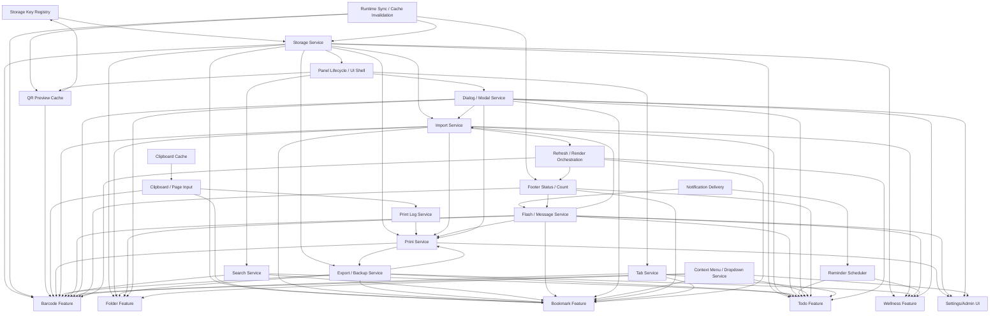

# Shared Services Map

Document date: 2026-07-02

Scope: architectural assessment of `PA.js` only.

This document identifies services that are currently cross-feature, or are strong future shared-service candidates because they are used by two or more feature modules. It does not propose code changes, does not generate patches, and does not modify `PA.js`.

## Definition Used

A service is considered **Shared** if it is, or should become, used by two or more feature modules.

Primary feature modules considered:

- Barcode
- Folder/Subfolder management
- Bookmark
- Todo
- Wellness/Reminder
- Import/Export/Backup
- UI Shell / Settings

## Executive Summary

`PA.js` already contains several cross-feature services, but many are still embedded in feature-heavy sections rather than isolated as explicit modules.

Highest-value shared-service extraction candidates:

1. **StorageService** — already partially extracted and foundational.
2. **Dialog / Modal Lifecycle Service** — used by nearly every feature and currently scattered across modal helpers.
3. **Import / Export / Backup Service** — spans Barcode, Bookmark, Todo, Wellness, and Print settings/logs.
4. **Print Service** — production-sensitive, cross-cutting across Barcode, Text Label, settings, modal, and future outputs.
5. **Clipboard / Page Input Service** — used by Barcode, Bookmark, Print Log, selected text shortcut, and page-send behavior.
6. **Search Service** — shared UI host already switches between Barcode, Bookmark, and Todo search modes.
7. **Notification / Reminder Delivery Service** — currently Todo/Wellness-centered, but structurally a shared runtime service.
8. **QR Preview Cache Service** — currently Barcode-heavy, but shared by Barcode renderer, Barcode form, detail modal, and print-preview-adjacent flows.

The most important architectural rule: **do not centralize feature schemas inside shared services**. Shared services should own generic capabilities; feature modules should own their data shapes, business rules, and UI semantics.

## Shared Service Inventory

| Service | Current owner in `PA.js` | Current dependencies | Future consumers | Extraction priority | Risk |
|---|---|---|---|---|---|
| Storage Service | Existing `StorageService` near the top of `PA.js`; compatibility facades `gmGet` / `gmSet` remain top-level | `STORAGE_KEYS`, `GM_getValue`, `GM_setValue`, `GM_addValueChangeListener`, `localStorage`, JSON parse/stringify, feature caches | Barcode, Folder, Bookmark, Todo, Wellness, Print, Import/Export, UI Shell, Runtime Sync | **Critical / already started** | **High** |
| Storage Key Registry | `STORAGE_KEYS` at top-level | Persistent key strings; userscript runtime order | All persistent services | **Critical / already done conceptually** | **Low** if exact strings stay unchanged |
| Cache Invalidation + Runtime Sync Service | Methods inside `StorageService`: `registerCacheInvalidationListeners`, `registerRuntimeSync`; plus render/footer callbacks | GM value listeners, browser `storage` event, `renderFolders`, `updateFooterCount`, QR prefetch, localStorage mirror | Barcode, Folder, Footer, QR Cache; future Bookmark/Todo sync if added | **High** | **High** |
| QR Preview Cache Service | Top early cache block: `qrPreviewCache`, localStorage cache, prefetch queue | `localStorage`, `QRCode`, timers, `scheduleIdle`, `getBarcodes`, panel visibility, document visibility | Barcode renderer, Barcode form, Barcode detail modal, Runtime Sync, future QR-based import/preview/print UI | **Medium-High** | **Medium** |
| Clipboard Cache Service | Early cache block: `cacheClipboardValue`, `getCachedClipboardValue`; runtime functions later use it | `STORAGE_KEYS.CLIPBOARD_CACHE`, `gmGet`, `gmSet`, in-memory `clipboardCache` | Clipboard Service, Barcode actions, Bookmark copy, Print Log copy, page-send fallback | **Medium** | **Low-Medium** |
| Clipboard / Page Input Service | Print pipeline block currently owns `copyToClipboard`, `sendClipboardToPage`, `sendValueToPage`, selected text helpers | `navigator.clipboard`, `navigator.permissions`, `document.activeElement`, `KeyboardEvent`, `window.prompt`, `panel`, `showFlash`, Clipboard Cache | Barcode, Bookmark, Print Log, shortcut-created barcode modal, future Todo/link copy | **High** | **Medium** |
| Print Service | Print pipeline block: print config, logs, ZPL, bridge, Printmon fallback, barcode/text print entrypoints | `gmGet`, `gmSet`, `GM_xmlhttpRequest`, `fetch`, `document.cookie`, ZPL bridge, Printmon HTTP, `showFlash`, Clipboard Service for log copy, DOM modal helpers | Barcode, Text Label, Barcode detail modal, Folder/Subfolder print-all, Settings, Import/Export backup, future Bookmark/Todo printing | **High** | **High / production-sensitive** |
| Print Log Service | Nested inside `initPrintLog()` and `PRINT_LOG` object | `STORAGE_KEYS.PRINT_LOG`, `gmGet`, `gmSet`, DOM modal, `copyToClipboard`, `showFlash`, `wireModalIdleTracking` | Print Service, Settings UI, Export/Backup, diagnostics | **Medium** | **Medium** |
| Import Service | Data merge block + `showImportModal` UI section | `FileReader`, JSON parsing, CSV/TXT parsers, Barcode/Folder/Bookmark/Todo data accessors, Wellness settings, Print settings/logs, `refreshPanelAfterDataMutation`, `showFlash` | Barcode, Bookmark, Todo, Wellness, Print config/log, Settings UI | **High but late** | **High** |
| Export / Backup Service | `buildFullBackupData`, `normalizeBackupPayload`, settings export button | Blob/Object URL APIs, Barcode/Folder/Bookmark/Todo/Wellness/Print stores, JSON serialization | Settings UI, Import Service, all feature data modules | **High but late** | **High** |
| Search Service | Shared search host in UI shell; feature-specific functions `openBarcodeSearchUI`, `openTodoSearchUI`, `openBookmarkSearchUI` | DOM search host, active tab/search state, feature renderers, Barcode/Folder/Bookmark/Todo data | Barcode, Bookmark, Todo; future global search | **Medium-High** | **Medium** |
| Flash / User Message Service | `showFlash` in Barcode/data utility area, but used broadly | `window._barcodeFlash`, footer center DOM, timers, `renderFooterQuoteIfAllowed`, `formWrapper` cleanup | Folder, Barcode, Bookmark, Todo, Wellness, Print, Import/Export, Settings | **High** | **Medium** |
| Notification Delivery Service | Todo/reminder section: `sendAppNotification`, native/GM/Chrome-history paths | `GM_notification`, `Notification`, `window.focus`, audio alert, `showFlash`, permission APIs | Todo reminders, Wellness reminders, future import/export/print completion alerts | **Medium** | **Medium-High** |
| Reminder Scheduler Service | Todo/wellness section: `scheduleReminderCheck`, `runReminderCheck`, `initReminderChecker` | Todo data, Wellness settings, Notification Service, timers, render callbacks | Todo, Wellness; future scheduled app events | **Medium** | **High** |
| Audio Alert Service | Todo/reminder section: `getReminderAudioContext`, `unlockReminderAudio`, `playReminderSound` | Web Audio API, document user-interaction events | Notification Service, Todo, Wellness, future alerts | **Low-Medium** | **Low-Medium** |
| Dialog / Modal Service | Scattered: `bmConfirm`, `showRenameModal`, `wireModalIdleTracking`, modal close functions, many feature modals | DOM, `panel`, timers, Escape/Enter handlers, modal auto-close, `localStorage` modal cleanup, settings/search/dropdown close helpers | Barcode, Folder, Bookmark, Todo, Import, Print, Wellness, About, Settings | **High** | **High** |
| Panel Lifecycle / UI Shell Service | UI state and shell blocks: panel creation, positioning, resizing, auto-close, `togglePanel` | DOM, `MutationObserver`, browser timers, `gmGet`/`gmSet` panel size, floating button, modal/search/dropdown state | All feature tabs and modals | **Medium-High** | **High** |
| Context Menu / Dropdown Service | Print pipeline owns `buildContextMenu`, `openContextMenuAtEvent`, `closeAllContextMenus`; Todo has dropdown helpers too | DOM, document click listeners, viewport positioning, feature menu callbacks | Folder, Barcode, Bookmark, Todo, Settings | **Medium** | **Medium** |
| Footer Status / Count Service | Footer/action dropdown block: `updateFooterCount`, footer quote center, render wrappers | Barcode/Folder/Bookmark/Todo data, render wrappers, current tab state, footer DOM | Barcode, Bookmark, Todo, UI Shell, Flash/Quote Service | **Medium** | **Medium-High** |
| Footer Quote Service | Barcode/data utility area owns quote fetching/rendering | `GM_xmlhttpRequest`, `fetch`, timers, footer DOM, flash/system-message state | Footer Status, UI Shell, possibly future Dashboard/Home | **Low-Medium** | **Low-Medium** |
| Refresh / Render Orchestration Service | UI shell function `refreshPanelAfterDataMutation`; render wrapper logic near footer | `renderFolders`, `renderBookmarks`, `renderTasksList`, `switchTab`, active states, footer count | Import/Export, Reset, Settings, all features after mutations | **Medium** | **High** |
| Tab Service | Tab infrastructure around `switchTab`, `registerTab`, `tabsMap`, `currentTabName` | DOM tab bar/containers, renderers, footer updater, global `window.bmSwitchTab` | Barcode, Bookmark, Todo, future tabs | **Medium** | **Medium** |
| Destination Select Service | Folder destination helpers currently in `FolderDataService`; Bookmark has parallel destination helpers | Folder/Bookmark folder data, DOM select controls, active folder/subfolder state | Barcode form, Barcode modal save, Import CSV/TXT, Bookmark forms/move modals | **Low-Medium** | **Medium** |
| External Library Adapter Service | Direct use of `JsBarcode` and `QRCode` across Barcode form/render/modal/QR cache | External CDN globals, canvas/SVG DOM, rendering options | Barcode Renderer, Barcode Form, Barcode Modal, QR Cache, Print Preview | **Medium** | **Medium-High** |
| Admin / Reset Data Service | Settings reset action currently inside settings dropdown | All major storage keys, feature caches, active states, refresh/render orchestration, `bmConfirm`, `showFlash` | Settings UI, all feature data modules | **Low until data owners stabilize** | **High** |

## Detailed Service Notes

### 1. Storage Service

**Current owner:** Existing `StorageService` near the top of `PA.js`.

**Current dependencies:**

- `STORAGE_KEYS`
- `GM_getValue`
- `GM_setValue`
- `GM_addValueChangeListener`
- `localStorage`
- JSON parsing/stringifying
- `barcodesCache`, `foldersCache`, dirty flags

**Future consumers:**

- All persistent feature modules: Barcode, Folder, Bookmark, Todo, Wellness, Print, Import/Export, UI Shell.

**Extraction priority:** Critical. This service is already partially extracted and should remain foundational.

**Risk:** High. Any subtle change to GM/localStorage fallback, mirroring, parse-failure tolerance, or cross-tab timing can break all feature data.

**Boundary recommendation:** Keep only generic persistence and listener registration here. Do not move feature schemas or business rules into StorageService.

---

### 2. Storage Key Registry

**Current owner:** `STORAGE_KEYS` top-level constant.

**Current dependencies:** None beyond startup order and exact persistent string values.

**Future consumers:** Every feature/service that reads or writes persistent data.

**Extraction priority:** Critical but mostly complete conceptually.

**Risk:** Low if exact strings are preserved. Very high if any key string changes.

**Boundary recommendation:** Keep it separate from generic app constants. Storage keys are persistent contracts, not ordinary constants.

---

### 3. Cache Invalidation + Runtime Sync Service

**Current owner:** `StorageService` methods plus late runtime registration callbacks.

**Current dependencies:**

- `GM_addValueChangeListener`
- `window.addEventListener('storage')`
- `updateLocalCache`
- `renderFolders`
- `updateFooterCount`
- `scheduleQrPreviewPrefetch`

**Future consumers:**

- Barcode and Folder data today.
- Potentially Bookmark/Todo/Wellness if cross-tab sync is expanded later.

**Extraction priority:** High, but after storage and render boundaries are stable.

**Risk:** High. It changes visible cross-tab behavior and render timing.

**Boundary recommendation:** Keep dirty-cache invalidation separate from UI render synchronization. They happen at different lifecycle times and should not be collapsed casually.

---

### 4. QR Preview Cache Service

**Current owner:** Early shared cache block using `qrPreviewCache`, `qrPreviewCacheOrder`, prefetch queue, and localStorage persistence.

**Current dependencies:**

- `localStorage`
- `QRCode`
- `document.visibilityState`
- `panel.style.display`
- `getBarcodes`
- timers / idle callbacks

**Future consumers:**

- Barcode grid renderer
- Barcode form preview
- Barcode detail modal
- QR print preview or future QR utilities

**Extraction priority:** Medium-High.

**Risk:** Medium. Functionality is cache/performance oriented, but incorrect extraction can degrade QR rendering, stale cache behavior, or startup performance.

**Boundary recommendation:** Extract separately from generic StorageService. Its schema and throttling rules are QR-specific.

---

### 5. Clipboard Cache Service

**Current owner:** Early cache block: `cacheClipboardValue` and `getCachedClipboardValue`.

**Current dependencies:**

- `STORAGE_KEYS.CLIPBOARD_CACHE`
- `gmGet`
- `gmSet`
- in-memory `clipboardCache`

**Future consumers:**

- Clipboard/page input service
- Barcode copy/send flows
- Bookmark copy flows
- Print log copy
- Selected-text shortcut flows

**Extraction priority:** Medium.

**Risk:** Low-Medium. Small data shape, but user-visible fallback behavior depends on it.

**Boundary recommendation:** Keep cache storage separate from actual clipboard/page typing operations.

---

### 6. Clipboard / Page Input Service

**Current owner:** Print pipeline block currently owns clipboard and page-send helpers.

**Current dependencies:**

- `navigator.clipboard`
- `navigator.permissions`
- `document.activeElement`
- `KeyboardEvent`
- `window.prompt`
- `panel`
- `showFlash`
- Clipboard Cache Service

**Future consumers:**

- Barcode cards and batch actions
- Barcode detail modal
- Header clipboard-send button
- Bookmark copy actions
- Print log copy
- Future Todo or note-copy actions

**Extraction priority:** High.

**Risk:** Medium. Browser permission behavior and page focus/target behavior are delicate.

**Boundary recommendation:** Split into two conceptual services if needed:

1. `ClipboardService` for copy/read/cache.
2. `PageInputService` for scanner-like typing into page targets.

---

### 7. Print Service

**Current owner:** Print pipeline block.

**Current dependencies:**

- Storage keys: `PRINT_SERVER_OVERRIDE`, `PRINT_LOG`, `NEW_RODEO_SETTINGS`
- `gmGet` / `gmSet`
- direct `GM_getValue` for external settings
- `GM_xmlhttpRequest` / `fetch`
- local ZPL bridge endpoint
- Printmon HTTP endpoint
- `document.cookie` badge ID
- `showFlash`
- Print log methods
- Text wrapping helpers

**Future consumers:**

- Barcode single print
- Barcode batch print
- Folder/subfolder print-all
- Barcode detail modal
- Text Label feature
- Settings/Print Server UI
- Import/Export backup for print settings/logs
- Future Bookmark/Todo printing

**Extraction priority:** High, but not before tests/characterization around print behavior.

**Risk:** High / production-sensitive. Printmon and ZPL bridge fallback behavior must remain exact.

**Boundary recommendation:** Extract in layers:

1. Print config/log accessors.
2. ZPL builders.
3. Transport adapters: ZPL bridge and Printmon HTTP.
4. User-facing print entrypoints.

---

### 8. Print Log Service

**Current owner:** `initPrintLog()` returns the `PRINT_LOG` object.

**Current dependencies:**

- `gmGet` / `gmSet`
- `STORAGE_KEYS.PRINT_LOG`
- DOM modal creation
- `copyToClipboard`
- `wireModalIdleTracking`
- `showFlash`

**Future consumers:**

- Print Service
- Settings dropdown
- Export/Backup
- Diagnostics/debug UI

**Extraction priority:** Medium.

**Risk:** Medium. Storage is simple, but modal UI and copy integration cross several services.

**Boundary recommendation:** Separate log data API from log modal UI.

---

### 9. Import Service

**Current owner:** Split between data merge functions and `showImportModal` UI.

**Current dependencies:**

- `FileReader`
- JSON parse
- CSV/TXT parsers
- Barcode/Folder data
- Bookmark data
- Todo data
- Wellness settings
- Print config/log
- `refreshPanelAfterDataMutation`
- `showFlash`
- Dialog/modal lifecycle

**Future consumers:**

- Settings UI
- Barcode data
- Bookmark data
- Todo data
- Wellness
- Print settings/log

**Extraction priority:** High but late.

**Risk:** High. This is a cross-feature schema compatibility contract.

**Boundary recommendation:** Split into:

1. Pure payload parser/normalizer.
2. Feature-specific merge adapters.
3. Import modal UI.
4. Post-import refresh orchestration.

---

### 10. Export / Backup Service

**Current owner:** `buildFullBackupData`, `normalizeBackupPayload`, and settings export button.

**Current dependencies:**

- All feature data accessors
- Print config/log storage
- Wellness settings
- Blob / Object URL browser APIs
- JSON serialization

**Future consumers:**

- Settings export
- Import validation
- Backup/restore workflows
- Future migration tooling

**Extraction priority:** High but late.

**Risk:** High because exported schema is a portability contract.

**Boundary recommendation:** Keep backup schema versioning explicit. Do not let generic storage service own backup composition.

---

### 11. Search Service

**Current owner:** Shared search host in UI shell; feature-specific implementations for Barcode, Todo, Bookmark.

**Current dependencies:**

- `searchHost`
- `searchInput`
- feature-specific search state
- Barcode/Folder/Bookmark/Todo data
- feature renderers
- active tab state

**Future consumers:**

- Barcode
- Bookmark
- Todo
- Future global search or command palette

**Extraction priority:** Medium-High.

**Risk:** Medium. It affects navigation, focus, Escape behavior, and feature render restoration.

**Boundary recommendation:** Extract a shared search shell first, then keep result providers feature-owned.

---

### 12. Flash / User Message Service

**Current owner:** `showFlash` lives in the Barcode/data utility section but is used broadly.

**Current dependencies:**

- `window._barcodeFlash`
- `window._barcodeFlashActive`
- footer center DOM
- timers
- `formWrapper.innerHTML`
- `renderFooterQuoteIfAllowed`

**Future consumers:**

- All features: Barcode, Folder, Bookmark, Todo, Wellness, Print, Import/Export, Settings.

**Extraction priority:** High.

**Risk:** Medium. It is simple but globally visible; it also interacts with footer quote behavior.

**Boundary recommendation:** Rename conceptually away from Barcode. It should become an app-level `MessageService` or `ToastService`.

---

### 13. Notification Delivery Service

**Current owner:** Todo/reminder section.

**Current dependencies:**

- `GM_notification`
- Web `Notification`
- Chrome/Windows notification behavior
- permission request APIs
- `window.focus`
- Audio Alert Service
- `showFlash` fallback

**Future consumers:**

- Todo reminders
- Wellness reminders
- Future print/import/export completion alerts
- Future scheduled events

**Extraction priority:** Medium.

**Risk:** Medium-High. Browser-specific notification behavior and permissions are fragile.

**Boundary recommendation:** Separate notification delivery from reminder scheduling and from Todo data.

---

### 14. Reminder Scheduler Service

**Current owner:** Todo/wellness section.

**Current dependencies:**

- Todo data: `getTasks`, `saveTasks`
- Wellness settings: `getWellnessSettings`, `saveWellnessSettings`
- Notification Delivery Service
- timers
- `renderTasksList`

**Future consumers:**

- Todo
- Wellness
- Future scheduled app events

**Extraction priority:** Medium.

**Risk:** High because writes can mutate task/wellness state and trigger notifications.

**Boundary recommendation:** Extract only after Todo/Wellness data APIs are stable.

---

### 15. Audio Alert Service

**Current owner:** Todo/reminder section.

**Current dependencies:**

- Web Audio API
- document click/keydown/touchstart unlock events

**Future consumers:**

- Notification Delivery Service
- Todo reminders
- Wellness reminders
- Future app alerts

**Extraction priority:** Low-Medium.

**Risk:** Low-Medium.

**Boundary recommendation:** Keep it small and independent; avoid coupling it to Todo data.

---

### 16. Dialog / Modal Service

**Current owner:** Scattered across UI state functions and feature-specific modal helpers.

**Current dependencies:**

- DOM APIs
- `panel`
- modal auto-close timers
- `wireModalIdleTracking`
- Escape/Enter handlers
- `localStorage.removeItem(STORAGE_KEYS.BARCODE_MODAL)` for barcode modal cleanup
- settings/search/dropdown/context-menu closing functions

**Future consumers:**

- Barcode form/detail
- Folder operations
- Bookmark forms/move modals
- Todo dialogs/details/insights
- Import modal
- Print server/log modals
- Wellness modal
- About modal
- Reset/confirm/rename flows

**Extraction priority:** High.

**Risk:** High. Modal close behavior is global and can break multiple feature workflows.

**Boundary recommendation:** Extract lifecycle primitives first:

- create modal shell
- close modal(s)
- Escape handling
- idle tracking
- confirm prompt
- rename prompt

Do not move large feature modals into the dialog service.

---

### 17. Panel Lifecycle / UI Shell Service

**Current owner:** UI state and UI shell sections.

**Current dependencies:**

- DOM APIs
- `MutationObserver`
- panel/floating button nodes
- browser resize/mouse events
- `gmGet` / `gmSet` for `PANEL_SIZE`
- modal/search/dropdown state
- QR prefetch on panel open

**Future consumers:**

- All feature tabs and modals.

**Extraction priority:** Medium-High.

**Risk:** High because declaration order and closures are central to current runtime behavior.

**Boundary recommendation:** Extract after shared dialog/search/dropdown boundaries are clear.

---

### 18. Context Menu / Dropdown Service

**Current owner:** Mixed. Barcode/folder context menu helpers live in print pipeline block; Todo has separate dropdown helpers; Settings has custom dropdown logic.

**Current dependencies:**

- DOM APIs
- document click listeners
- viewport positioning
- feature callbacks
- `closeAllContextMenus`

**Future consumers:**

- Folder
- Barcode
- Bookmark
- Todo
- Settings

**Extraction priority:** Medium.

**Risk:** Medium. Positioning and close behavior are user-visible.

**Boundary recommendation:** Create generic menu positioning/close primitives only. Keep menu item definitions inside feature modules.

---

### 19. Footer Status / Count Service

**Current owner:** Footer/action dropdown section near the end of `PA.js`.

**Current dependencies:**

- Barcode/Folder data
- Bookmark data
- Todo data
- current tab state
- active folder/subfolder state
- render wrapper hooks around `renderFolders`, `renderBookmarks`, `renderTasksList`, `switchTab`
- footer DOM nodes

**Future consumers:**

- Barcode
- Bookmark
- Todo
- UI Shell
- Flash / Message Service
- Footer Quote Service

**Extraction priority:** Medium.

**Risk:** Medium-High. The current wrapper approach changes render functions and can be order-sensitive.

**Boundary recommendation:** Replace render wrapping only after a stable event/render orchestration service exists.

---

### 20. Footer Quote Service

**Current owner:** Barcode/data utility area around `showFlash` and quote functions.

**Current dependencies:**

- `GM_xmlhttpRequest`
- `fetch`
- timers
- quote API endpoint
- footer DOM
- flash/system-message state

**Future consumers:**

- Footer Status Service
- UI Shell
- Future dashboard/home surface

**Extraction priority:** Low-Medium.

**Risk:** Low-Medium.

**Boundary recommendation:** Keep external quote fetching separate from user message/flash display.

---

### 21. Refresh / Render Orchestration Service

**Current owner:** UI shell and footer wrappers.

**Current dependencies:**

- `renderFolders`
- `renderBookmarks`
- `renderTasksList`
- `switchTab`
- active states
- selected ID sets
- footer updater

**Future consumers:**

- Import/Export
- Reset Data
- Storage Runtime Sync
- Feature data mutations

**Extraction priority:** Medium.

**Risk:** High. Render sequencing and stale UI state can easily regress.

**Boundary recommendation:** Extract after feature renderers have clearer boundaries.

---

### 22. Tab Service

**Current owner:** Tab infrastructure section and late footer wrapper around `switchTab`.

**Current dependencies:**

- DOM tab buttons/containers
- `currentTabName`
- feature renderers
- footer count updates
- global `window.bmSwitchTab`

**Future consumers:**

- Barcode
- Bookmark
- Todo
- Future app modules

**Extraction priority:** Medium.

**Risk:** Medium.

**Boundary recommendation:** Keep tab registration/generic switching shared; keep per-tab rendering owned by features.

---

### 23. Destination Select Service

**Current owner:** Folder destination helpers in `FolderDataService`; Bookmark has separate analogous helpers.

**Current dependencies:**

- Folder/Bookmark folder data
- DOM select controls
- active folder/subfolder state

**Future consumers:**

- Barcode form
- Barcode detail modal save-to-folder
- Import CSV/TXT destination controls
- Bookmark form and move modals

**Extraction priority:** Low-Medium.

**Risk:** Medium. The current Barcode and Bookmark hierarchies are similar but not identical.

**Boundary recommendation:** Do not prematurely force Barcode and Bookmark folder trees into one schema. Extract generic select-building primitives only if both feature schemas stay explicit.

---

### 24. External Library Adapter Service

**Current owner:** Direct global calls to `QRCode` and `JsBarcode` inside QR cache, Barcode form, Barcode renderer, Barcode modal, and print-preview rendering.

**Current dependencies:**

- CDN globals declared by userscript metadata
- Canvas/SVG DOM
- barcode/QR render options
- browser pixel ratio and layout measurements

**Future consumers:**

- Barcode Preview Service
- QR Preview Cache Service
- Barcode Detail Modal
- Print Preview Service

**Extraction priority:** Medium.

**Risk:** Medium-High. Rendering dimensions and format-specific behavior are highly visual.

**Boundary recommendation:** Extract adapter wrappers only after barcode rendering tests/manual screenshots exist.

---

### 25. Admin / Reset Data Service

**Current owner:** Settings dropdown reset button.

**Current dependencies:**

- `bmConfirm`
- all major storage keys
- barcode/folder caches
- task cache
- active Barcode/Bookmark state
- `refreshPanelAfterDataMutation`
- `showFlash`

**Future consumers:**

- Settings UI
- all data modules as reset targets
- future diagnostics/support workflows

**Extraction priority:** Low until data owners stabilize.

**Risk:** High. It is destructive and cross-feature.

**Boundary recommendation:** Keep late. Once feature data services exist, reset should call feature-owned reset APIs rather than write every key directly.

## Dependency Overview

## Recommended Extraction Priority Tiers

### Tier 0 — Already established / protect first

| Service | Why |
|---|---|
| Storage Key Registry | Persistent contract; must not change. |
| Storage Service | Foundation for every data module. |

### Tier 1 — High-value shared services

| Service | Why |
|---|---|
| Flash / User Message Service | Used everywhere and currently has Barcode naming leakage. |
| Dialog / Modal Lifecycle Service | Cross-feature and duplicated/implicit in many modals. |
| Clipboard / Page Input Service | Clearly cross-feature and currently misplaced in print pipeline. |
| Print Service | Large production-sensitive cross-cutting module. |
| Import / Export / Backup Service | Cross-feature schema boundary; needs explicit ownership. |
| Search Service | Already shared between Barcode, Bookmark, Todo through a common host. |

### Tier 2 — Medium priority shared services

| Service | Why |
|---|---|
| QR Preview Cache Service | Performance/cache concern shared across Barcode submodules and future QR consumers. |
| Runtime Sync / Cache Invalidation | Important but depends on renderer/footer boundaries. |
| Panel Lifecycle / UI Shell | Foundational UI but closure/order-sensitive. |
| Footer Status / Count Service | Cross-feature, but render-wrapper approach is risky. |
| Notification Delivery Service | Shared runtime capability currently embedded in Todo/Wellness. |
| Reminder Scheduler Service | Shared between Todo and Wellness, but high side-effect risk. |
| Tab Service | Shared UI infrastructure. |

### Tier 3 — Later or opportunistic services

| Service | Why |
|---|---|
| Footer Quote Service | Cross-cutting but not core to data/refactor stability. |
| Context Menu / Dropdown Service | Useful, but feature menu definitions should remain local. |
| Destination Select Service | Similar patterns exist, but Barcode and Bookmark schemas differ. |
| External Library Adapter Service | Good future boundary, but visual regression risk requires testing. |
| Admin / Reset Data Service | Should wait until feature data services own reset behavior. |
| Audio Alert Service | Small utility; extract when notification service moves. |

## Highest-Risk Services

| Service | Risk | Main reason |
|---|---|---|
| Storage Service | High | All persistence depends on exact GM/localStorage semantics. |
| Runtime Sync / Cache Invalidation | High | Cross-tab behavior and render timing are observable. |
| Dialog / Modal Service | High | Modal close/idle/Escape behavior affects every feature. |
| Panel Lifecycle / UI Shell | High | Closure order, mutation observer, auto-close behavior. |
| Print Service | High | External printer/bridge behavior is production-sensitive. |
| Import / Export / Backup | High | Cross-feature schema compatibility contract. |
| Refresh / Render Orchestration | High | Can produce stale or wrong UI after data changes. |
| Admin / Reset Data | High | Destructive and touches all feature stores. |
| Reminder Scheduler | High | Mutates Todo/Wellness state and triggers notifications. |

## Architectural Recommendations

1. **Keep shared services capability-focused.**  
   Example: StorageService should own read/write mechanics, not Barcode/Bookmark/Todo schemas.

2. **Do not merge feature data ownership into Import/Export.**  
   Import/Export should orchestrate feature-owned merge APIs once those exist.

3. **Separate UI lifecycle services from feature UI.**  
   DialogService should provide modal primitives, not own Barcode/Todo/Bookmark modal content.

4. **Extract Clipboard/Page Input before deeper Barcode UI extraction.**  
   Clipboard/page-send is already shared and currently misplaced in the print block.

5. **Treat Print as a service family, not one giant module.**  
   Recommended sub-boundaries: config/log, ZPL builders, bridge adapter, Printmon adapter, user-facing print entrypoints.

6. **Search should be provider-based.**  
   Shared shell + feature-specific result providers is safer than one monolithic global search implementation.

7. **Do not expand runtime sync during extraction.**  
   Existing sync only covers folders and barcodes. Adding Bookmark/Todo sync is a behavior change and should be a separate feature decision.

8. **Rename user-message concepts away from Barcode.**  
   `window._barcodeFlash` and `showFlash` are app-wide now. Their current naming leaks historical Barcode ownership.

## Suggested Shared-Service Extraction Order

This order avoids changing feature behavior while reducing cross-feature coupling incrementally:

1. Protect `STORAGE_KEYS` and `StorageService` behavior with characterization checks.
2. Extract/rename **Flash / User Message Service** behind compatibility facade.
3. Extract **Clipboard Cache**, then **Clipboard / Page Input Service**.
4. Extract **Dialog / Modal lifecycle primitives** only; keep feature modal contents in place.
5. Extract **Search Shell** with feature-owned search providers.
6. Extract **Print Log data API**, then print config, then ZPL/transport adapters.
7. Extract **QR Preview Cache Service**.
8. Extract **Import/Export pure payload utilities**, then feature merge orchestration later.
9. Extract **Panel Lifecycle / UI Shell** and **Tab Service** after modal/search boundaries are stable.
10. Extract **Runtime Sync** after render and footer dependencies are explicit.
11. Extract **Admin / Reset Data** only after feature data services provide reset APIs.

## Final Assessment

`PA.js` contains many shared services, but only `StorageService` and `STORAGE_KEYS` have started to become explicit architectural boundaries.

The next shared-service work should prioritize small cross-feature services with low schema risk, especially:

- Flash / user messages
- Clipboard cache and clipboard/page input
- Dialog/modal lifecycle primitives
- Search shell

High-risk services such as Print, Import/Export, Runtime Sync, Panel Lifecycle, and Reset should be extracted only after characterization and after feature data boundaries are stable.
