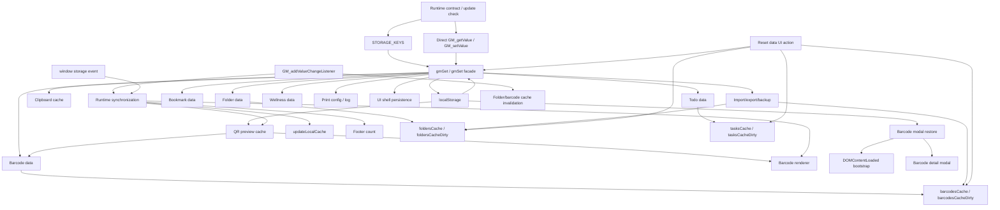

# PA Storage Dependency Map

Document date: 2026-07-02

Scope: current implementation of `PA.js` only.

This document is an engineering dependency analysis for the current PA storage layer. It does not propose code changes, does not refactor code, and does not modify `PA.js`.

Authority documents used:

- `PA.js`
- `analysis/PA_Code_Discovery.md`
- `architecture/Refactor_Plan.md`
- `architecture/Refactor_Rules.md`

## Executive Summary

The current storage layer is not a single isolated module yet. It is a cluster of foundational behavior near the beginning of `PA.js`, plus direct storage calls scattered through data modules, import/export, print configuration, UI persistence, modal restore, and runtime synchronization.

The core storage contract is formed by:

- `STORAGE_KEYS`
- `gmGet(key, fallback)`
- `gmSet(key, value)`
- direct `GM_getValue` / `GM_setValue` calls in the update check and print setting bridge
- direct `localStorage` access for QR preview cache, QR prefetch timestamp, barcode modal restore, and GM/localStorage mirroring
- `GM_addValueChangeListener` listeners for folder/barcode cache invalidation and full cross-tab UI synchronization
- `window.addEventListener('storage', ...)` for localStorage-based folder/barcode synchronization

The highest-risk dependency is not the existence of `gmGet`/`gmSet`; it is that data modules currently combine storage writes, cache updates, UI refreshes, active-state mutation, and user feedback inside the same functions.

## Storage APIs and Usage Inventory

Observed usage counts in current `PA.js`:

| API / access pattern | Count | Notes |
|---|---:|---|
| `gmGet` | 18 | Includes function definition and feature/module reads. |
| `gmSet` | 59 | Includes function definition and feature/module writes. |
| `GM_getValue` / `GM_setValue` / `GM_addValueChangeListener` | 19 | Includes metadata grants, update check, storage facade, print setting bridge, and sync listeners. |
| `localStorage` | 14 | Includes facade mirroring, QR cache, QR prefetch timestamp, barcode modal persistence, and sync cache updates. |
| `storage` event listener | 1 | Synchronizes `bm_folders` and `bm_barcodes` through browser localStorage events. |

## Persistent Storage Keys

| Key constant | Exact key | Primary owner today | Shape / purpose |
|---|---|---|---|
| `STORAGE_KEYS.UPDATE_CHECK` | `PA` | Runtime update check | Number timestamp for last update check. |
| `STORAGE_KEYS.CLIPBOARD_CACHE` | `bm_last_copied` | Clipboard/page integration cache | String last copied/sent value. |
| `STORAGE_KEYS.QR_PREVIEW_CACHE` | `bm_qr_preview_cache` | QR preview cache | `{ entries: Array<[key, url]> }`. |
| `STORAGE_KEYS.QR_PREFETCH_LAST_RUN` | `bm_qr_preview_prefetch_last_run` | QR prefetch throttling | String timestamp. |
| `STORAGE_KEYS.FOLDERS` | `bm_folders` | Folder data | Array of top-level barcode folders. |
| `STORAGE_KEYS.SUBFOLDERS` | `bm_subfolders` | Folder data | Array of one-level barcode subfolders. |
| `STORAGE_KEYS.BARCODES` | `bm_barcodes` | Barcode data | Array of barcode records. |
| `STORAGE_KEYS.BOOKMARKS` | `bm_bookmarks` | Bookmark data | Array of bookmark records. |
| `STORAGE_KEYS.BOOKMARK_FOLDERS` | `bm_bookmark_folders` | Bookmark data | Array of bookmark folders. |
| `STORAGE_KEYS.BOOKMARK_SUBFOLDERS` | `bm_bookmark_subfolders` | Bookmark data | Array of bookmark subfolders. |
| `STORAGE_KEYS.BOOKMARK_DEFAULTS_MIGRATION` | `bm_bookmark_no_defaults_migrated` | Bookmark legacy migration | Boolean migration marker. |
| `STORAGE_KEYS.TASKS` | `bm_tasks` | Todo data | Array of task records. |
| `STORAGE_KEYS.TODO_PROJECTS` | `bm_todo_projects` | Todo data | Array of project names. |
| `STORAGE_KEYS.WELLNESS_SETTINGS` | `bm_wellness_settings` | Wellness data | Normalized wellness settings object or null. |
| `STORAGE_KEYS.PRINT_SERVER_OVERRIDE` | `bm_print_server_override` | Print config | String print server override. |
| `STORAGE_KEYS.PRINT_LOG` | `bm_print_log` | Print log | Array of print log entries. |
| `STORAGE_KEYS.PANEL_SIZE` | `bm_panel_size` | UI shell | `{ width, height }` panel dimensions. |
| `STORAGE_KEYS.BARCODE_MODAL` | `bm_barcode_modal` | Barcode detail modal/bootstrap restore | `{ open, value, format, name }`. |
| `STORAGE_KEYS.NEW_RODEO_SETTINGS` | `newRodeo-settings` | Print integration | External/legacy settings object from another tool. |

## Mermaid Dependency Graph

## Module-by-Module Dependency Map

### 1. Runtime Contract and Update Check

| Category | Details |
|---|---|
| Storage keys used | `PA` through `STORAGE_KEYS.UPDATE_CHECK`. |
| Read operations | Direct `GM_getValue(ScriptName)` reads last update-check timestamp. |
| Write operations | Direct `GM_setValue(ScriptName, Date.now())` after update check request. |
| Cache interactions | None. |
| Cross-tab synchronization | None. |
| Startup dependencies | Runs immediately near the top of the IIFE before storage helpers are defined. Requires `GM_getValue`, `GM_setValue`, and `GM_xmlhttpRequest`. |
| Import/export dependencies | None. |

Assessment: this should remain outside the general feature storage layer until runtime/bootstrap is extracted. It uses GM APIs directly because it executes before the storage facade exists.

### 2. Storage Facade

| Category | Details |
|---|---|
| Storage keys used | Generic `key` parameter; all keys may flow through it. |
| Read operations | `localStorage.getItem(key)`, then `GM_getValue(key, undefined)`. |
| Write operations | Backfills GM with cached local value if GM key is missing; `gmSet` writes through `GM_setValue` then `localStorage.setItem`. |
| Cache interactions | Provides persisted data to all module caches. No in-memory feature cache directly owned except via consumers. |
| Cross-tab synchronization | Indirect: localStorage mirroring enables browser `storage` events for some keys. |
| Startup dependencies | Defined before all data modules. `clipboardCache` initializes immediately after definition. |
| Import/export dependencies | All import/export module reads/writes eventually depend on this behavior. |

Assessment: this is the future `core/storage` service. It must preserve GM/localStorage fallback, mirroring, parse failure tolerance, and async-GM-value fallback behavior exactly.

### 3. Storage Key Registry

| Category | Details |
|---|---|
| Storage keys used | Defines all key strings; no reads/writes. |
| Read operations | None. |
| Write operations | None. |
| Cache interactions | None. |
| Cross-tab synchronization | None directly; sync listeners use registry values. |
| Startup dependencies | Must be available before update-check IIFE and storage helpers. |
| Import/export dependencies | Indirect: import/export uses registry-backed keys through module functions and print keys. |

Assessment: already isolated conceptually. It should remain separate from app constants and from storage behavior.

### 4. Runtime Cache / QR Preview Cache / Clipboard Cache

| Category | Details |
|---|---|
| Storage keys used | `bm_last_copied`, `bm_qr_preview_cache`, `bm_qr_preview_prefetch_last_run`, `bm_barcodes`, `bm_folders`. |
| Read operations | `gmGet(CLIPBOARD_CACHE_KEY, '')`; `gmGet(CLIPBOARD_CACHE_KEY, '')` fallback in `getCachedClipboardValue`; `localStorage.getItem(QR_PREVIEW_CACHE_KEY)`; `localStorage.getItem(QR_PREFETCH_LAST_RUN_KEY)`. |
| Write operations | `gmSet(CLIPBOARD_CACHE_KEY, safeValue)`; `localStorage.setItem(QR_PREVIEW_CACHE_KEY, JSON.stringify({ entries }))`; `localStorage.setItem(QR_PREFETCH_LAST_RUN_KEY, String(ts))`. |
| Cache interactions | Owns `clipboardCache`, `qrPreviewCache`, `qrPreviewCacheOrder`, QR prefetch queue state, `barcodesCacheDirty`, `foldersCacheDirty`, `barcodesCache`, `foldersCache`. |
| Cross-tab synchronization | Early `GM_addValueChangeListener` invalidates barcode/folder dirty flags only. |
| Startup dependencies | `clipboardCache` is initialized at load; QR preview cache is loaded at startup through `loadQrPreviewCache()`. |
| Import/export dependencies | Import/export writes folders/barcodes and updates folder/barcode caches; QR prefetch can run after barcode changes. |

Assessment: split this into at least three future pieces: clipboard cache, QR preview cache, and folder/barcode dirty-cache helpers. QR localStorage persistence should probably remain inside a QR cache service rather than generic storage because its schema is cache-specific.

### 5. Folder Data

| Category | Details |
|---|---|
| Storage keys used | `bm_folders`, `bm_subfolders`, `bm_barcodes`. |
| Read operations | `getFolders()` reads `bm_folders`; `getAllSubFolders()` reads `bm_subfolders`; folder move/delete/rename functions call `getBarcodes()` to read barcode data. |
| Write operations | Creates/updates/deletes/moves folders and subfolders through `gmSet`; cascades barcode updates/deletes through `gmSet(STORAGE_KEYS.BARCODES, ...)`. |
| Cache interactions | Reads/writes `foldersCache`; writes `barcodesCache` after barcode cascade updates. |
| Cross-tab synchronization | Writes to `bm_folders`, `bm_subfolders`, and `bm_barcodes`; only `bm_folders` and `bm_barcodes` have current cross-tab listeners. `bm_subfolders` has no direct listener. |
| Startup dependencies | `getFolders()` is called during initial `renderFolders()` inside `initialize()`. Empty folders can cause default folder creation through UI flows, not during storage facade init. |
| Import/export dependencies | Import/export reads/writes the same folder/subfolder/barcode keys and resets active folder state. |

Assessment: folder data is storage-heavy and coupled to barcode data. It should not be the first feature module extracted unless barcode data facade is stable.

### 6. Barcode Data

| Category | Details |
|---|---|
| Storage keys used | `bm_barcodes`. |
| Read operations | `getBarcodes()` reads `bm_barcodes`. `idbGetBarcodesByFolder()` reads via `getBarcodes()`. |
| Write operations | `getBarcodes()` may write back to assign missing/duplicate IDs; add/update/delete/batch/move/format functions write `bm_barcodes`. |
| Cache interactions | Owns `barcodesCache` through `setBarcodesCache`; respects `barcodesCacheDirty`. |
| Cross-tab synchronization | `bm_barcodes` has both early dirty-flag listener and runtime render/footer/QR prefetch listener. |
| Startup dependencies | Initial `renderFolders()` reads barcodes for folder counts. QR prefetch depends on `getBarcodes()`. |
| Import/export dependencies | Full backup includes barcodes. Import merge writes barcodes. Reset clears barcodes. |

Assessment: barcode data is a good early feature-data candidate after storage facade and cache boundaries are stable, but it is not first because folder data, renderer, import/export, and print all consume it.

### 7. Bookmark Data

| Category | Details |
|---|---|
| Storage keys used | `bm_bookmarks`, `bm_bookmark_folders`, `bm_bookmark_subfolders`, `bm_bookmark_no_defaults_migrated`. |
| Read operations | `getBookmarks()`, `getBookmarkFolders()`, `getAllBookmarkSubFolders()`, `ensureBookmarkDefaults()`. |
| Write operations | `saveBookmarks()`, `saveBookmarkFolders()`, `saveBookmarkSubFolders()`, `ensureBookmarkDefaults()` migration marker write and optional cleanup writes. |
| Cache interactions | No dedicated in-memory cache; selected bookmark IDs and active folder/subfolder are UI/data state, not persisted cache. |
| Cross-tab synchronization | No current GM/localStorage listener for bookmark keys. Other tabs will not auto-render bookmark changes through current sync path. |
| Startup dependencies | `ensureBookmarkDefaults()` may run as part of bookmark flows; bookmark data is not part of initial barcode render unless bookmark tab/UI is entered. |
| Import/export dependencies | Full backup reads bookmark folders/subfolders/items. Import merge writes all three bookmark collections. Reset clears all bookmark collections and sets migration marker true. |

Assessment: bookmark data is one of the best isolated feature modules because it uses its own keys and has no dedicated cross-tab listener today. It can be extracted earlier than folder/barcode UI, after storage facade.

### 8. Todo Data

| Category | Details |
|---|---|
| Storage keys used | `bm_tasks`, `bm_todo_projects`. |
| Read operations | `getTasks()` reads `bm_tasks`; `getTodoProjects()` reads `bm_todo_projects`. |
| Write operations | `saveTasks()` writes tasks; `getTodoProjects()` initializes default projects if missing; project save/rename/delete writes projects and may write tasks through `saveTasks()`. |
| Cache interactions | Owns `tasksCache` and `tasksCacheDirty`. `saveTasks()` updates badge, reminder countdowns, and reminder scheduler. |
| Cross-tab synchronization | No current direct listener for `bm_tasks` or `bm_todo_projects`. |
| Startup dependencies | Reminder checker starts during `initialize()` and reads tasks/wellness. |
| Import/export dependencies | Full backup reads tasks/projects. Import merge writes projects/tasks. Reset clears tasks/projects and manually resets task cache. |

Assessment: todo data can be isolated after storage facade, but reminder scheduler side effects make it riskier than bookmark data. Save semantics must preserve badge/countdown/scheduler callbacks.

### 9. Wellness Data

| Category | Details |
|---|---|
| Storage keys used | `bm_wellness_settings`. |
| Read operations | `getWellnessSettings()` reads and normalizes settings. |
| Write operations | `saveWellnessSettings()` writes normalized settings. |
| Cache interactions | No direct cache, but save triggers wellness UI toggle refresh and reminder scheduler. |
| Cross-tab synchronization | No current direct listener for wellness settings. |
| Startup dependencies | Reminder checker reads wellness settings during startup. |
| Import/export dependencies | Full backup includes wellness settings. Import writes wellness settings if present. Reset writes null. |

Assessment: wellness data is small and isolated, but it is coupled to reminders. Extract after todo/reminder storage characterization exists.

### 10. Import / Export / Backup

| Category | Details |
|---|---|
| Storage keys used | All primary feature keys plus print config/log through module accessors and direct `gmGet`/`gmSet` for print keys. |
| Read operations | `buildFullBackupData()` reads folders, barcodes, subfolders, bookmark folders/subfolders/items, todo projects, tasks, wellness settings, print server override, and print log. Merge functions read existing feature collections. |
| Write operations | `mergeImportData()` writes folders/barcodes/subfolders; bookmark/todo merge functions write their feature stores; `importBackupData()` writes wellness, print override, print log. |
| Cache interactions | Updates folder/barcode caches after barcode import; todo merge uses `saveTasks()` and `saveTodoProjects()`; reset-like active state changes happen after import. |
| Cross-tab synchronization | Writes keys that may trigger folder/barcode sync in other tabs. Bookmark/todo/wellness/print writes have no current cross-tab listeners. |
| Startup dependencies | None directly, but import/export uses current in-memory/UI state and refreshes panel after mutation. |
| Import/export dependencies | This is the import/export owner. Backup schema is production contract. |

Assessment: keep import/export late relative to feature data extraction. It spans many storage owners and is a high coupling point.

### 11. Print Configuration and Print Log

| Category | Details |
|---|---|
| Storage keys used | `bm_print_server_override`, `bm_print_log`, `newRodeo-settings`. |
| Read operations | `getPrintServerOverride()` reads override through `gmGet`; print log `read()` reads log through `gmGet`; `getDefaultPrintServer()` directly reads `GM_getValue(STORAGE_KEYS.NEW_RODEO_SETTINGS, null)`. |
| Write operations | `setPrintServerOverride()` writes override through `gmSet`; print log `write()` writes log through `gmSet`; import/reset can write override/log. |
| Cache interactions | `PRINT_LOG` object is initialized once and holds methods, not persisted cache. |
| Cross-tab synchronization | No current listener for print override or print log. |
| Startup dependencies | `initPrintLog()` runs during definition of print pipeline. Default print server read happens when resolving print server. |
| Import/export dependencies | Full backup reads override/log; import can restore override/log; reset clears both. |

Assessment: print storage should eventually live in the print service/provider boundary, not a generic app storage service. Direct `GM_getValue` for `newRodeo-settings` should remain a print integration adapter concern.

### 12. UI Shell Persistence

| Category | Details |
|---|---|
| Storage keys used | `bm_panel_size`. |
| Read operations | Reads saved panel size through `gmGet(STORAGE_KEYS.PANEL_SIZE, null)` when panel shell is created. |
| Write operations | Writes `{ width, height }` through `gmSet(STORAGE_KEYS.PANEL_SIZE, ...)` during resize. |
| Cache interactions | None. DOM style is runtime state. |
| Cross-tab synchronization | No current listener. |
| Startup dependencies | Applied during UI shell construction before `initialize()` appends panel. |
| Import/export dependencies | Not included in full backup. |

Assessment: this belongs in the future UI shell/lifecycle module, not the storage service. Storage service should only provide primitive read/write.

### 13. Barcode Detail Modal Persistence

| Category | Details |
|---|---|
| Storage keys used | `bm_barcode_modal`. |
| Read operations | `DOMContentLoaded` handler reads modal restore state directly from `localStorage`. |
| Write operations | Barcode renderer writes modal open state directly to `localStorage`; modal close and `closeAllBmModals()` remove it directly from `localStorage`. |
| Cache interactions | None. This is UI restore state. |
| Cross-tab synchronization | No current listener. It is local restore state only. |
| Startup dependencies | DOMContentLoaded restore depends on this key and calls `showBigBarcodeModal()` if valid. |
| Import/export dependencies | Not included in full backup. |

Assessment: keep this out of the generic storage facade until UI bootstrap/lifecycle is extracted. The direct localStorage behavior is explicitly protected by `Refactor_Rules.md` and should be preserved.

### 14. Runtime Synchronization / Events

| Category | Details |
|---|---|
| Storage keys used | `bm_folders`, `bm_barcodes`. |
| Read operations | No direct read from storage in sync callbacks; receives new values from GM listener or browser event. |
| Write operations | `updateLocalCache(key, value)` writes listener values to localStorage. |
| Cache interactions | Early listeners invalidate dirty flags; runtime listeners render folders, update footer counts, and schedule QR prefetch. |
| Cross-tab synchronization | Central owner of `GM_addValueChangeListener` render sync and `window.addEventListener('storage', ...)` sync. |
| Startup dependencies | Registered near the end after render/footer functions exist. |
| Import/export dependencies | Import writes folders/barcodes and can trigger sync in other tabs. |

Assessment: event registration should eventually move to `events/` after storage facade, cache helpers, renderers, and footer update are explicit dependencies.

### 15. Reset Data UI Action

| Category | Details |
|---|---|
| Storage keys used | Folders, barcodes, subfolders, bookmarks, bookmark folders, bookmark subfolders, bookmark migration marker, tasks, todo projects, wellness settings, print override, print log. |
| Read operations | None directly; user confirmation only. |
| Write operations | Clears or resets every major feature store through `gmSet`. |
| Cache interactions | Clears folder/barcode caches and task cache; resets active folder/bookmark state. |
| Cross-tab synchronization | Writes folder/barcode keys, which may trigger current sync. Other cleared keys have no listeners. |
| Startup dependencies | None. UI action from settings dropdown. |
| Import/export dependencies | Reset affects all backup-able data except panel size and modal restore. |

Assessment: this is currently a cross-feature admin operation. It should remain late and should not be extracted before feature storage owners are defined.

## Direct Storage Dependency Classification

### Modules Depending Directly on Storage Today

1. Runtime update check.
2. Storage facade.
3. Clipboard cache.
4. QR preview cache and prefetch throttle.
5. Folder data.
6. Barcode data.
7. Bookmark data.
8. Todo data.
9. Wellness data.
10. Import/export/backup.
11. Print config/log.
12. UI shell persistence.
13. Barcode detail modal persistence.
14. Runtime synchronization/events.
15. Reset data UI action.

### Modules With Indirect Storage Dependency Through Data APIs

1. Barcode renderer: uses `getFolders()`, `getBarcodes()`, folder/subfolder helpers, and modal localStorage write.
2. Bookmark UI: uses bookmark data accessors.
3. Todo UI: uses tasks/projects/wellness helpers.
4. Footer/status: updated after storage changes but does not own persistent keys except through callers.
5. Print actions: use print config/log and barcode data by action path.

## What Should Remain Inside the Future Storage Service

The future `core/storage` service should own only generic persistence mechanics:

- `gmGet` behavior.
- `gmSet` behavior.
- GM/localStorage read order.
- localStorage mirroring after GM reads.
- GM backfill from localStorage cache.
- JSON parse/stringify tolerance.
- missing-GM fallback behavior.
- async-looking GM value fallback behavior.
- storage key registry import/reference.

It should not own feature schemas, normalization, default records, UI refreshes, cache mutation, import merging, print provider logic, or reset orchestration.

## What Should Stay Inside Feature or Service Modules

| Access | Future owner | Reason |
|---|---|---|
| `bm_folders` / `bm_subfolders` | Folder data module | Feature schema and cascade behavior. |
| `bm_barcodes` | Barcode data module | Barcode IDs, folder assignment, batch mutations. |
| `bm_bookmarks` and bookmark folder keys | Bookmark data module | Bookmark-specific sanitization/deduplication/migration. |
| `bm_tasks` / `bm_todo_projects` | Todo data module | Task cache and reminder side effects. |
| `bm_wellness_settings` | Wellness data module | Normalization and reminder scheduling. |
| `bm_print_server_override` / `bm_print_log` | Print service | Print adapter/provider behavior and logs. |
| `newRodeo-settings` | Print integration adapter | External/Amazon-adjacent print settings. |
| `bm_qr_preview_cache` / prefetch timestamp | QR preview cache service | Cache schema and throttling are not generic storage. |
| `bm_last_copied` | Page integration / clipboard service | Clipboard fallback behavior. |
| `bm_panel_size` | UI shell/lifecycle | UI shell preference. |
| `bm_barcode_modal` | Barcode detail modal/bootstrap | UI restore state with direct localStorage semantics. |
| reset-all writes | Admin/settings orchestration | Cross-feature operation after owners exist. |

## Modules That Could Be Isolated First

### Best early candidates after storage facade

1. **Storage key registry** — already conceptually isolated; string constants only.
2. **Bookmark data accessors** — own keys, no dedicated cross-tab listener, limited cache coupling.
3. **Wellness settings accessors** — small surface, but only after reminder side effects are characterized.
4. **Clipboard cache** — small key surface and simple string shape.
5. **Print config/log accessors** — separable from ZPL senders if print behavior is tested, but print overall is high risk.

### Not first despite being important

1. **Folder data** — tightly coupled to barcode cascades, active state, render refresh, and folder cache.
2. **Barcode data** — central to renderer, QR cache, import/export, print, and sync.
3. **Runtime synchronization/events** — depends on renderers, footer, QR prefetch, and cache helpers.
4. **Import/export/backup** — spans nearly every feature store.
5. **Reset data** — spans nearly every feature store and cache.
6. **Barcode modal localStorage restore** — tied to UI lifecycle/bootstrap; should wait until UI boundaries are explicit.

## Extraction Recommendations

### Recommendation 1 — Do not extract raw `localStorage` behavior blindly

Direct localStorage access currently has two different meanings:

1. Generic GM/localStorage compatibility in `gmGet`/`gmSet`.
2. Feature/UI-specific local persistence for QR cache, QR prefetch timestamp, and barcode modal restore.

Only the first belongs in the generic storage service. The second should remain with its feature/service owner.

### Recommendation 2 — Keep `STORAGE_KEYS` separate from `APP_CONSTANTS`

Storage keys are persistent production contracts. They should remain in a dedicated key registry, not merged into app constants.

### Recommendation 3 — Extract the storage facade before feature modules

Feature modules should call a stable storage facade, not direct GM/localStorage APIs.

Do this only after characterization tests prove:

- GM read path unchanged.
- localStorage fallback unchanged.
- GM backfill unchanged.
- write mirroring unchanged.
- parse failure fallback unchanged.

### Recommendation 4 — Separate cache invalidation from render synchronization

There are two listener layers today:

1. Early listener: invalidates folder/barcode dirty flags.
2. Runtime listener: mirrors new values into localStorage, renders folders, updates footer count, schedules QR prefetch.

These should not be collapsed without tests. They have different responsibilities and different dependency timing.

### Recommendation 5 — Treat import/export as a late integration module

Import/export is not merely storage IO. It performs dedupe, merge, schema normalization, active state resets, cache writes, and UI refresh. It should wait until feature data modules have stable APIs.

### Recommendation 6 — Keep print storage with print service/provider boundary

`bm_print_server_override`, `bm_print_log`, and `newRodeo-settings` should move with print config/log or provider adapters, not into generic storage beyond key access.

## Suggested Extraction Order

1. **Storage key registry** — already done conceptually; preserve exact strings.
2. **Storage facade characterization tests** — no extraction yet; lock `gmGet`/`gmSet` behavior.
3. **Storage facade wrapper** — preserve `gmGet`/`gmSet` names and behavior.
4. **Clipboard cache** — isolate `bm_last_copied` access.
5. **QR preview cache** — isolate QR cache localStorage schema and prefetch timestamp.
6. **Bookmark data storage accessors** — isolate bookmark keys and sanitization.
7. **Todo project/task accessors** — after reminder side effects are tested.
8. **Wellness settings accessors** — after reminder side effects are tested.
9. **Print config/log accessors** — before but separate from ZPL/Printmon sender extraction.
10. **Barcode data accessors** — after cache and renderer consumers are mapped.
11. **Folder/subfolder data accessors** — after barcode data facade is stable because folder operations cascade into barcode records.
12. **Runtime sync/events** — after cache helpers, render functions, and footer update dependencies are explicit.
13. **Import/export/backup** — after all feature data APIs are stable.
14. **Reset data orchestration** — after all feature storage owners exist.
15. **UI shell/modal persistence** — during UI lifecycle/bootstrap extraction, not during core storage extraction.

## Risk Assessment

| Area | Risk | Reason |
|---|---|---|
| Storage facade | High | Every feature depends on exact GM/localStorage compatibility. |
| Storage key registry | Low | String constants only if values remain identical. |
| Clipboard cache | Low | Single string key with simple fallback. |
| QR preview cache | Medium | Direct localStorage schema and timing affect perceived performance. |
| Folder data | High | Writes folders, subfolders, barcodes, caches, active state, UI. |
| Barcode data | High | Central to renderer, print, import/export, QR cache, sync. |
| Bookmark data | Medium | Own key family and no current sync listener; migration marker must be preserved. |
| Todo data | High | Task writes trigger badge/reminder scheduler side effects. |
| Wellness data | Medium | Small schema but coupled to reminder scheduler. |
| Print config/log | Medium to High | Print behavior is production-sensitive; storage is smaller than print senders but still backup-related. |
| Import/export/backup | High | Cross-feature schema and data portability contract. |
| UI shell panel size | Medium | User-visible preference and startup UI layout. |
| Barcode modal restore | High | Direct localStorage behavior is startup/bootstrap-visible. |
| Runtime synchronization | High | Cross-tab behavior and render timing are observable. |
| Reset data | High | Cross-feature destructive operation touching many stores/caches. |

## Startup Dependency Map

| Startup phase | Storage dependency |
|---|---|
| Metadata/runtime resolver | none for script metadata; update check uses direct GM storage. |
| Update check IIFE | reads/writes `PA` through direct GM APIs before `gmGet`/`gmSet`. |
| Storage/cache foundation | defines `gmGet`/`gmSet`; initializes clipboard cache; loads QR preview cache. |
| Early cache listeners | registers dirty-flag listeners for `bm_barcodes` and `bm_folders`. |
| UI shell construction | reads `bm_panel_size`. |
| Runtime sync registration | registers GM listeners and browser storage event listener for folders/barcodes. |
| `initialize()` | calls `renderFolders()`, which reads folders/barcodes/subfolders through data helpers. |
| DOMContentLoaded restore | reads `bm_barcode_modal` from localStorage and opens modal if valid. |
| Reminder checker startup | reads tasks and wellness settings. |

## Import/Export Dependency Map

| Backup/import function | Storage dependency |
|---|---|
| `buildFullBackupData()` | Reads folder, barcode, subfolder, bookmark, todo, wellness, print override, and print log stores. |
| `normalizeBackupPayload()` | No storage access; maps incoming payload schema. |
| `mergeImportData()` | Reads current folders/barcodes/subfolders; writes merged folder/barcode/subfolder stores; updates folder/barcode caches. |
| `mergeBookmarkImportData()` | Reads/writes bookmark stores through bookmark accessors. |
| `mergeTodoImportData()` | Reads/writes todo projects and tasks through todo accessors. |
| `importBackupData()` | Orchestrates all merges; writes wellness settings, print override, print log; refreshes UI. |
| Reset data action | Clears all major feature stores and caches; not part of backup but affects backup-able data. |

## Cross-Tab Synchronization Details

Current cross-tab synchronization is incomplete but intentional behavior must be preserved.

### Synchronized today

- `bm_folders`
- `bm_barcodes`

### Mechanisms

1. Early `GM_addValueChangeListener`:
   - `bm_barcodes` -> `invalidateBarcodesCache()`
   - `bm_folders` -> `invalidateFoldersCache()`

2. Late/runtime `GM_addValueChangeListener`:
   - mirrors new values into localStorage via `updateLocalCache()`
   - calls `renderFolders()`
   - calls `updateFooterCount()`
   - for barcodes, calls `scheduleQrPreviewPrefetch()`

3. Browser `storage` event:
   - listens for `bm_folders` or `bm_barcodes`
   - calls `renderFolders()` and `updateFooterCount()`
   - for barcodes, calls `scheduleQrPreviewPrefetch()`

### Not synchronized today

- `bm_subfolders`
- `bm_bookmarks`
- `bm_bookmark_folders`
- `bm_bookmark_subfolders`
- `bm_tasks`
- `bm_todo_projects`
- `bm_wellness_settings`
- `bm_print_server_override`
- `bm_print_log`
- `bm_panel_size`
- `bm_barcode_modal`

This is current behavior and should not be changed during storage extraction.

## Final Recommendation

The future storage layer should be extracted in two separate concepts:

1. **Generic storage service**: owns `gmGet`, `gmSet`, key registry access, and GM/localStorage compatibility only.
2. **Feature storage owners**: each owns schema, defaults, normalization, cache interaction, UI side effects, and import/export integration for its own keys.

Do not create a single oversized storage module that owns all schemas and all feature data. That would centralize coupling rather than reduce it.
