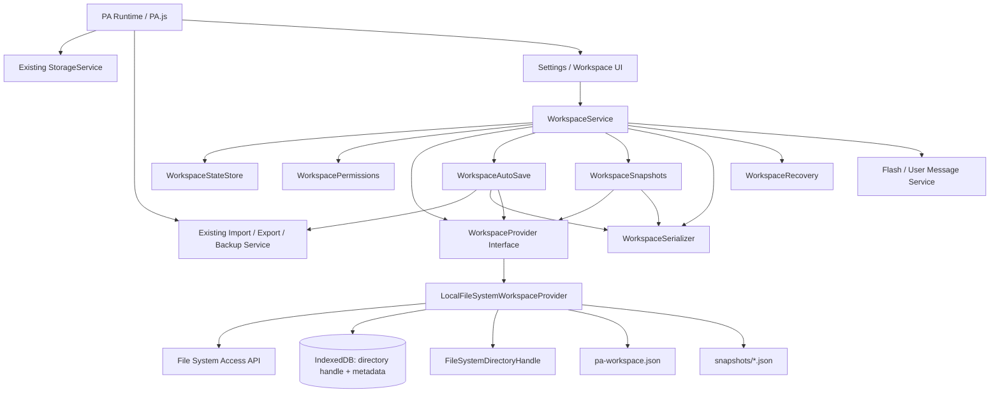
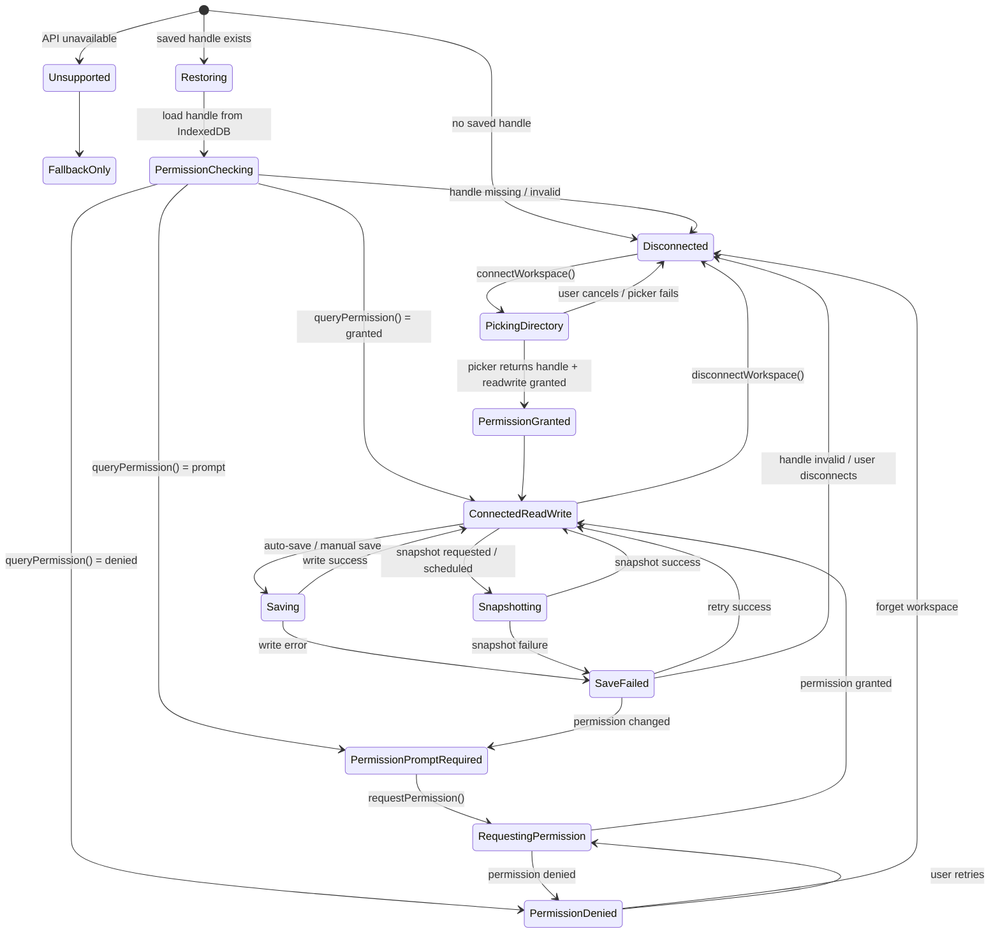
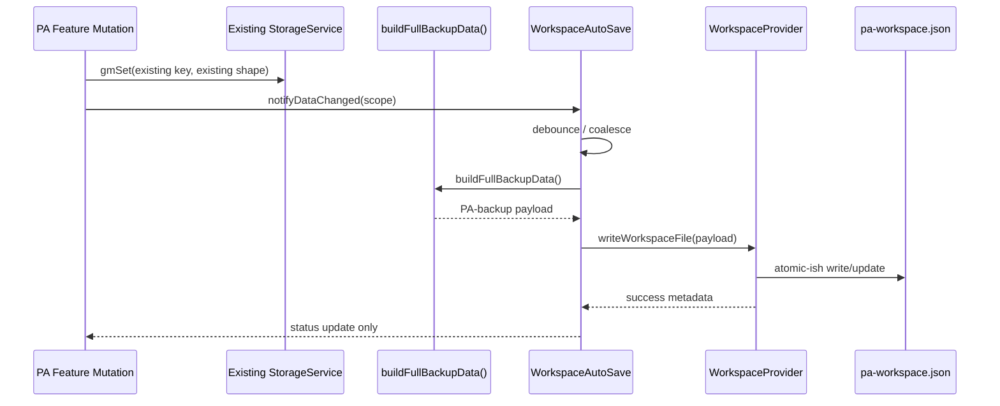
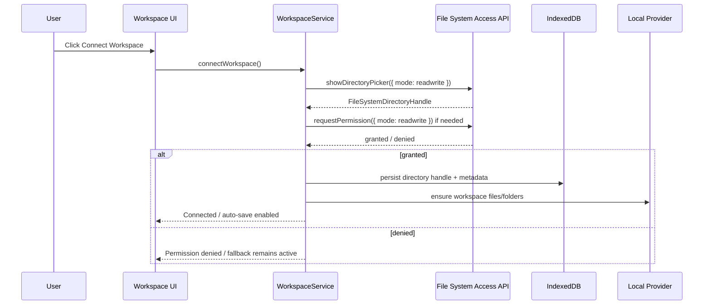
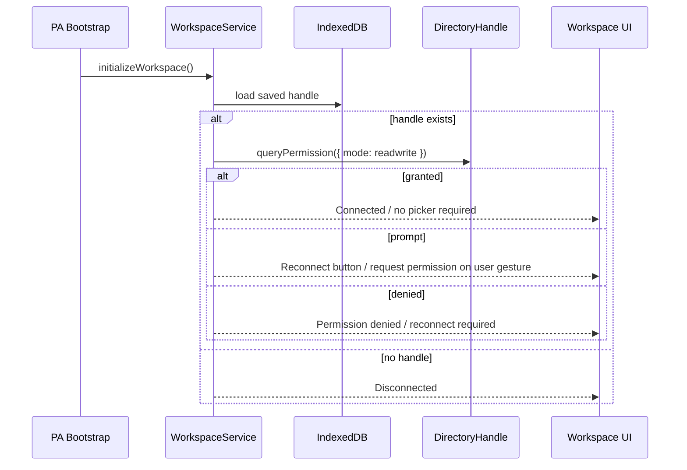

# Workspace Architecture

Document date: 2026-07-02

Scope: design only. This document does not implement Workspace, does not modify `PA.js`, and does not generate a code patch.

Input documents reviewed:

- `architecture/Refactor_Plan.md`
- `architecture/Refactor_Rules.md`
- `analysis/PA_Code_Discovery.md`

Note: the requested `Architecture_Rules.md` file does not exist in this workspace. The active rules document is `architecture/Refactor_Rules.md`, which defines the permanent PA architecture/refactor rules.

## 1. Goals

The Workspace architecture adds an optional local-folder persistence layer to PA using the browser File System Access API.

The validated prototype has proven that Chrome can support:

- `showDirectoryPicker()`
- `FileSystemDirectoryHandle`
- IndexedDB persistence of a `DirectoryHandle`
- Restoration after page refresh
- Restoration after full Chrome restart
- `queryPermission()`
- `requestPermission()`
- Persistent file read/write/update
- No repeated folder selection after permission is restored

Workspace goals:

1. Provide a durable local workspace folder for PA data files.
2. Keep the existing `StorageService`, GM storage, and localStorage behavior unchanged.
3. Add Workspace as an optional persistence/sync provider, not as a replacement for existing storage.
4. Support auto-save of backup-compatible PA state to files.
5. Support snapshots for rollback, recovery, and user confidence.
6. Restore workspace connection across page refresh and full Chrome restart when permission is still granted.
7. Avoid repeated folder selection after the user has connected a workspace and permission remains valid.
8. Prepare a provider boundary for future cloud-backed workspaces without forcing cloud behavior into Core.
9. Preserve all PA refactor rules: no storage key changes, no schema changes, no hidden behavior changes, no mixed-module implementation patches.

Non-goals for the first Workspace design:

- No replacement of `gmGet` / `gmSet`.
- No migration of existing PA data out of GM/localStorage.
- No direct file-backed live database in the initial phase.
- No cloud sync implementation.
- No Git/GitHub/OneDrive/Google Drive integration yet.
- No change to import/export schema.
- No change to current backup schema version.
- No code implementation in this document.

## 2. Design Principles

Workspace must follow PA's existing refactor principles.

### Preserve Production Behavior

Workspace must be optional and non-invasive. Existing PA behavior must remain identical when Workspace is disabled, unavailable, disconnected, or denied permission.

### Provider, Not Replacement

Workspace is a persistence provider layered beside existing storage. The initial source of truth remains current PA storage:

- GM storage via `gmGet` / `gmSet`
- localStorage mirrors
- existing backup/import data shapes

Workspace receives serialized state and writes files. It must not own feature schemas.

### Backup-Compatible First

The safest initial file format is the existing full backup payload produced by `buildFullBackupData()`.

Initial canonical file:

- `pa-workspace.json`

Optional snapshots:

- `snapshots/pa-workspace-YYYY-MM-DDTHH-mm-ss.sssZ.json`

### Explicit Permission Boundary

File System Access permission is a runtime capability, not a storage guarantee. Workspace must model permission state explicitly and never assume a restored handle is currently writable.

### IndexedDB Owns Handles Only

Directory handles should be persisted in IndexedDB because GM storage/localStorage cannot reliably store structured `FileSystemDirectoryHandle` objects.

IndexedDB should store:

- workspace directory handle
- workspace metadata
- last known permission state
- last successful write metadata

IndexedDB should not become a second copy of all PA feature data unless a separate future plan approves that.

### Debounced and Observable Auto Save

Auto-save should be debounced, status-visible, and recoverable. A Workspace write failure must never corrupt existing PA storage.

### Snapshots Before Risky Writes

Snapshots should protect users from accidental overwrites, broken serialization, or future import mistakes.

### Browser-Compatibility First

Chrome/Edge can use File System Access API. Firefox/Safari must gracefully fall back to existing export/import/download workflows.

### Future Cloud Provider Boundary

The architecture must isolate local File System Access behind a provider interface so future cloud providers can implement the same logical operations.

## 3. Component Diagram

### Component Responsibilities

| Component | Responsibility |
|---|---|
| `WorkspaceService` | Main orchestration facade for UI and PA integration. |
| `WorkspaceStateStore` | Runtime state machine and persisted metadata, not feature data. |
| `WorkspacePermissions` | `queryPermission` / `requestPermission` orchestration. |
| `WorkspaceProvider` | Provider contract for local filesystem now and cloud later. |
| `LocalFileSystemWorkspaceProvider` | File System Access API implementation. |
| `WorkspaceAutoSave` | Debounced save scheduling after data mutations. |
| `WorkspaceSnapshots` | Snapshot creation, retention, and restore candidates. |
| `WorkspaceSerializer` | Converts existing PA backup payload into workspace file payload. |
| `WorkspaceRecovery` | Handles failed writes, stale handles, permission loss, and restore prompts. |
| IndexedDB handle store | Stores `FileSystemDirectoryHandle` and metadata across restarts. |

## 4. State Machine

Workspace state must be explicit because a saved directory handle and current write permission are different things.

### State Definitions

| State | Meaning | UI status |
|---|---|---|
| `Unsupported` | File System Access API unavailable. | Workspace unavailable; use export/import fallback. |
| `FallbackOnly` | Browser cannot support persistent folder handles. | Existing PA storage remains active. |
| `Disconnected` | No workspace handle is available. | Connect button shown. |
| `PickingDirectory` | User is choosing folder through `showDirectoryPicker()`. | Waiting / browser prompt. |
| `Restoring` | PA found a saved handle in IndexedDB. | Checking workspace. |
| `PermissionChecking` | `queryPermission()` in progress. | Checking permission. |
| `PermissionPromptRequired` | Handle restored, but write access needs prompt. | Reconnect / grant access button. |
| `RequestingPermission` | `requestPermission()` in progress. | Browser permission prompt. |
| `PermissionDenied` | Permission denied or revoked. | Action required. |
| `ConnectedReadWrite` | Workspace folder is connected and writable. | Auto-save enabled. |
| `Saving` | Current backup payload is being written. | Saving indicator. |
| `Snapshotting` | Snapshot file is being written. | Snapshot indicator. |
| `SaveFailed` | Last write failed. | Error status with retry. |

## 5. Browser Compatibility

### Supported Browser Path

| Browser | Expected support | Workspace behavior |
|---|---|---|
| Chrome desktop | Supported | Full Workspace support. |
| Edge desktop | Likely supported | Full Workspace support if File System Access API is available. |
| Chromium variants | Varies | Feature-detect. Enable only when APIs exist. |

Required feature detection:

- `window.showDirectoryPicker`
- `FileSystemDirectoryHandle`
- `indexedDB`
- `directoryHandle.queryPermission`
- `directoryHandle.requestPermission`
- `directoryHandle.getFileHandle`

### Fallback Browser Path

| Browser | Expected support | Fallback |
|---|---|---|
| Firefox | Not supported for File System Access persistent directory handles | Existing export/import download flow. |
| Safari | Not supported or incomplete | Existing export/import download flow. |
| Mobile browsers | Unreliable | Existing storage only unless explicitly supported. |

Fallback behavior must preserve current PA functionality:

- Existing GM/localStorage storage continues.
- Existing Export File remains available.
- Existing Import File remains available.
- No Workspace UI action should break PA startup.

### Userscript Runtime Considerations

PA currently runs as a Tampermonkey/Greasemonkey userscript on `*://*/*`. File System Access API availability may depend on:

- secure context rules
- top-level browsing context
- browser implementation
- user activation requirement for `showDirectoryPicker()`
- page origin and userscript sandbox behavior

Workspace must be feature-detected at runtime and never assumed from browser name alone.

## 6. Storage Flow

Workspace adds file persistence beside existing PA storage.

### Important Storage Rules

1. Existing PA storage remains primary for runtime reads/writes.
2. Workspace save reads current state through existing backup APIs.
3. Workspace file format should initially mirror the backup payload.
4. Workspace file writes must not change any GM/localStorage key.
5. Workspace handle persistence belongs in IndexedDB, not GM/localStorage.
6. Workspace metadata may be mirrored into existing storage only if it uses new workspace-scoped keys in a future approved patch.

### IndexedDB Handle Store

Suggested IndexedDB database:

- Database: `pa-workspace-db`
- Object store: `workspace-handles`
- Primary key: `id`

Suggested records:

| ID | Content |
|---|---|
| `default` | active workspace metadata and `FileSystemDirectoryHandle` |

Suggested metadata shape:

| Field | Purpose |
|---|---|
| `id` | `default` for initial single-workspace support. |
| `directoryHandle` | Structured-cloned `FileSystemDirectoryHandle`. |
| `provider` | `local-file-system`. |
| `connectedAt` | ISO timestamp. |
| `lastRestoredAt` | ISO timestamp when handle restoration succeeded. |
| `lastPermissionState` | `granted`, `prompt`, `denied`, or `unknown`. |
| `lastSuccessfulWriteAt` | ISO timestamp. |
| `workspaceFileName` | `pa-workspace.json`. |
| `schemaVersion` | Workspace metadata schema, separate from PA backup schema. |

## 7. Permission Flow

Permission flow must separate first connection from restoration.

### First Connect Flow

### Restore Flow After Refresh or Chrome Restart

### Permission Rules

1. `showDirectoryPicker()` must only run from a user gesture.
2. `requestPermission()` should also be initiated from a user gesture when browser policy requires it.
3. `queryPermission()` may run during startup/restore.
4. Workspace must not repeatedly show the directory picker if a persisted handle is available and permission is granted.
5. Permission loss must disable auto-save and show a clear reconnect action.
6. Denied permission must not clear user data.

## 8. Auto Save Strategy

Auto-save should be event-driven but debounced.

### Initial Auto Save Trigger Sources

Workspace should subscribe to high-level data mutation events, not patch every `gmSet` blindly in the first implementation.

Candidate trigger points after future event orchestration exists:

- successful Barcode data mutation
- successful Folder/Subfolder data mutation
- successful Bookmark data mutation
- successful Todo data mutation
- successful Wellness settings mutation
- successful Print config/log mutation
- successful Import/Reset operation

Transitional option:

- Wrap selected existing mutation completion paths with `WorkspaceAutoSave.notifyDataChanged(scope)` through compatibility facades.

Avoid in first implementation:

- Triggering a file write for every low-level `gmSet` call.
- Auto-saving while import is mid-merge.
- Auto-saving while reset is mid-operation.
- Auto-saving partial state before caches and render updates settle.

### Debounce Policy

Suggested defaults:

| Setting | Suggested value | Reason |
|---|---:|---|
| Normal debounce | 1500–3000 ms | Coalesce rapid UI operations. |
| Max wait | 10000–15000 ms | Ensure long editing sessions still flush. |
| Retry delay | exponential, starting 5000 ms | Avoid repeated permission/write failure loops. |
| Manual Save Now | immediate | User-controlled flush. |

### Write Policy

1. Build current backup payload using existing backup builder.
2. Serialize to JSON with stable formatting.
3. Write to a temporary file when possible.
4. Replace/update `pa-workspace.json`.
5. Record last successful save metadata.
6. Surface status in Workspace UI.

File System Access API does not provide universal atomic rename semantics like a desktop filesystem API. The design should use the safest browser-supported pattern available:

- write complete payload to `pa-workspace.tmp.json`
- close writable stream
- then write/update `pa-workspace.json`
- optionally keep previous snapshot before overwriting

### Auto Save Status

Workspace UI should expose:

- disconnected
- connected
- permission required
- saving
- saved at timestamp
- save failed
- snapshot created

Status should integrate with the future app-wide message service, not hard-code Barcode flash state.

## 9. Snapshot Strategy

Snapshots protect user data and support rollback.

### Snapshot Types

| Snapshot type | Trigger | File path |
|---|---|---|
| Manual snapshot | User clicks Create Snapshot | `snapshots/manual/pa-workspace-<timestamp>.json` |
| Pre-import snapshot | Before importing workspace data into PA | `snapshots/pre-import/pa-workspace-<timestamp>.json` |
| Pre-reset snapshot | Before Reset Data if workspace connected | `snapshots/pre-reset/pa-workspace-<timestamp>.json` |
| Scheduled snapshot | Optional daily or session-based snapshot | `snapshots/auto/pa-workspace-<timestamp>.json` |
| Pre-overwrite snapshot | Before replacing current workspace file | `snapshots/pre-save/pa-workspace-<timestamp>.json` |

### Snapshot Retention

Suggested initial policy:

- Keep last 10 manual snapshots.
- Keep last 10 automatic snapshots.
- Keep last 5 pre-import snapshots.
- Keep last 5 pre-reset snapshots.
- Never delete snapshots without a future explicit retention setting or safe default.

Because File System Access API directory iteration and deletion support varies by implementation details, retention cleanup should be best-effort and non-blocking.

### Snapshot Payload

Use the same backup-compatible payload as `pa-workspace.json`.

Add workspace envelope metadata only if it does not break current import compatibility. Safer initial design:

- Keep `pa-workspace.json` exactly backup-compatible.
- Store extra workspace metadata in a separate file:
  - `.pa-workspace-meta.json`

Suggested metadata file:

| Field | Purpose |
|---|---|
| `workspaceSchemaVersion` | Workspace metadata schema. |
| `workspaceId` | Random UUID generated on first connect. |
| `lastSaveAt` | Last successful write timestamp. |
| `lastSnapshotAt` | Last successful snapshot timestamp. |
| `provider` | `local-file-system`. |
| `app` | `PA`. |

## 10. Integration Points

Workspace must integrate through explicit boundaries and avoid changing current behavior.

### StorageService

Relationship: **consumer of backup state, not replacement for storage**.

Workspace should not alter:

- `gmGet`
- `gmSet`
- localStorage mirroring
- existing cache invalidation
- existing storage keys

### Import / Export / Backup

Workspace should initially reuse:

- `buildFullBackupData()` for saving to workspace
- `normalizeBackupPayload()` for reading workspace file candidates
- `importBackupData()` only when user explicitly chooses to restore/import from workspace

Workspace auto-save must not call `importBackupData()`.

### Settings UI

Suggested Workspace settings actions:

- Connect Workspace
- Reconnect / Grant Permission
- Save Now
- Create Snapshot
- Open Workspace Status
- Import From Workspace File
- Disconnect Workspace
- Forget Saved Workspace Handle

Settings UI should show browser compatibility state.

### Message / Flash Service

Workspace should use app-wide status messaging once `showFlash` is abstracted. Until then, a future implementation may use compatibility facade behavior, but design should not call it a Barcode-owned service.

### Dialog / Modal Service

Workspace requires confirmation dialogs for:

- disconnect workspace
- forget handle
- import from workspace
- restore snapshot
- overwrite current workspace file

These should use a future DialogService boundary rather than embedding modal logic inside Workspace core.

### Runtime Bootstrap

Workspace bootstrap should be late and non-blocking:

1. Existing PA initialization completes as today.
2. Workspace service initializes asynchronously.
3. If handle restores and permission is granted, auto-save becomes available.
4. If not, PA continues normally.

Workspace must not block:

- floating button creation
- panel hidden-by-default behavior
- initial `renderFolders()`
- reminder checker startup

### Render / Footer / Status

Workspace status can appear in:

- Settings dropdown
- About/status modal
- Future footer status area

It must not disrupt current footer quote/status behavior without a separate UI task.

## 11. Public API

The Workspace service should expose a small public API. Names below are design-level names, not implementation commitments.

### WorkspaceService API

| Method | Purpose | Notes |
|---|---|---|
| `initializeWorkspace()` | Load persisted handle and check capability/permission. | Runs after PA bootstrap, non-blocking. |
| `isWorkspaceSupported()` | Feature-detect File System Access + IndexedDB support. | No side effects. |
| `getWorkspaceState()` | Return current state snapshot. | For UI rendering. |
| `connectWorkspace()` | User-gesture flow using `showDirectoryPicker()`. | Persists handle in IndexedDB. |
| `restoreWorkspace()` | Attempt handle restoration from IndexedDB. | Uses `queryPermission()`. |
| `requestWorkspacePermission()` | Request read/write permission for restored handle. | User-gesture flow. |
| `disconnectWorkspace(options)` | Stop using current handle for this session. | Should not delete PA data. |
| `forgetWorkspace()` | Remove persisted handle from IndexedDB. | Confirm first. |
| `saveNow(reason)` | Immediate workspace save. | Requires granted permission. |
| `scheduleAutoSave(reason, scope)` | Debounced save trigger. | No-op if disconnected/unsupported. |
| `createSnapshot(reason)` | Write snapshot file. | Requires granted permission. |
| `readWorkspaceFile()` | Read current `pa-workspace.json`. | For explicit import/preview. |
| `importFromWorkspace()` | User-confirmed import from workspace file. | Must create pre-import snapshot first when possible. |
| `getLastSaveInfo()` | Return last save metadata. | For status UI. |

### WorkspaceProvider Interface

| Method | Local File System implementation |
|---|---|
| `connect()` | `showDirectoryPicker()` and return directory handle. |
| `restore()` | Load directory handle from IndexedDB. |
| `queryPermission(mode)` | `directoryHandle.queryPermission({ mode })`. |
| `requestPermission(mode)` | `directoryHandle.requestPermission({ mode })`. |
| `writeFile(path, content)` | `getFileHandle(..., { create: true })`, `createWritable()`, write, close. |
| `readFile(path)` | `getFileHandle()`, `getFile()`, `text()`. |
| `ensureDirectory(path)` | `getDirectoryHandle(..., { create: true })`. |
| `listFiles(path)` | Directory iteration if supported. |
| `deleteFile(path)` | Best-effort cleanup for retention. |
| `getMetadata()` | Provider status and capability metadata. |

### Event Surface

Workspace should publish status events rather than coupling directly to UI:

- `workspace:state-changed`
- `workspace:save-started`
- `workspace:save-succeeded`
- `workspace:save-failed`
- `workspace:permission-required`
- `workspace:snapshot-created`

Future implementation can use a lightweight internal event bus or direct callbacks, but the architecture should avoid feature modules importing Workspace UI.

## 12. Future Cloud Providers

Workspace must be provider-based from the beginning.

### Provider Types

| Provider | Status | Notes |
|---|---|---|
| Local File System | First provider | File System Access API. |
| Download Folder / Manual Export | Fallback provider | Existing export/import behavior. |
| OneDrive | Future | Requires auth/provider boundary. |
| Google Drive | Future | Requires auth/provider boundary. |
| GitHub Gist / Repository | Future | Good for versioned snapshots, requires auth. |
| WebDAV | Future | Could support self-hosted users. |
| OPFS | Future | Origin Private File System, not user-visible folder. |

### Cloud Provider Boundary

Cloud providers must not enter Core directly. They should implement the same logical provider operations:

- connect/authenticate
- query status
- read workspace file
- write workspace file
- create snapshot/version
- list snapshots
- disconnect/revoke

### Cloud Provider Rules

1. Missing cloud provider must not affect PA startup.
2. Cloud authentication must not be required for public GitHub usage.
3. Provider-specific tokens/secrets must not be stored in backup payloads.
4. Provider metadata must be separate from feature data.
5. Cloud conflict resolution must be a separate future design.

## 13. Risks

| Risk | Level | Details | Mitigation |
|---|---|---|---|
| Browser support fragmentation | High | File System Access API is not universal. | Feature-detect and preserve fallback. |
| Permission revocation | High | Restored handle may lose write access. | Explicit permission state machine. |
| Userscript sandbox behavior | Medium-High | API availability may vary by page/runtime. | Runtime detection and non-blocking init. |
| Data corruption during write | High | Browser writes can fail mid-operation. | Snapshot before risky writes, write temp first when possible. |
| Backup schema drift | High | Workspace file could diverge from import/export schema. | Use existing backup payload unchanged initially. |
| Auto-save too frequent | Medium | Can degrade performance or spam disk writes. | Debounce and max wait policy. |
| Auto-save partial state | High | Import/reset operations mutate multiple stores. | Trigger after high-level mutation completion only. |
| Confusing source of truth | High | Users may think file replaces PA storage. | Clearly document Workspace as backup/sync provider initially. |
| Cross-tab conflicts | Medium-High | Multiple PA tabs could write workspace file. | Use debounced writes, timestamps, future lock/conflict strategy. |
| Handle persistence failure | Medium | IndexedDB can be cleared or unavailable. | Graceful disconnect state. |
| Privacy/security expectations | Medium | User-selected folder contains PA data. | Clear UI labels and no hidden cloud upload. |
| Snapshot growth | Medium | Many snapshots can consume disk space. | Retention policy and user controls. |
| Integration with current refactor | High | PA is still single-file and global-state-heavy. | Implement only after storage/shared services boundaries are stable. |

## 14. Migration Plan

Workspace implementation must be staged and reversible. This plan is design-level only.

### Phase 0 — Documentation and Validation Baseline

Status: current design phase.

Deliverables:

- Workspace architecture document.
- Prototype validation results recorded separately if desired.
- No `PA.js` changes.

### Phase 1 — Provider Boundary Design and Test Harness

Scope:

- Add design/test-only artifacts or isolated prototype files, not production integration.

Goals:

- Characterize `showDirectoryPicker()`.
- Characterize IndexedDB handle persistence.
- Characterize permission restore after refresh/restart.
- Define manual checklist for Chrome/Edge.

PA impact:

- None.

### Phase 2 — WorkspaceService Skeleton Behind No-Op Facade

Scope:

- Add `WorkspaceService` concept as disabled/no-op or isolated module in future modular structure.

Rules:

- No existing storage changes.
- No auto-save yet.
- No UI behavior changes except possibly hidden capability detection if approved.

Rollback:

- Remove Workspace skeleton; no data migration.

### Phase 3 — Settings UI Entry Point

Scope:

- Add Workspace status/connect actions to Settings UI.

Rules:

- One logical UI patch.
- No auto-save yet.
- Existing Export/Import remains unchanged.

Manual checks:

- Unsupported browser shows fallback.
- Chrome connect can select folder.
- Disconnect does not delete PA data.

### Phase 4 — IndexedDB Handle Persistence

Scope:

- Persist and restore `FileSystemDirectoryHandle` in IndexedDB.

Rules:

- Workspace metadata only.
- No PA feature data stored in IndexedDB.
- No changes to existing PA storage keys.

Manual checks:

- Refresh restore.
- Full Chrome restart restore.
- Permission prompt/denied/granted paths.

### Phase 5 — Manual Save to Workspace

Scope:

- Add `Save Now` that writes `pa-workspace.json` from `buildFullBackupData()`.

Rules:

- Manual only.
- No auto-save.
- File payload remains backup-compatible.

Manual checks:

- Save creates/updates file.
- File can be imported through existing Import flow.
- Permission loss handled.

### Phase 6 — Manual Snapshot

Scope:

- Add `Create Snapshot`.

Rules:

- Snapshot payload same as backup payload.
- Retention best-effort only.

Manual checks:

- Snapshot file appears.
- Snapshot can be imported manually.

### Phase 7 — Debounced Auto Save

Scope:

- Add `WorkspaceAutoSave` triggered by high-level mutation completion events.

Rules:

- Do not hook every raw `gmSet` initially.
- Do not auto-save mid-import/reset.
- Clearly show save status.

Manual checks:

- Create/edit/delete Barcode triggers one debounced save.
- Bookmark and Todo mutations trigger debounced saves only after mutation completion.
- Rapid operations coalesce.
- Permission denied disables auto-save.

### Phase 8 — Import From Workspace / Restore Snapshot

Scope:

- Allow explicit user-confirmed import from `pa-workspace.json` or snapshot.

Rules:

- Create pre-import snapshot first when possible.
- Use existing `normalizeBackupPayload()` and `importBackupData()`.
- No silent overwrite of current PA data.

Manual checks:

- Preview before import.
- Merge counts unchanged.
- Existing backup compatibility unchanged.

### Phase 9 — Conflict and Multi-Tab Strategy

Scope:

- Design and implement conflict detection if needed.

Possible signals:

- last saved timestamp
- workspace file hash
- active tab write lock metadata

Rules:

- Must be separate from initial auto-save.
- Must not change existing cross-tab sync behavior for `bm_folders` / `bm_barcodes`.

### Phase 10 — Cloud Provider Preparation

Scope:

- Introduce provider registry only after local Workspace stabilizes.

Rules:

- No cloud auth in Core.
- No cloud tokens in backup payload.
- Missing provider must not affect PA startup.

## Final Recommendation

Workspace should enter PA as an optional persistence provider that writes backup-compatible files to a user-selected local folder.

The safest first production path is:

1. restore directory handle from IndexedDB,
2. verify permission through `queryPermission()` / `requestPermission()`,
3. support manual Save Now,
4. support snapshots,
5. only then enable debounced auto-save after high-level data mutations.

Workspace must not replace existing PA storage, change storage keys, alter backup schema, or block startup. The architecture should prepare for future cloud providers through a provider interface, but local File System Access must remain the only initial provider.

